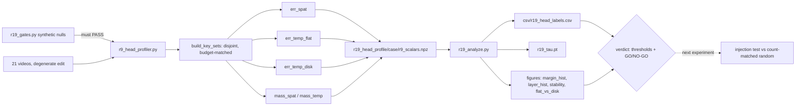

# R19: Equal-budget head classification (SVG probe, block-causal)

## Context

The routing program needs a per-head label: does this head anchor **appearance**
(attends within its frame) or carry **motion** (attends to the same location
across frames)? Everything downstream — where the visual prompt is injected,
which heads receive source features — is gated on that label being real.

The probe is SVG's Algorithm 1: sample ~1% of query rows, compute the full
attention output for them, then recompute it under two candidate key sets, and
keep whichever reconstructs better. That algorithm is adopted unchanged.

**What this plan fixes is the two key sets.** Reconstruction error falls as a key
set grows, so the sets must offer the same number of keys or the comparison
measures set size instead of head type — verified: on random `q/k/v` a head with
*no* specialisation scores margin **−0.97** when the sets are 1560 vs 18. With
budget-matched sets the same head scores **≈0**.

They must also be **disjoint**. If the temporal set contains part of the query's
own frame, a good temporal score no longer distinguishes "uses other frames" from
"uses its own frame", and there is nothing to attribute the reconstruction to.
The overlap is `1/N` — 5.6% at the last block but **33% at the first**, where the
probe stops discriminating entirely.

This is where R19 deliberately departs from SVG, and the reason is a difference
in purpose. **SVG optimises approximation**: the mask *replaces* attention, so it
should contain everything useful, own frame included. **R19 optimises
attribution**: the forward pass stays dense and only the label is wanted, so the
two hypotheses must be separable. Same probe, opposite requirement on the masks.

Done when: labels, margins and flip rates exist for all blocks x steps x 21 videos
under both band shapes, both null gates pass, and a GO/NO-GO on the taxonomy is
recorded with thresholds read off the observed histogram.

## Execution steps

| # | id | type | what | sets_status |
|---|----|------|------|-------------|
| 0 | gates | manual | two synthetic null checks — blocking | — |
| 1 | launch-profile | sbatch | r19_profile.sh — 21 videos, one job (~1.5 h) | `running` |
| 2 | wait-profile | manual | 21/21 npz, budget-match invariant held | `finished` |
| 3 | analyze | manual | labels, histogram, flip rates, flat-vs-disk | — |
| 4 | verdict | manual | thresholds from the histogram; GO/NO-GO | `analyzed` |

## Decisions

| Decision | Choice |
|---|---|
| Probe | SVG Algorithm 1 verbatim: sample query rows, compute the dense output ("golden") for them, recompute under each candidate mask with `-inf` **before** softmax (never zero weights after), compare by MSE. `golden` is exact on the key side, which is why ~1% of rows suffices |
| Spatial set | The query's own frame, **minus the query's own token** — 1,559 keys, constant in `N`. "Look at yourself" |
| Temporal set | A **constant-width tube through the other frames only**: `span = round(L/(N−1))` positions near `row_pos`, in each of the `N−1` frames that are not the query's. ~1,559 keys. The tube does **not** taper with temporal distance — frame `f−1` and frame `f−17` are treated alike |
| Why the band narrows with `N` | Purely the budget: the fixed ~1,560 keys are shared over more frames as the cache fills (`span` = 779 at N=3 → 91 at N=18). It is *not* a temporal-locality effect |
| Own frame excluded | The two hypotheses must be **disjoint** or the winner is unattributable. Costs little at high `N` (span 91 vs 87) and rescues low `N`, where inclusion puts 33% of the query's own neighbourhood inside the "temporal" set. **Trade-off recorded**: excluding also removes the diagonal of SVG's slash, so a temporal head loses its own-frame mass. Self-dominant heads are then caught by the dense-abstain rather than misread as spatial — which is why the self token is dropped from **both** sets |
| Band shape | **Both computed, in the same run.** `flat` (|p − p_q|, the spec in svg_routing_strat.md) is a horizontal stripe in the 30x52 grid — it never reaches the vertical neighbour, 52 away. `disk` (the `span` nearest cells by 2D distance) is isotropic, the honest reading of "near this spot". SVG's flat band follows from block-sparse memory layout, a constraint R19 does not have. Selection **by rank**, not by a distance threshold — a threshold over-selects on ties (1614 vs 1547 measured) |
| Routing | **Four-way**, per svg_routing_strat.md §4. `best_rel = sqrt(min(err)/mean(golden²))` above `tau_dense` ⇒ **DENSE** (neither pattern fits — diffuse heads announce themselves instead of being decided by whichever mask is denser); else margin past `±tau_route` ⇒ **SPATIAL**/**TEMPORAL**; else **MIXED** (both patterns fit). DENSE and MIXED are opposite failure modes and must not be merged |
| Thresholds | `tau_route≈0.15`, `tau_dense≈0.35` as starting points only. **Read off the margin histogram at the verdict step**, never fixed in advance |
| Blocks profiled | **All of them, including block 0.** Disjoint sets make low `N` valid. Report per-`N`, do not pool: at N=3 the label means "uses other frames at all" (span 779 ≈ half a frame), at N=18 the sharper "tracks the same position through time" (span 91) |
| Blocks per video | 6 for 18-latent-frame clips, **7 for 0034_cows** (21 latent frames). `N` is read from the cache at each capture, never assumed |
| Null gates | Blocking, CPU, seconds. (a) random `q/k/v` ⇒ margin ≈0 for **both** shapes; (b) a fixed synthetic temporal head's margin stays flat as `N` grows 3→21. (b) is the direct test that the budget match works: with unequal budgets the same head's margin drifts +0.24→+0.96 |
| Second, budget-free score | Attention **mass** on each set, normalised by `|set|/S_vis`, on the same rows. Independent of any reconstruction budget, so it cross-checks that the margin measures head type. Recorded always; classification is on the MSE margin |
| Coverage | **All 21 unique videos in `evaluation/cases.json`** x all blocks x steps {0,7,12,13,14} x 47 query rows, fixed seed. (cases.json holds 22 entries; `0011_lucia` appears under edit 2 and edit 5 — **deduplicated by `video_name`**, since the probe runs a *degenerate* edit with target prompt = source, so the two entries would produce byte-identical captures.) |
| Why edit type is irrelevant here | The probe profiles the **source branch under a degenerate edit** (trg = src), so no edit is actually performed. What the head labels depend on is the **motion content of the video**, not which edit the case describes. The 21 clips are therefore selected for motion diversity, not for edit-type balance |
| Why 21 and not 5 | Cross-video flip rate is the headline stability number, and it was the weakest axis of the earlier profiling: 5 videos give only 10 video-pairs, so the estimate was tenths-quantized with a 95% CI of roughly [1,10]%. 21 videos give **210 pairs** and a usable CI. This **absorbs axis (b) of R18** (videos 5→~25); R18's remaining axes (query rows 47→470, all 15 steps) stay open |
| Stability | Two measures across **videos**, **steps** and **blocks**, and they answer different questions. **Any-label flip** (`flip_rates`, pairwise) = how reproducible the label is; a move to `DENSE` counts. **Wrong-arm rate** (`confusion_rates`) = share of observations landing in the *opposite* arm; `DENSE` does not count, because an abstain never places a head in the arm meant for its opposite. **The gates filter on wrong-arm.** Any-label overstates instability by ~30× on TEMPORAL heads (42.8% vs 1.3% across videos) because they abstain far more often than SPATIAL ones (29.3% vs 8.2%). Block-flip is interpretable at all only because the mask rule is constant in `N` — a rule that changed between blocks would make mask drift indistinguishable from head re-tasking |
| Attention dumps | `--map_mode marginal` (~5 MB/video, ~105 MB for 21): per-frame marginal for every sampled row plus 30x52 position marginals for a few. The full joint over 47 rows would be ~950 MB. No quantitative column depends on it |
| Outputs (bulk) | `/projects/dataggen/outputs/five_bench/r19_head_profile/{case}/r9_scalars.npz` — fresh root, earlier profiling left intact for comparison |
| Outputs (repo) | `evaluation/csv/r19_head_labels.csv`, `evaluation/r19_tau.pt`, `evaluation/figures/r19_{margin_hist,layer_hist,stability,flat_vs_disk}.pdf` |
| Out of scope | **The injection test** — labels are *geometry* (is this head's attention row- or column-shaped), while the research claim is *function* (row = appearance, column = motion). Geometry does not prove function; that needs injection at spatial vs temporal vs a **count-matched random** head set, and it is the next experiment. Also out: routing implementation, mask-gated VP, scaled re-profiling (more videos/rows/steps) |

## Step commands

### gates

```bash
cd ~/Code/StreamEdit_bigchantier
python evaluation/r19_gates.py        # must print PASS for both; blocking
```

### launch-profile

```bash
sbatch slurm_scripts/five_bench/r19_profile.sh
```

### wait-profile

```bash
tail -20 logs/r19_profile_{job_id}.out     # every capture: |n_spat - n_temp|/n_spat < 2%
ls /projects/dataggen/outputs/five_bench/r19_head_profile/*/r9_scalars.npz   # expect 21
```

### analyze

```bash
python evaluation/r19_analyze.py \
  --profile_root /projects/dataggen/outputs/five_bench/r19_head_profile \
  --out_csv evaluation/csv --out_fig evaluation/figures
```

### verdict

```bash
# Read figures/r19_margin_hist.pdf FIRST, then choose thresholds from it.
#  GO    : histogram bimodal with a gap at 0; low flip rate in the adopted band;
#          flat and disk agree on the extremes => record thresholds + head census
#  NO-GO : margins unimodal near 0 => the probe does not separate heads in this
#          backbone; the routing program needs a different head definition first
# The label is GEOMETRY. The appearance/motion claim needs the injection test
# with a count-matched random control -- next experiment, not this one.
# Record verdict + outcome bullet in daily.md; update ideas.tex claim-5 status.
```

## Pipeline



## Code to touch

- **`evaluation/r9_head_profiler.py`** (modify). Replace the key-set
  construction in `_capture`. Current:

  ```python
  spat_mask = (key_idx // FRAME_TOKENS)[None, :] == row_frame[:, None]
  temp_mask = (key_idx %  FRAME_TOKENS)[None, :] == row_pos[:, None]
  ```

  becomes an own-frame set minus the self token, and a tube through the other
  frames whose width comes from the budget:

  ```python
  key_frame = (key_idx // FRAME_TOKENS)[None, :]
  key_pos   = (key_idx %  FRAME_TOKENS)[None, :]
  own       = key_frame == row_frame[:, None]
  q_abs     = row_frame * FRAME_TOKENS + row_pos

  span = round(FRAME_TOKENS / (frames_vis - 1))      # positions per other frame
  w    = (span - 1) // 2

  spat_mask      = own & (key_idx[None, :] != q_abs[:, None])
  temp_mask_flat = (torch.abs(key_pos - row_pos[:, None]) <= w) & ~own
  temp_mask_disk = <span nearest cells by 2D distance, BY RANK> & ~own
  ```

  Guard `frames_vis < 2` (the temporal axis does not exist). Add
  `err_temp_flat`, `err_temp_disk`, `best_rel`, the mass columns, and the
  achieved `N`/`span`/key-count invariants to the npz. Keep `--map_mode`.

- **`evaluation/r19_gates.py`** (new): the two blocking synthetic checks. Random
  `q/k/v` at real shapes through the same `build_key_sets`; asserts margin ≈0 for
  both shapes and a flat margin for a synthetic temporal head across `N` = 3…21.
  Prints PASS/FAIL and exits non-zero on failure.

- **`evaluation/r19_analyze.py`** (new): four-way labels, margin histogram,
  per-layer census, video/step/block flip rates, flat-vs-disk agreement.
  `--tau_route`/`--tau_dense` unset by default so the histogram is inspected
  before any cut is chosen. Writes `r19_head_labels.csv` and `r19_tau.pt`.

- **`slurm_scripts/five_bench/r19_profile.sh`** (new): mirrors the existing
  profiling job header (L40S, 1 GPU, `--mem=64G`), `OUT_ROOT` at
  `r19_head_profile`, loops the **21 unique `video_name`s from cases.json**
  (deduplicated -- do not run `0011_lucia` twice), `--map_mode marginal`,
  `--time=04:00:00` (~4 min/video incl. model load amortised over the job).
