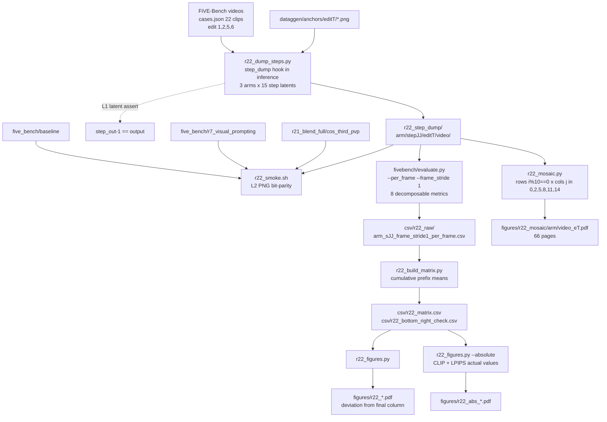

# R22: Metric Convergence Over Steps/Frames

## Context

For each of the 22 clips in `evaluation/cases.json`, produce an `nb_frames x 15` matrix `M(i,j)` = a FiVE metric evaluated on the first `i` pixel frames of the video as it stood at denoising step `j`. The two axes ask different questions — how much of the clip you have seen (streaming latency) versus how far the sampler has run (compute) — and the surface says where quality actually arrives.

The pipeline's 15-step loop is **nested inside a per-block loop** ([edit_causal_inference.py:487](../Self-Forcing_StreamEdit/pipeline/edit_causal_inference.py#L487)), and `output[:, cs:cs+n] = denoised_pred` fires once per block after that block's 15 steps finish ([line 574](../Self-Forcing_StreamEdit/pipeline/edit_causal_inference.py#L574)). There is therefore no instant at which the whole video sits at step `j`. `V_j` is defined as **the assembly of each block's own step-`j` x0 prediction, collected during one unperturbed rollout** — blocks still commit their step-14 value to the KV cache, so generation is untouched and `V_14` is the real output by construction. `V_j` for `j<14` is a trajectory preview, not what a `j`-step sampler would emit: block `b`'s step-`j` latent was produced while attending to blocks `<b` that were already fully denoised and re-cached at clean context (Step 3.3).

**Done when:** `evaluation/csv/r22_matrix.csv` holds `M(i,j)` for 8 metrics x 15 steps x every pixel-frame prefix, for all 22 clips under all 3 arms; `evaluation/csv/r22_bottom_right_check.csv` shows the identity holding everywhere; the smoke's GATE2 recorded PASS (step-14 render bit-identical to the arm's stored reference); heatmap PDFs written.

**Extended 2026-08-18** (after the task first reached `analyzed`), also done when: the absolute-value CLIP/LPIPS figures exist (`r22_abs_{metric}_{arm}.pdf` + `r22_abs_mean_surfaces.pdf`), and the 66 per-(video, arm) frame mosaics exist under `evaluation/figures/r22_mosaic/{arm}/{video}_e{T}.pdf`. Both are read-only views over artefacts that already exist — the matrix CSV and the 36 GB step dump — so nothing regenerates and the numbers cannot move.

## Execution steps

| # | Step id | Type | What |
|---|---------|------|------|
| — | *(prep)* | — | `patch-step-dump`, `write-r22-driver`, `write-r22-smoke`, `write-r22-dump`, `write-r22-eval`, `write-r22-matrix`, `write-r22-figures` — see **Code to touch** |
| 1 | `smoke` | sbatch | 1 clip x paper_novp; latent assert + step-14 PNG bit-parity vs `five_bench/baseline` |
| 2 | `wait-smoke` | manual | Both gates PASS. **GATE2 FAIL is a stop condition** — do not launch `dump` |
| 3 | `dump` | sbatch | Array 0-2 = 3 arms, 22 clips each, 15 step-videos per clip → `running` |
| 4 | `wait-dump` | manual | 330 frame dirs per arm; 0 `FAILED` → `finished` |
| 5 | `evaluate` | sbatch | Array 0-2; 15 x `evaluate.py --per_frame --frame_stride 1`, 8 metrics |
| 6 | `wait-eval` | manual | 45 per-frame CSVs; **0 `Error:` lines** |
| 7 | `build-matrix` | local | Cumulative prefix means → `r22_matrix.csv` + identity check |
| 8 | `figures` | local | Per-clip heatmap grids + mean surfaces (deviation) → `analyzed` |
| 9 | `figures-absolute` | local | Same geometry, **actual values** of CLIP + LPIPS, sequential colormap |
| 10 | `mosaic` | local | Per (video, arm) **image** mosaic; rows = frames `i%10==0`, cols = steps {0,2,5,8,11,14} |

Steps 9–10 were added 2026-08-18, after the task first reached `analyzed`. Both are
additive read-only views over artefacts that already exist (`r22_matrix.csv` for 9, the
step dump for 10) — neither re-runs inference or evaluation, and neither carries
`sets_status`, so the task stays `analyzed` throughout.

```
/run-step R22 smoke
/run-step R22 wait-smoke
/run-step R22 dump
/run-step R22 wait-dump
/run-step R22 evaluate
/run-step R22 wait-eval
/run-step R22 build-matrix
/run-step R22 figures
/run-step R22 figures-absolute
/run-step R22 mosaic
```

## Decisions

| Question | Choice |
|---|---|
| Definition of `V_j` | Per-block step-`j` x0 prediction (`denoised_pred`, [line 559](../Self-Forcing_StreamEdit/pipeline/edit_causal_inference.py#L559)), assembled with the same `[:, cs:cs+n]` write `output` uses, over one unperturbed rollout. Not a `j`-step sampler — a trajectory preview. |
| Why x0 and not the noisy latent | `denoised_pred` is the clean-image estimate; decoding `noisy_pred_input` through the VAE gives noise. At `index=14` it *is* what line 574 writes, which is what makes the bottom-right identity exact rather than approximate. |
| Column count | 15 (`j = 0..14`), `--step 15`. `j=0` is the first model update, not the source: `denoised_pred` is initialised to `src_input` at [line 452](../Self-Forcing_StreamEdit/pipeline/edit_causal_inference.py#L452) but the dump writes *after* the S.O.G. update. |
| Row axis `i` | **Every pixel frame**, `i = 1..nb_frames` (21–117 rows, clip-dependent). Free under cumulative means. Long-format CSV, so ragged row counts are fine. |
| *(corrected 2026-08-18)* Row-axis **direction** in figures | **Matrix convention: `i` increases DOWNWARD**, so `i=1` is the top row and every panel's bottom-right cell is `M(nb_frames,14)` — the same cell this plan, the L3 check and the reports all call "the bottom-right entry". The first version drew `i` upward (matplotlib's `origin="lower"` default habit): tick labels were numerically correct, but the panel's bottom-right was `M(1,14)`, which reads as the opposite claim about how quality moves through a clip and directly contradicted the plan's own wording. Caught by the user on inspection. The mosaic already used frame 0 at top, so all three families now agree. Do not flip back without rewording every "bottom-right" reference. |
| Metrics (8) | `structure_distance`, `psnr_unedit_part`, `lpips_unedit_part`, `mse_unedit_part`, `ssim_unedit_part`, `clip_similarity_source_image`, `clip_similarity_target_image`, `clip_similarity_target_image_edit_part`. All are per-frame means, so `M(i,j)` = cumulative mean of the per-frame values ⇒ **15 evaluations per clip, not `nb_frames`x15**. |
| Metrics excluded | `motion_fidelity_score{,_edit_part}` and `five_acc` are whole-clip (CoTracker tracklet sets / VLM verdict) — not decomposable, and `--per_frame` already emits them with `frame_idx=-1`. `niqe_target_image` is decomposable in principle but **`calculate_NIQE` returns the literal string `"nan"` per frame** ([metrics_calculator.py:807](../evaluation/fivebench/metrics_calculator.py#L807)); real values go only to a txt that is deleted per video, so the long CSV cannot carry it. |
| Arms (3) | `paper_novp` (Eq.4, no anchor — R1 config), `paper_vp` (Eq.4 + §4.5 anchor — R7 config), `cos_third_pvp` (R21's strongest editor under the persistent bank). |
| Why these 3 | Each has a **stored full-bench reference render of the same post-seeding-fix generation**, so step-14 can be bit-compared: `five_bench/baseline` (R1), `five_bench/r7_visual_prompting` (R7), `r21_blend_full/cos_third_pvp` (R21). |
| Bottom-right identity — 3 levels | **L1 latent:** `assert torch.equal(step_out[-1], output)` inside `inference`, per window — exact and free. **L2 pixel (the substantive one):** step-14 PNGs bit-identical to the stored reference arm, checked in the smoke. **L3 metric:** `M(nb_frames,14)` equals the plain mean of the step-14 per-frame column — true by construction of the cumulative mean, kept as a regression assert. |
| Identity trap | `M(nb_frames,14)` will **not** equal `r21_*_avg.csv` / `r20_*_avg.csv`. Those ran at `--frame_stride 8` and their overall row is a mean-of-edit-type-means, not a per-clip mean. Do not write that comparison into the check. |
| Clip set | The 22 clips of `evaluation/cases.json`, spanning edit types 1/2/5/6 (1/16/3/2) — same subset R20 used, and comparable to full runs since the 2026-07-22 per-pair reseed. |
| Output root | `/projects/dataggen/outputs/five_bench/r22_step_dump/{arm}/step{jj}/edit{T}/{video}/` — the `step{jj}` level sits above `edit{T}` precisely so each step dir is a valid `--tgt_layout edit_video` root. |
| Sampler config | `--step 15 --fg_boost_factor 4 --blend_power 2 --seed 0 --flow_shift 1.0`, `rollout_chunk_size=21`, per-pair reseed on — the run_fivebench.py defaults R1/R7/R20/R21 used. Anchors from `/projects/dataggen/outputs/five_bench/anchors/edit{T}/`. |
| Eval GPU | **L40S**, `--mem=64G`. R21 needed H100 only because Qwen2.5-VL + CoTracker were co-resident; dropping `five_acc` and `motion_fidelity` removes that pressure entirely. |
| Disk | ~67k dump PNGs (~34 GB) + an equal volume of `{video}_resize` copies that `evaluate.py` writes at stride 1. The eval script `rm -rf`s the `_resize` dirs after each `j`. |
| Mean surface | Per-clip heatmaps at native row count; the clip-averaged surface uses **normalised prefix fraction `i/nb_frames` resampled to 50 bins**, since raw row-wise averaging is undefined across 21–117-frame clips. |
| Colour semantics — deviation figures | `D(i,j) = M(i,j) − M(i,14)`, diverging map centred at 0, so the last column is white **by construction**. The plan's original "centred on the column-14 value" admitted a scalar reading (`M(nb_frames,14)`); the **column** is used because the scalar leaves the last column non-white wherever `M(i,14)` varies with `i` (everywhere), and because the 22 clips sit at very different absolute levels (per-clip PSNR ~18–32 dB). |
| *(added 2026-08-18)* Absolute-value figures | The deviation view deliberately discards level, so a second family plots **`M(i,j)` itself** for the CLIP and LPIPS metrics on a **sequential** colormap. Metrics: `clip_similarity_target_image`, `clip_similarity_target_image_edit_part`, `lpips_unedit_part` (`--abs_metrics` to change). `clip_similarity_source_image` excluded — computed on the source video, constant along `j`. |
| Absolute colour scale | **Shared across the 22 panels of a figure and across the 3 arms of a metric row.** Cross-clip and cross-arm comparability is the only reason to look at absolute values; per-panel autoscale would destroy it. Accepted cost: within-clip structure is compressed — that is what the deviation family is for. The two modes are complementary, not redundant. |
| *(added 2026-08-18)* Frame mosaic | Per (video, arm): rows = pixel frames with `i % 10 == 0` (0-based, matching the dump filenames), cols = steps `{0,2,5,8,11,14}`, cell = that frame decoded at that step. Read straight off the step dump — **no re-inference, no re-decode**. 66 pages (22 clips × 3 arms), grids 3×6 (`0072_dog-agility`, 21f) to 10×6 (`0034_cows`, 93f). |
| Mosaic file naming | `r22_mosaic/{arm}/{video}_e{T}.pdf` — the `_e{T}` is **required**, not cosmetic: `0011_lucia` appears under edit types 2 and 5, so `{video}.pdf` would silently overwrite one with the other. Same keying trap that `r22_build_matrix.py` hit. |
| Mosaic tile size | Frames are 832×480; tiles are downsampled to `--tile_width` 208 px (÷4) before embedding. At full resolution a 60-tile page is ~30 MB and the 66-page set ~2 GB, which is not a figure set anyone can open. |
| Out of scope | Non-decomposable metrics, full FiVE-Bench (22 clips only), `zero`/`cos_full`/`cos_half` arms, head-gated arms, a published report artifact. |

## Step commands

### smoke

```bash
sbatch slurm_scripts/five_bench/r22_smoke.sh
```

### wait-smoke

```bash
sacct -j {job_id} --format=JobID,State,Elapsed
grep -E '^\[r22_smoke\] (GATE1|GATE2)' logs/r22_smoke_*.out   # both must read PASS
```

### dump

```bash
sbatch --array=0-2 slurm_scripts/five_bench/r22_dump.sh
```

### wait-dump

```bash
sacct -j {job_id} --format=JobID,State,Elapsed
OUT=/projects/dataggen/outputs/five_bench/r22_step_dump
for a in paper_novp paper_vp cos_third_pvp; do
  echo "$a $(ls -d $OUT/$a/step*/*/*/ 2>/dev/null | wc -l)"   # each 330 = 22 x 15
done
grep -c 'FAILED' logs/r22_dump_*.out                          # expect 0
```

### evaluate

```bash
sbatch --array=0-2 slurm_scripts/five_bench/r22_eval.sh
```

### wait-eval

```bash
sacct -j {job_id} --format=JobID,State,Elapsed
ls evaluation/csv/r22_raw/*_frame_stride1_per_frame.csv | wc -l   # expect 45
grep -c 'Error:' logs/r22_eval_*.out logs/r22_eval_*.err          # MUST be 0
```

### build-matrix

```bash
python evaluation/r22_build_matrix.py \
  --per_frame_glob 'evaluation/csv/r22_raw/*_frame_stride1_per_frame.csv' \
  -o evaluation/csv/r22_matrix.csv \
  --check_out evaluation/csv/r22_bottom_right_check.csv
```

### figures

```bash
python evaluation/r22_figures.py \
  --matrix evaluation/csv/r22_matrix.csv \
  --outdir evaluation/figures
```

### figures-absolute

```bash
python evaluation/r22_figures.py \
  --matrix evaluation/csv/r22_matrix.csv \
  --outdir evaluation/figures \
  --absolute
```

### mosaic

```bash
python evaluation/r22_mosaic.py \
  --dump_root /projects/dataggen/outputs/five_bench/r22_step_dump \
  --cases_json evaluation/cases.json \
  --frame_mod 10 \
  --steps 0 2 5 8 11 14 \
  --outdir evaluation/figures/r22_mosaic
```

## Pipeline



## Code to touch

| File | Change |
|---|---|
| `Self-Forcing_StreamEdit/pipeline/edit_causal_inference.py` | Add `step_dump: Optional[list] = None` to `inference()` and `rollout_inference()`; three write sites in `inference` (allocate / write / assert+append) and forwarding + window-slicing in `rollout_inference`. Default `None` ⇒ no added work, bit-for-bit unchanged. |
| `evaluation/r22_dump_steps.py` | **New** — driver: load pipe once, per-pair `set_seed`, `rollout_inference(return_latents=True, wo_video_decode=True, step_dump=steps)`, assert, then decode+save each step latent one at a time. |
| `slurm_scripts/five_bench/r22_smoke.sh` | **New** — 1 clip x paper_novp, GATE1 latent assert + GATE2 PNG bit-parity vs `five_bench/baseline/edit1/0001_bus`. L40S, 1h. |
| `slurm_scripts/five_bench/r22_dump.sh` | **New** — `#SBATCH --array=0-2`, L40S, `--mem=64G`, 6h. Task→arm; inner loop `EDIT_TYPES=(1 2 5 6)`. Same conda dance as `r20_infer.sh`. |
| `slurm_scripts/five_bench/r22_eval.sh` | **New** — `#SBATCH --array=0-2`, L40S, `--mem=64G`, `--time=20:00:00`. `five-bench` env. Inner loop `j=0..14` → `evaluate.py --per_frame --frame_stride 1 --metrics <8> --tgt_layout edit_video --cases_json --tgt_key r22_{arm}_s{jj}`. `rm -rf` `_resize` dirs after each `j`; exit non-zero on any `Error:` line. |
| `evaluation/r22_build_matrix.py` | **New** — glob → pivot → cumulative mean → `r22_matrix.csv`; L3 identity assert → `r22_bottom_right_check.csv`. |
| `evaluation/r22_figures.py` | **New** — per-clip heatmap grids + normalised-fraction mean surfaces. **Extended 2026-08-18**: `--absolute` mode plotting `M(i,j)` on a sequential colormap for the CLIP/LPIPS metrics (`--abs_metrics`), emitting `r22_abs_{metric}_{arm}.pdf` + `r22_abs_mean_surfaces.pdf`. Reuses `clip_surface` / `resample_fraction`; the deviation path must stay bit-identical. |
| `evaluation/r22_mosaic.py` | **New 2026-08-18** — per (video, arm) image mosaic straight off the step dump; rows = frames `i % --frame_mod == 0`, cols = `--steps`. Downsamples tiles to `--tile_width`. Skips and reports missing frames rather than aborting the set. |

Implementation notes:

- **Allocation point matters.** `step_out` must be cloned from `output` *after* Step 2's `output[:, left:right] = current_trg_ref_latents` ([line 425](../Self-Forcing_StreamEdit/pipeline/edit_causal_inference.py#L425)) so the initial-latent prefix (VP first frame under `vp`, overlap seeding on windows ≥ 2) is present in every step slice. `denoising_step_list` is read at line 442, which is the natural place.

  ```python
  # after: denoising_step_list = self.denoising_step_list
  if step_dump is not None:
      step_out = output.unsqueeze(0).repeat(len(denoising_step_list), *([1] * output.ndim)).clone()
  ...
  # inside the step loop, immediately after `denoised_pred = noisy_pred_input - t_i * v_t`
  if step_dump is not None:
      step_out[index][:, current_start_frame:current_start_frame + current_num_frames] = denoised_pred
  ...
  # after the block loop, before returning
  if step_dump is not None:
      assert torch.equal(step_out[-1], output), "R22: step-14 dump diverged from output"
      step_dump.append(step_out)
  ```

- **Rollout slicing must mirror `rollout_latent`.** `rollout_inference` keeps the whole first window and `rollout_latent[:, rollout_overlap:]` thereafter ([line 193](../Self-Forcing_StreamEdit/pipeline/edit_causal_inference.py#L193)). The step tensor carries a leading step axis, so the same cut is `[:, :, rollout_overlap:]` and the concat is `dim=2`. Getting this wrong silently misaligns frames only on the 1–8 multi-window clips, which is exactly the class of bug the smoke (a single-window clip) cannot catch — check `0034_cows` explicitly in `wait-dump`.

- **Decode one at a time.** 15 decoded videos at `[81,3,480,832]` fp32 is 7.3 GB. Decode → save PNGs → free, with `pipeline.vae.model.clear_cache()` between calls, mirroring the `use_cache=False` pattern `rollout_inference` uses at [line 216](../Self-Forcing_StreamEdit/pipeline/edit_causal_inference.py#L216). If the 15 decodes are *not* mutually independent, GATE2 fails — that is precisely what it is for.

- **`--frame_stride 1` is load-bearing.** `--per_frame` records `frame_idx = f_i * frame_stride` ([evaluate.py:475](../evaluation/fivebench/evaluate.py#L475)), so at the default stride 8 the matrix would have ~9 rows, not `nb_frames`. Stride 1 is the only reason the row axis is per-pixel-frame.

- **Cumulative mean is exact, not an approximation.** `evaluate.py` reduces each image metric with `calculate_mean` over the per-frame list ([line 484](../evaluation/fivebench/evaluate.py#L484)), so the prefix-truncated value is the prefix mean of the same values — identical to re-running the metric on `V[:i]`. This is what turns an `nb_frames x 15` cost into a `15` cost. It holds only for the 8 metrics listed; do not extend the set without re-deriving it.

- **Do NOT check the bottom-right cell against `r21_*_avg.csv` or `r20_*_avg.csv`** — they will not match, and the mismatch is not a bug. Two independent reasons: (a) those runs used `--frame_stride 8`, so their per-clip value is a mean over every 8th frame while `M(nb_frames,14)` is a mean over *all* frames; (b) the `_avg.csv` overall row is `evaluate.py`'s **mean of per-edit-type means**, so on the 22-clip subset edit1 (1 clip) weighs as much as edit2 (16), whereas `M` is per clip. The only legitimate targets for the L3 assert are internal: the plain mean of the same step-14 per-frame column, per (arm, clip, metric). If a cross-check against a stored arm is wanted, it belongs at **L2** (bit-identical PNGs in the smoke), where it is exact and unambiguous.

- **QOS cap.** R21 hit `QOSMaxSubmitJobPerUserLimit` at ~8 *array tasks* (not jobs). Every array here is 3 tasks, so `dump` and `evaluate` each fit comfortably even with interactive sessions queued — but do not merge them into one 45-task array.
