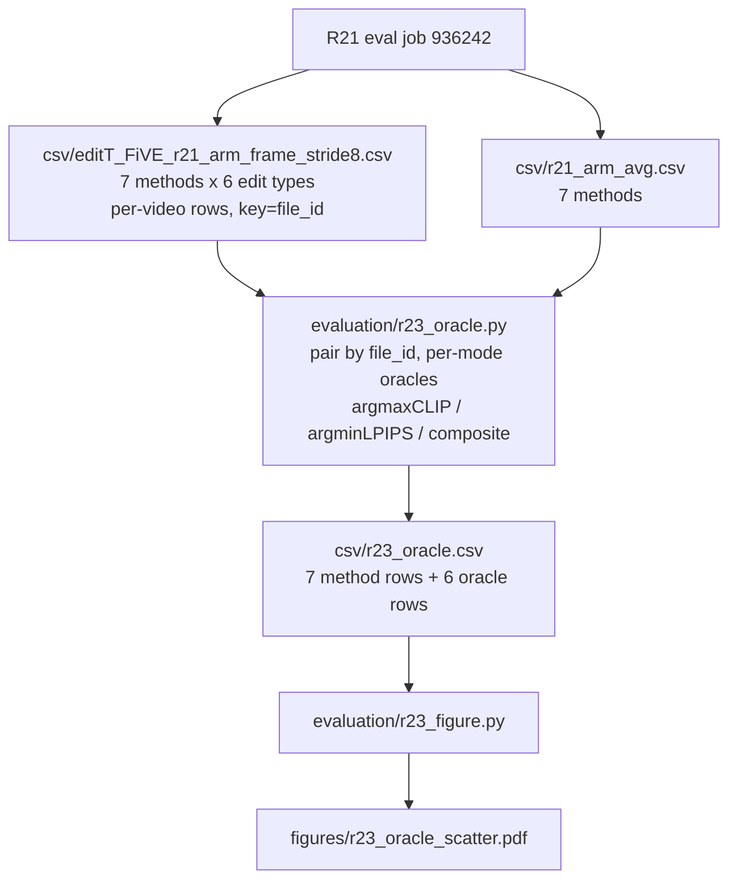

# R23: Per-video Scheduler Oracle

## Context

R21 scored three blend-rate schedules on the whole FiVE-Bench (419 pairs, 6 edit types) under two anchoring regimes: `paper` (Eq.4), `cos_third` and `zero`, each under `vp` and `pvp`, plus an un-anchored `novp` Eq.4 floor. Every arm is a single fixed schedule applied to every video. R23 asks what a per-video choice would have been worth: for each clip take the best-performing schedule, aggregate, and see where the resulting (avg CLIP, avg LPIPS) point sits relative to the fixed-schedule points.

The inputs already exist as a side product of R21's eval — `evaluate.py` writes a per-video CSV per (method, edit type) keyed by `file_id`, alongside the `_avg.csv` the workboard quotes. No inference and no GPU: R23 is a join, an argmax, and a plot.

This is an upper bound, not a method. It bounds what any per-video schedule router could achieve on this pool, and — via the spread of which schedule wins — says whether such a router would have anything to route.

**Done when:** `evaluation/figures/r23_oracle_scatter.pdf` exists, showing the 7 fixed-method points and the 6 oracle points (3 selection rules × 2 VP modes) in the (avg CLIP, avg LPIPS) plane, with the aggregation verified against R21's `_avg.csv` values to within 1e-3.

## Execution steps

| # | Step id | Type | What |
|---|---------|------|------|
| — | *(prep)* | — | `write-r23-oracle`, `write-r23-figure` — see **Code to touch** |
| 1 | `wait-r21-eval` | manual | R21 job 936242 done: 7 `_avg.csv`, 42 per-video CSVs, 0 `FAILED` |
| 2 | `oracle` | local | Join per-video rows, 3 oracle rules × 2 VP modes → `r23_oracle.csv` → `finished` |
| 3 | `figure` | local | CLIP-vs-LPIPS scatter → `r23_oracle_scatter.pdf` |
| 4 | `verdict` | manual | Record oracle-vs-best-fixed gap per axis in daily.md Outcomes → `analyzed` |

```
/run-step R23 wait-r21-eval
/run-step R23 oracle
/run-step R23 figure
/run-step R23 verdict
```

## Decisions

| Question | Choice |
|---|---|
| Scheduler pool | **R21 full bench only** — `paper` (Eq.4), `cos_third`, `zero`. Three schedules, 419 clips, all 6 edit types. |
| `cos_full` / `cos_half` / `const` | **Out of scope.** They exist only in R20, on a 22-clip subset over edit types 1/2/5/6. Mixing them in would build an oracle whose arms were evaluated on different clip sets; getting them to full bench is a new inference run, not an analysis. |
| VP-mode handling | **One oracle per VP mode**, over that mode's 3 schedules: `vp` = {`r21_ref_vp`, `r21_cos_third_vp`, `r21_zero_vp`}, `pvp` = {`r21_paper_pvp`, `r21_cos_third_pvp`, `r21_zero_pvp`}. No pooling across modes — the schedule and the anchor mechanism move the same quantity, so pooling would credit the oracle for switching anchoring. |
| `novp` | **No oracle** — only one novp arm exists at full bench (`r21_ref_novp`, R1 Eq.4). Plotted as a single grey reference point marking the no-anchoring floor. |
| Selection rules | Three, side by side per mode: **argmax CLIP**, **argmin LPIPS**, **composite** = `z(clip) − z(lpips)`. The two single-metric oracles bracket the achievable region; the composite is the only one that trades. |
| Composite standardization | z-scores over the pooled `clips × arms` observations **within one VP mode** (mean/std of each metric over all 3 arms × all clips of that mode), so the two axes are comparable and the score does not depend on which arm a clip came from. |
| CLIP axis | `clip_similarity_target_image` (whole-frame CLIP-T). `--clip_col` overridable to `clip_similarity_target_image_edit_part` for a masked variant; not run by default. |
| LPIPS axis | `lpips_unedit_part` (background preservation), the metric the schedules actually trade against CLIP. |
| Aggregation convention | **Mean over the 6 per-edit-type means**, replicating `evaluate.py`'s overall row — *not* a mean over the 419 clips (edit5 has 9 clips and edit1 has 100, so the two differ). Required for the oracle point to be on the same scale as the arm points it is plotted against. |
| Scaling | Replicate `evaluate.py`: `lpips_*` ×1000, CLIP unscaled. Per-video CSVs hold raw values; only `_avg.csv` is scaled. |
| Join key | `file_id` **within an edit type** — the enumerate index over `edit{T}_FiVE.json` (`evaluate.py:318`, `evaluation_result = [key]`). `video_name` is not in the per-video CSV, so the edit-type CSV filename supplies the other half of the key. |
| Column-shift guard | Assert `len(row) == len(header)` on every row. Upstream's `except: continue` (`evaluate.py:487-489`) drops a metric column and shifts every later one while still exiting 0 — this is how R20's `five_acc` was corrupted. CLIP (idx 7/8) and LPIPS (idx 3) sit **before** the crash-prone `niqe`/`motion_fidelity` columns, so a shift affecting them means an earlier metric failed and the row is unusable. |
| Pairing guard | Intersect `file_id` sets across a mode's 3 arms; oracle over the intersection only. Abort if >1% of clips are dropped — an unpaired oracle compares different clip sets per arm. |
| Aggregation gate | Recompute each arm's CLIP/LPIPS from its per-video rows and require agreement with `r21_{arm}_avg.csv` to within 1e-3 after scaling. This is the check that proves the convention above matches the harness rather than being assumed. |
| Out of scope | Per-video pick table, anti-oracle / random-schedule controls, the other 14 FiVE metrics, R20's 22-clip 6-schedule pool, per-edit-type oracle breakdown. |

## Step commands

### wait-r21-eval

```bash
sacct -j 936242 --format=JobID,State,Elapsed          # slurmdbd may be down; fall back to logs
grep -h '^\[r21_eval\] \(OK\|FAILED\)' logs/r21_eval_*.out   # expect 7 OK, 0 FAILED
ls evaluation/csv/r21_*_avg.csv | wc -l                # expect 7
ls evaluation/csv/edit*_FiVE_r21_*_frame_stride8.csv | wc -l  # expect 42 = 7 methods x 6 types
grep -c 'Error:' logs/r21_eval_*.metrics.log           # MUST be 0
```

### oracle

```bash
python evaluation/r23_oracle.py \
  --csv_dir evaluation/csv \
  --stem_prefix r21 \
  --clip_col clip_similarity_target_image \
  --lpips_col lpips_unedit_part \
  -o evaluation/csv/r23_oracle.csv
```

### figure

```bash
python evaluation/r23_figure.py \
  --oracle_csv evaluation/csv/r23_oracle.csv \
  -o evaluation/figures/r23_oracle_scatter.pdf
```

### verdict

```bash
column -s, -t evaluation/csv/r23_oracle.csv
# Record in daily.md Outcomes: per VP mode, the oracle's CLIP gain and LPIPS cost
# vs the best fixed schedule on each axis; whether the oracle sits outside the
# fixed-point hull; and how concentrated the winning-schedule counts are.
```

## Pipeline



## Code to touch

| File | Change |
|---|---|
| `evaluation/r23_oracle.py` | **New** — the join + oracle. Reads `{csv_dir}/edit{T}_FiVE_{stem_prefix}_{arm}_frame_stride8.csv` for T in 1..6 and the 7 R21 arms; columns are named `{method_dir}\|{metric}`, so resolve `--clip_col`/`--lpips_col` by suffix match rather than by a hardcoded prefix (the prefix is the arm's output-dir basename, which differs per arm). Emits `evaluation/csv/r23_oracle.csv`: one row per method (`vp_mode`, `schedule`, `avg_clip`, `avg_lpips`, `n_clips`) plus one per oracle (`vp_mode`, `rule` ∈ {`oracle_clip`, `oracle_lpips`, `oracle_composite`}, same columns, plus `picks_paper`/`picks_cos_third`/`picks_zero` counts so the figure's caption can state whether the oracle concentrates). |
| `evaluation/r23_figure.py` | **New** — matplotlib (`matplotlib.use("Agg")`, as in `r19_figures.py`), reads only `r23_oracle.csv`. Scatter: y = `avg_clip`, x = `avg_lpips` with the x-axis inverted so up-and-right is better on both axes. Colour = VP mode, marker = schedule, oracle points as stars. Annotate every point; grey the `novp` floor. → `evaluation/figures/r23_oracle_scatter.pdf`. |

Implementation notes:

- **Aggregation is the whole correctness surface.** The oracle point only means something if it is computed the same way as the points it is plotted against. `evaluate.py` writes its overall row as a mean of the six per-edit-type means (`evaluate.py:546-582`), and applies `lpips ×1000` at the per-edit-type averaging stage (`evaluate.py:521-532`). Replicate both, then assert the arm rows reproduce `r21_{arm}_avg.csv` to 1e-3 — if that assert fails, nothing downstream is trustworthy and the script must exit non-zero rather than emit a CSV.

- **The oracle must be paired.** Take the intersection of `file_id`s across a mode's three arms before selecting. `evaluate.py` skips clips whose `bmasks` are missing (`evaluate.py:302-305`) without writing a row, so the arms are not guaranteed to hold identical clip sets even though they rendered identically. An unpaired oracle would silently be an oracle over a different clip set than the arms it beats.

- **Short rows are unusable, not fixable.** Upstream appends no placeholder when a metric raises, so a dropped metric shifts every later column. Do not attempt to realign — record the `(file, file_id)` and fail. R21's eval was built to make these zero (H100 + `expandable_segments`, non-zero exit on any `Error:` line), so any short row means the eval did not actually come back clean and `wait-r21-eval` missed it.

- **Three schedules is a small pool, and the oracle inflates with pool size.** With 3 arms and a noisy per-clip metric, a per-video argmax gains something even if all three schedules are equivalent. The `picks_*` counts are the cheap read on this: near-uniform picks are what pure noise-chasing looks like, a concentrated distribution with a consistent minority is what real per-video structure looks like. State whichever it is in the verdict rather than reporting the gap alone.

- **The novp point is a floor, not a competitor.** It is R1's un-anchored Eq.4 render, on the plot only to show what anchoring buys. It takes part in no oracle.
