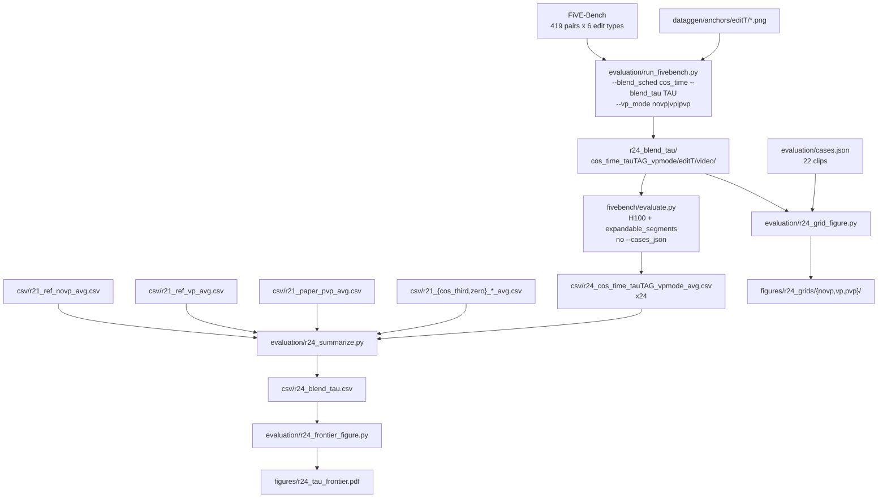

# R24: Cosine Blend-Rate Tau Sweep

## Context

StreamGVE's blender rate (Eq. 4) is implemented at [causal_model.py:334](../../Self-Forcing_StreamEdit/wan/modules/causal_model.py#L334) as `blender_rate = 1 - t_{i+1}**rho`, i.e. a source-anchoring weight `W_src(t) = t**rho` that decays on a fixed convex profile tied to the noise level. R20 replaced it with three cosine schedules indexed by *denoising step*; R24 replaces it with a cosine ramp indexed by *time*, with an explicit release-point parameter:

$$W^{src}(t_i) = 0.5\,\bigl(1 + \cos(\pi \cdot \mathrm{clip}((1 - t_i)/\tau,\, 0,\, 1))\bigr), \qquad r = 1 - W^{src}$$

`tau` is the fraction of the noise range over which the source anchor is released: the anchor is held near `t=1`, decays as a raised cosine, and reaches zero once `1 - t >= tau`. Six values are swept, `tau ∈ [1/6, 1/4, 1/3, 1/2, 3/4, 1]`, each under all three anchoring regimes (`novp`, `vp`, `pvp`), on the whole FiVE-Bench — 18 arms × 419 pairs.

`t` is read as `current_timestep_next`, the same quantity Eq. 4 raises to `rho`. With `--step 15` and `--flow_shift 1.0` the timestep warp is the identity, so the schedule sees `t_{i+1}/1000 = [0.933, 0.866, …, 0.066, 0]` and the six `W_src` curves are fully determined ahead of time — see the reference matrix in **Code to touch**. Two consequences are locked into the design. The sweep is bounded below by the step spacing: any `tau < 1 - t_1 = 1/15 ≈ 0.067` saturates the clip term before the first evaluation and collapses to `W_src ≡ 0` (exactly R21's `zero`), and `tau = 1/10` clears that bound by only one step, so both are excluded and the grid starts at `tau = 1/6`, the smallest value with more than one non-zero point. At the top end `tau = 1` holds *more* source than Eq. 4 over the first half of the trajectory before releasing faster than it at the end.

**Done when:** `evaluation/csv/r24_blend_tau.csv` holds the 16 FiVE metrics for all 18 arms with per-metric deltas against the matching VP-mode Eq. 4 reference, `evaluation/figures/r24_tau_frontier.pdf` places them in the (CLIP, LPIPS) plane as three tau-parametrized curves, and `figures/r24_grids/` holds the 66 qualitative grids.

## Execution steps

| # | Step id | Type | What |
|---|---------|------|------|
| — | *(prep)* | — | `plumb-cos-time`, `plumb-tau`, `extend-run-fivebench`, `write-smoke`, `write-infer`, `write-eval`, `write-summarize`, `write-frontier`, `write-grids` — see **Code to touch** |
| 1 | `smoke` | sbatch | Curve assertion + 3 bit-parity gates + 3-mode render |
| 2 | `wait-smoke` | manual | `CURVE-OK`, 3 × `IDENTICAL`, 3 × `[ok]` — hard gate before 18 arms |
| 3 | `infer-mid` | sbatch | Array 0-11 → tau {1/6, 1/4, 1/3, 1/2} × 3 VP modes (12 arms, 5028 pairs) → `running` |
| 4 | `wait-infer-mid` | manual | 419 frame dirs per arm, 0 failures |
| 5 | `infer-ends` | sbatch | Array 12-17 → tau {3/4, 1} × 3 VP modes (6 arms) |
| 6 | `wait-infer-ends` | manual | 419 frame dirs per arm; 18 arm dirs total → `finished` |
| 7 | `verify-refs` | local | Integrity-gate the three stored full-bench Eq.4 reference CSVs |
| 8 | `evaluate` | sbatch | Array 0-17, 16-metric `evaluate.py` on H100 with the metric-crash env fix |
| 9 | `wait-eval` | manual | 18 `_avg.csv`, 0 OOM, 0 niqe errors, CSV integrity |
| 10 | `summarize` | local | Join arms + references + R21 comparators → `r24_blend_tau.csv` |
| 11 | `frontier` | local | CLIP-vs-LPIPS tau curves → `r24_tau_frontier.pdf` |
| 12 | `grids` | local | 66 qualitative grids over the 22 `cases.json` clips |
| 13 | `verdict` | manual | Pareto reading + metrics/visuals cross-check → `analyzed` |

```
/run-step R24 smoke
/run-step R24 wait-smoke
/run-step R24 infer-mid
/run-step R24 wait-infer-mid
/run-step R24 infer-ends
/run-step R24 wait-infer-ends
/run-step R24 verify-refs
/run-step R24 evaluate
/run-step R24 wait-eval
/run-step R24 summarize
/run-step R24 frontier
/run-step R24 grids
/run-step R24 verdict
```

## Decisions

| Question | Choice |
|---|---|
| Schedule form | `W_src(t) = 0.5*(1 + cos(pi * clip((1 - t)/tau, 0, 1)))`, bridge gets `blender_rate = 1 - W_src`. Same sign convention as R20: the helper returns the **source** weight. |
| Which `t` | `t = shared_dict['current_timestep_next']` = `denoising_step_list[i+1]/1000`, the exact quantity Eq. 4 raises to `rho`. The tau arms and the baseline are then read at the same point of the trajectory — no one-step offset confound — and the last step is exactly `W_src = 0` (pure target), because `t_next = 0` there. |
| Rejected: `t = current_timestep` | The literal `t_i` reading. At `i = 0` it gives `t = 1000/1000 = 1` ⇒ `W_src = 1`, a **full-source blend on step 0 for every tau**, which makes all eight taus distinct (τ=1/20 becomes "one full-source step, then release" rather than `zero`). Rejected because it reads a different `t` than the Eq. 4 baseline it is compared against, and because τ=1 would end at `W_src = 0.01` instead of releasing to pure target. Note this convention is what R20's `cos_full`/`cos_half`/`cos_third` effectively used — they all start at `W_src = 1.00` while the Eq. 4 row they were scored against starts at 0.87, an inconsistency already present in the R20 table. |
| Parametrization | New schedule name `cos_time` + a separate `--blend_tau` float, **not** eight new `--blend_sched` choice strings. Keeps the choice list finite and makes an unswept tau a one-flag change. |
| tau grid | `[1/6, 1/4, 1/3, 1/2, 3/4, 1]` — six values × 3 VP modes = 18 arms. |
| **tau = 1/20 dropped** | At `step=15`/`flow_shift=1.0` the first evaluation is already at `1 - t_1 = 0.067 > 0.05`, so the clip term saturates before the sampler ever lands on the ramp and `W_src ≡ 0` everywhere: tau=1/20 is bit-identically R20/R21's `zero` schedule. Rendering it would re-derive an arm R21 already scored at full bench, so it is excluded from the sweep and R21's `zero_{vp,pvp}` rows serve as the tau→0 endpoint instead. It survives only as smoke gate 2, where the equivalence is the cheapest available proof that the `cos_time` branch actually reaches the bridge. |
| Lower bound of the sweep | Any `tau < 1 - t_1 = 1/N = 1/15 ≈ 0.067` degenerates for the same reason — the ramp is narrower than one denoising step. **tau=1/10 is also dropped:** it clears that bound by one step and carries a single non-zero point (`W_src = 0.25`), which is a perturbation of `zero` rather than a distinct schedule. The grid therefore starts at **tau=1/6**, the smallest value with more than one non-zero point (0.65, 0.09). Making the sub-1/6 region meaningful would require raising `--step`, which changes NFE and breaks comparability with every R1/R7/R20/R21 number — explicitly not done. |
| Missing `zero_novp` | R21 rendered `zero_vp` and `zero_pvp` at full bench but never `zero_novp`, so the novp curve has no rendered tau→0 endpoint. Accepted: the novp curve simply ends at tau=1/6. If the frontier figure needs the endpoint, it is one extra arm (`--blend_sched zero --vp_mode novp`), not a re-scope of R24. |
| Time vs index family | R20/R21's `cos_full`/`cos_half`/`cos_third` are the *index*-parametrized cousins (`p = i/(N-1)`), close to tau = 1, 1/2, 1/3 but not equal — `t_{i+1}` skips the `W_src = 1` point at `i = 0`, so no `cos_time` arm ever holds the source fully. R21's full-bench `cos_third_*` and `zero_*` rows are carried into the summary table as comparators, not as R24 arms. |
| Clip set | **Full FiVE-Bench**, all 6 edit types, 419 pairs (100/100/100/100/9/10), no `--cases_json`. Directly comparable to every R21 number. |
| Compute budget | 18 arms × ~10 h (R21's measured full-bench rate) ≈ **180 GPU-h inference** on L40S, plus 18 × ~5 h ≈ **90 GPU-h eval** on H100. Submitted in two chunks (12/6) rather than one 18-task array: R21 hit `QOSMaxSubmitJobPerUserLimit` on a 30-task submission, and the L40S partition holds ~20 GPUs total. |
| Phase order | Mid-range taus {1/6, 1/4, 1/3, 1/2} first — R20's verdict put the useful trade-off there — then the long-hold end {3/4, 1}. Each chunk is independently scoreable, so a truncated run still yields a usable curve. |
| Eq.4 references | **Reuse, do not re-render or re-evaluate:** `r21_ref_novp_avg.csv` (R1 baseline), `r21_ref_vp_avg.csv` (R7), `r21_paper_pvp_avg.csv` — all three are full-bench and were already scored under the R21 metric-crash fix (H100 + `expandable_segments`, job 937950). `verify-refs` gates that claim; only a failed gate adds reference tasks to `r24_eval.sh`. |
| Metric-crash environment | `r24_eval.sh` runs on **H100** with `PYTORCH_CUDA_ALLOC_CONF=expandable_segments:True`. This is the R21 fix for R20's 144 CoTracker OOMs and 140 niqe failures, which silently shifted CSV columns. **No code change to `evaluate.py` / `metrics_calculator.py`** — they stay byte-identical to upstream FiVE-Bench. |
| Known-expected metric error | `Error: motion_fidelity_score_edit_part` on `0010_giant-slalom` in edit types 1-4 is the empty-mask degeneracy (R2/R14/R21), written as `nan` by the `evaluate.py:487` patch. 4 per arm, identical across arms — not a gate failure. |
| Grid scope | Qualitative grids restricted to the **22 `evaluation/cases.json` clips** × 3 VP modes = 66 PNGs, not all 419 (which would be 1257). Same scope as R20's grids, so the two are readable side by side. 8 rows: Source + Eq.4 + the 6 taus. |
| Sampler config | `--step 15`, `--flow_shift 1.0`, `--fg_boost_factor 4`, `--blend_power 2`, `--seed 0`, `rollout_chunk_size=21`, `rollout_overlap_block_num=1`, `sink_size=0` — the `run_fivebench.py` defaults shared by R1/R7/R20/R21. `blend_power` is inert under `cos_time` but is left at 2 so the flag record matches the references. |
| Arm naming | `cos_time_tau{TAG}_{vp_mode}` with `TAG ∈ {0p167, 0p250, 0p333, 0p500, 0p750, 1p000}` — zero-padded decimals so the arms sort in tau order. Output root `/projects/dataggen/outputs/five_bench/r24_blend_tau`, never mixed with `r21_blend_full`. |
| Default behaviour | `blend_sched=None` ⇒ Eq. 4 unchanged, bit-for-bit; `blend_tau` is ignored unless `blend_sched=cos_time`, and supplying it with any other schedule is a hard error rather than a silent no-op. |
| Out of scope | Per-video tau routing (that is R23's oracle extended to these 6 schedules), per-frame tau, head-gated `pvp`, other `rho` values for Eq. 4, re-rendering any R21 arm. |

## Step commands

### smoke

```bash
sbatch slurm_scripts/five_bench/r24_smoke.sh
```

### wait-smoke

```bash
tail -60 logs/r24_smoke_{job_id}.out
grep '^CURVE-OK'      logs/r24_smoke_{job_id}.out   # 6x15 W_src matrix matches reference
grep -c '^IDENTICAL'  logs/r24_smoke_{job_id}.out   # expect 3
grep -c '^\[ok\]'     logs/r24_smoke_{job_id}.out   # expect 3 (tau=0.5 on novp/vp/pvp)
```

### infer-mid

```bash
sbatch --array=0-11 slurm_scripts/five_bench/r24_infer.sh
```

### wait-infer-mid

```bash
sacct -j {job_id} --format=JobID,State,Elapsed
OUT=/projects/dataggen/outputs/five_bench/r24_blend_tau
for a in "$OUT"/cos_time_tau0p167_* "$OUT"/cos_time_tau0p250_* \
         "$OUT"/cos_time_tau0p333_* "$OUT"/cos_time_tau0p500_*; do
  echo "$(basename "$a") $(ls -d "$a"/*/*/ 2>/dev/null | grep -vc '_resize/$')"   # 419 each
done
grep -h 'failures:' logs/r24_infer_*.out
```

### infer-ends

```bash
sbatch --array=12-17 slurm_scripts/five_bench/r24_infer.sh
```

### wait-infer-ends

```bash
sacct -j {job_id} --format=JobID,State,Elapsed
OUT=/projects/dataggen/outputs/five_bench/r24_blend_tau
for a in "$OUT"/cos_time_tau0p750_* "$OUT"/cos_time_tau1p000_*; do
  echo "$(basename "$a") $(ls -d "$a"/*/*/ 2>/dev/null | grep -vc '_resize/$')"   # 419 each
done
ls -d "$OUT"/cos_time_tau*/ | wc -l    # expect 18 arm dirs, all renders complete
```

### verify-refs

```bash
python - <<'PY'
import csv, pathlib
for stem in ("r21_ref_novp", "r21_ref_vp", "r21_paper_pvp"):
    p = pathlib.Path(f"evaluation/csv/{stem}_avg.csv")
    rows = list(csv.reader(p.open()))
    w = len(rows[0])
    bad = [i for i, r in enumerate(rows) if len(r) != w]
    nan = [c for c in rows[-1] if c.strip().lower() == "nan"]
    print(stem, "cols", w, "misaligned", bad, "nan", nan)
PY
```

### evaluate

```bash
sbatch --array=0-17 slurm_scripts/five_bench/r24_eval.sh
```

### wait-eval

```bash
ls evaluation/csv/r24_cos_time_tau*_avg.csv | wc -l          # expect 18
grep -c 'out of memory' logs/r24_eval_*.metrics.log          # MUST be 0
grep -c 'Error: niqe'   logs/r24_eval_*.metrics.log          # MUST be 0
grep -h 'Error: motion_fidelity_score_edit_part' logs/r24_eval_*.metrics.log | wc -l   # 4/arm, expected
python - <<'PY'
import csv, glob
for f in sorted(glob.glob("evaluation/csv/r24_cos_time_tau*_avg.csv")):
    rows = list(csv.reader(open(f))); w = len(rows[0])
    print(f.split('/')[-1], w, [i for i, r in enumerate(rows) if len(r) != w])
PY
```

### summarize

```bash
python evaluation/r24_summarize.py \
  --arm_csv_glob 'evaluation/csv/r24_cos_time_tau*_avg.csv' \
  --ref_novp evaluation/csv/r21_ref_novp_avg.csv \
  --ref_vp evaluation/csv/r21_ref_vp_avg.csv \
  --ref_pvp evaluation/csv/r21_paper_pvp_avg.csv \
  --extra_csv_glob 'evaluation/csv/r21_{cos_third,zero}_*_avg.csv' \
  -o evaluation/csv/r24_blend_tau.csv
```

### frontier

```bash
python evaluation/r24_frontier_figure.py \
  --summary_csv evaluation/csv/r24_blend_tau.csv \
  --clip_col clip_similarity_target_image \
  --lpips_col lpips_unedit_part \
  -o evaluation/figures/r24_tau_frontier.pdf
```

### grids

```bash
python evaluation/r24_grid_figure.py \
  --out_root /projects/dataggen/outputs/five_bench/r24_blend_tau \
  --ref_root /projects/dataggen/outputs/five_bench \
  --cases_json evaluation/cases.json \
  --n_frames 5 \
  -o figures/r24_grids
```

### verdict

```bash
xdg-open evaluation/figures/r24_tau_frontier.pdf
ls figures/r24_grids/{novp,vp,pvp}/ | head
column -s, -t evaluation/csv/r24_blend_tau.csv | less -S
```

## Pipeline



## Code to touch

| File | Change |
|---|---|
| `Self-Forcing_StreamEdit/pipeline/utils.py` | `_schedule_blend_rate(sched, step_idx, num_steps, t_next=None, tau=None)` — add the `cos_time` branch; existing branches untouched. |
| `Self-Forcing_StreamEdit/pipeline/edit_causal_inference.py` | Add `blend_tau: Optional[float] = None` to `rollout_inference` (:97) and `inference` (:292); forward at the two window-loop call sites (:135, :197). |
| `Self-Forcing_StreamEdit/pipeline/edit_causal_inference.py` | At the schedule hook (:554) pass `t_next=timestep_next, tau=blend_tau` into the helper. |
| `evaluation/run_fivebench.py` | Add `"cos_time"` to `--blend_sched` choices, add `--blend_tau` (float, default `None`), cross-validate the pair, forward `blend_tau` into the pipeline call (:322). |
| `slurm_scripts/five_bench/r24_smoke.sh` | **New** — curve assertion + 3 sha256 parity gates + 3-mode render. L40S, `--mem=64G`, `--time=02:00:00`. |
| `slurm_scripts/five_bench/r24_infer.sh` | **New** — `--array=0-17`, one arm per task looping all 6 edit types. L40S, `--mem=64G`, `--time=20:00:00`. `OUT_ROOT=/projects/dataggen/outputs/five_bench/r24_blend_tau`. |
| `slurm_scripts/five_bench/r24_eval.sh` | **New** — `--array=0-17`, one method per task. H100, `--mem=64G`, `--time=20:00:00`, `export PYTORCH_CUDA_ALLOC_CONF=expandable_segments:True`. No `--cases_json`. |
| `evaluation/r24_summarize.py` | **New** — adapted from `r21_summarize.py`; join arms + 3 references + R21 comparators into `evaluation/csv/r24_blend_tau.csv`. |
| `evaluation/r24_frontier_figure.py` | **New** — CLIP-vs-LPIPS tau curves, one per VP mode. |
| `evaluation/r24_grid_figure.py` | **New** — adapted from `r20_grid_figure.py`; 10 rows × 5 frames, 22 clips × 3 modes. |

Schedule helper, extending the R20 function in place:

```python
def _schedule_blend_rate(sched: str, step_idx: int, num_steps: int,
                         t_next: float | None = None,
                         tau: float | None = None) -> float:
    """Source-anchoring weight s in [0, 1]; caller sets blender_rate = 1 - s.

    R20 schedules index by denoising STEP; R24's `cos_time` indexes by the
    noise level t_{i+1} -- the same quantity Eq. 4 raises to rho.
    """
    #✨ R24: time-parametrized cosine ramp. tau is the fraction of the noise
    # range over which the source anchor is released. Held at t=1, zero once
    # 1 - t >= tau. At step=15 / flow_shift=1.0 the first evaluation is already
    # at 1 - t_1 = 0.067, so any tau < 1/N saturates the clip before the sampler
    # lands on the ramp and degenerates exactly to `zero`. tau=1/10 clears that
    # bound by one step only, so the swept grid starts at tau=1/6.
    if sched == "cos_time":
        if t_next is None or tau is None:
            raise ValueError("cos_time needs both t_next and tau")
        if not (tau > 0.0):
            raise ValueError(f"cos_time needs tau > 0, got {tau!r}")
        x = min(1.0, max(0.0, (1.0 - t_next) / tau))
        return 0.5 * (1.0 + math.cos(math.pi * x))

    p = 0.0 if num_steps <= 1 else step_idx / (num_steps - 1)
    if sched == "cos_full":
        return 0.5 * (1.0 + math.cos(math.pi * p))
    ...  # cos_half / cos_third / const / zero unchanged
```

Pipeline hook, replacing the `shared_dict_dual['blender_rate']` write at `edit_causal_inference.py:554`:

```python
shared_dict_dual['blender_rate'] = (
    None if blend_sched in (None, "paper")
    else 1.0 - _schedule_blend_rate(
        blend_sched, index, len(denoising_step_list),
        t_next=timestep_next, tau=blend_tau,
    )
)
```

`run_fivebench.py` flag pair, validated together right after `parse_args`:

```python
if args.blend_sched == "cos_time" and args.blend_tau is None:
    raise SystemExit("[run_fivebench] --blend_sched cos_time requires --blend_tau")
if args.blend_tau is not None and args.blend_sched != "cos_time":
    raise SystemExit(
        f"[run_fivebench] --blend_tau is only meaningful with --blend_sched "
        f"cos_time, got {args.blend_sched!r} -- refusing to silently ignore it"
    )
```

Arm table for `r24_infer.sh` (`TAUS`/`TAGS` parallel arrays; arm index = `3*tau_index + vp_index`, phases contiguous):

```bash
TAUS=(0.1666666667 0.25  0.3333333333 0.5   0.75  1.0)
TAGS=(0p167        0p250 0p333        0p500 0p750 1p000)
VPS=(novp vp pvp)
#  0-11 phase 1 (mid: 1/6, 1/4, 1/3, 1/2)   12-17 phase 2 (ends: 3/4, 1)
TID=${SLURM_ARRAY_TASK_ID}
TAU=${TAUS[$((TID / 3))]}; TAG=${TAGS[$((TID / 3))]}; VP=${VPS[$((TID % 3))]}
METHOD="cos_time_tau${TAG}_${VP}"
```

Reference `W_src` matrix for the `smoke` curve assertion — `--step 15`, `--flow_shift 1.0`, `t_next = [0.933, 0.866, 0.800, 0.733, 0.666, 0.600, 0.533, 0.466, 0.400, 0.333, 0.266, 0.200, 0.133, 0.066, 0.0]`:

```
  tau |  W_src per denoising step                                                     | non-zero
  1/6 | 0.65 0.09 0.00 0.00 0.00 0.00 0.00 0.00 0.00 0.00 0.00 0.00 0.00 0.00 0.00    |  2
  1/4 | 0.83 0.44 0.10 0.00 0.00 0.00 0.00 0.00 0.00 0.00 0.00 0.00 0.00 0.00 0.00    |  3
  1/3 | 0.90 0.65 0.35 0.09 0.00 0.00 0.00 0.00 0.00 0.00 0.00 0.00 0.00 0.00 0.00    |  4
  1/2 | 0.96 0.83 0.65 0.45 0.25 0.10 0.01 0.00 0.00 0.00 0.00 0.00 0.00 0.00 0.00    |  7
  3/4 | 0.98 0.92 0.83 0.72 0.59 0.45 0.31 0.19 0.10 0.03 0.00 0.00 0.00 0.00 0.00    | 11
    1 | 0.99 0.96 0.90 0.83 0.75 0.65 0.55 0.45 0.35 0.25 0.16 0.10 0.04 0.01 0.00    | 14
------+-------------------------------------------------------------------------------+---------
paper | 0.87 0.75 0.64 0.54 0.44 0.36 0.28 0.22 0.16 0.11 0.07 0.04 0.02 0.00 0.00    | 15  (Eq.4, rho=2)
 1/10 | 0.25 0.00 0.00 0.00 0.00 0.00 0.00 0.00 0.00 0.00 0.00 0.00 0.00 0.00 0.00    |  1  (dropped, 1 point)
 zero | 0.00 0.00 0.00 0.00 0.00 0.00 0.00 0.00 0.00 0.00 0.00 0.00 0.00 0.00 0.00    |  0  (R21 arm = tau<=1/15)
```

Implementation notes:

- **`run_fivebench.py` is shared with R1/R7/R20/R21.** `--blend_tau` must default to `None` and must not reach the pipeline unless `cos_time` is selected; the `smoke` non-regression gate (defaults ⇒ `five_bench/baseline`, `cos_third --vp_mode vp` ⇒ `r21_blend_full/cos_third_vp`) is what proves it, and a failure there invalidates the R21 comparators, not the R24 arms.
- **`novp` arms must omit `--first_frame_edit_dir`.** `run_fivebench.py:198` forces `vp_mode="novp"` when the anchor dir is absent, which is the intended path — passing both would still work but makes the log ambiguous.
- The prev-key blend at `causal_model.py:371` writes **in place into a view of `kv_cache["k"]`**, so source keys accumulate in the target cache across steps within a block. A small tau stops *adding* source but does not *undo* what earlier steps injected. Expect the low-tau arms to separate less than the `W_src` curves suggest — report it, do not "fix" it.
- Eq. 4 and `cos_time` cross over: tau=1 holds more source than the paper for roughly the first eight steps and less thereafter, while every tau ≤ 1/2 releases far earlier throughout. If the metrics still order monotonically in tau, that is R20's single preservation↔editability knob reappearing at full-bench scale, and the interesting result is the *shape* of the curve, not a winner.
- `0034_cows` (24 latent frames) is the clip that splits windows under `pvp` at `rollout_chunk_size=21` — the only real test that the persistent anchor bank is rebuilt across a window boundary. Watch it specifically in the `pvp` grids.
- `--extra_csv_glob` in `r24_summarize.py` uses brace expansion; if the shell does not expand it inside quotes, pass the two globs separately rather than relying on `glob.glob` to handle braces (it does not).
