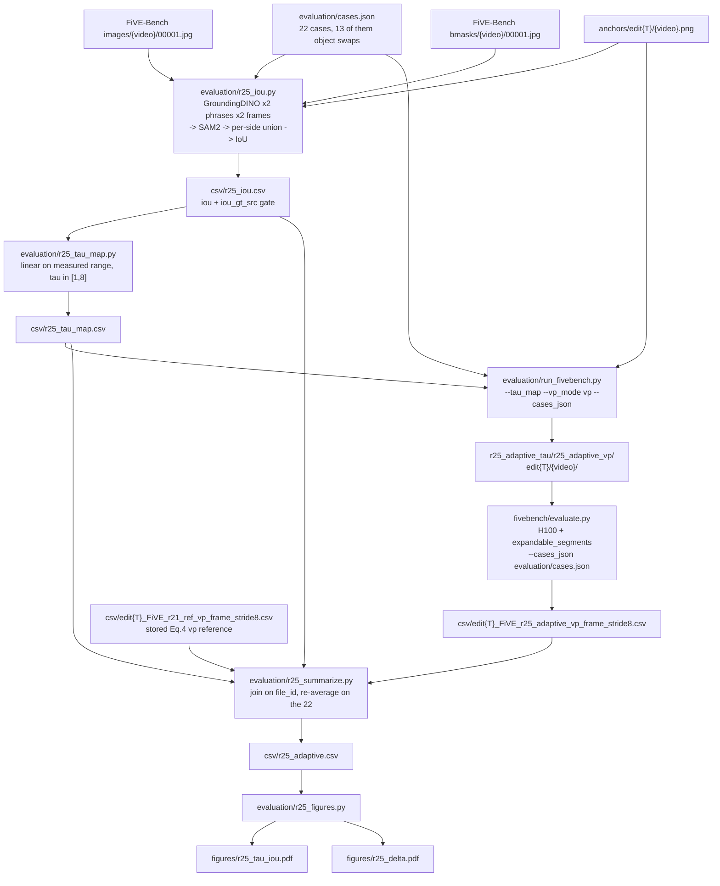

# R25: IoU-Driven Adaptive Tau

## Context

StreamGVE's blender rate (Eq. 4) is implemented at [causal_model.py:334](../Self-Forcing_StreamEdit/wan/modules/causal_model.py#L334) as `blender_rate = 1 - t_{i+1} ** blend_power`, i.e. a source-anchoring weight

$$W^{src}(t_i) = t_i^{\tau}, \qquad r = 1 - W^{src}$$

with a single global exponent `tau = blend_power = 2` for every video and every token. Because `t in (0, 1)`, `t**tau` *decreases* in tau: a large tau releases the source anchor fast, a small tau holds it. The curve family is [f_t_power_tau_comparison.png](../f_t_power_tau_comparison.png).

R25 makes that exponent a property of *the edit*. The driver is the shape change the edit demands, measured once on clean pixels before any denoising, as the IoU between the region the edited content occupies in the source first frame and in the Qwen anchor:

$$\tau = f\bigl(\mathrm{IoU}(I_0, I_{0,\mathrm{edit}})\bigr), \qquad \mathrm{IoU} \to 1 \Rightarrow \tau_{\min}, \quad \mathrm{IoU} \to 0 \Rightarrow \tau_{\max}$$

A colour edit leaves the silhouette intact (IoU near 1) and should stay anchored to the source; a person-to-lion swap needs the silhouette to move (low IoU) and should release early. **One phrase is grounded per side** (revised 2026-08-26): `M_src = m(src_word, I0)` on the source frame and `M_edit = m(trg_word, anchor)` on the anchor. The original design unioned both phrases on both images, on the assumption that a phrase naming something absent would contribute nothing to that side — but GroundingDINO never abstains, and measuring it on this case set showed all four groundings firing on 22/22 cases with the "absent" phrase scoring up to 0.94, so the union added a false positive everywhere and broke worst on the add/remove cases it existed for. Only type 6 (removal) is handled by construction: `M_edit` is set empty so a removal reads as IoU = 0, the maximal shape change. **Type 5 (addition), revised 2026-09-01:** an earlier version also unioned `M_edit` with `M_src` so an addition would read as regional growth (`M_src` = SUV, `M_edit` = SUV ∪ flamingo on 0069_car-turn) rather than as a disjoint new object; that union has been reverted, and `M_edit = m(trg_word, anchor)` alone for type 5, exactly as for a swap. Consequence: since IoU_hi in the completed run was set by a type-5 case (`0007_guitar-violin`, 0.957) and is expected to drop once measured without the union, the measured-range normalization shifts and every case's tau — not only the three addition cases — needs to be re-derived and every arm re-rendered.

`f` is linear over the *measured* IoU range with `tau_min = 2`, `tau_max = 10` (revised 2026-08-26). `tau_min = 2` pins the mildest edits at the Eq. 4 default rather than bracketing it, so the arm only ever releases the source *at least* as fast as the paper baseline, never slower.

This is the per-video scalar counterpart of a per-token field. An earlier per-token implementation ("R25 V0" — `build_rho_field`, `--edit_field/--rho_min/--rho_max`) was removed from the tree on 2026-08-26, so nothing of it remains to build on or conflict with; the three self-attention blend sites are back to the pristine scalar `blender_rate` ([causal_model.py:371-399](../Self-Forcing_StreamEdit/wan/modules/causal_model.py#L371-L399)). This task therefore needs no pipeline change at all — it only varies the existing `blend_power` per pair. R26 is the spatial counterpart.

**Done when:** `evaluation/csv/r25_adaptive.csv` holds the scored FiVE metrics per case (9 in the phase-1 run; see the metric-environment row) for the adaptive arm and the Eq. 4 vp reference re-averaged over the same 22 cases, with per-metric deltas; `evaluation/figures/r25_tau_iou.pdf` shows the realized IoU-to-tau mapping by edit type; `evaluation/figures/r25_delta.pdf` shows whether the per-case gain tracks `|tau - 2|`.

## Execution steps

| # | Step id | Type | What |
|---|---------|------|------|
| — | *(prep)* | — | `write-iou`, `write-taumap`, `plumb-taumap`, `write-smoke`, `write-infer`, `write-eval`, `write-summarize`, `write-figure` — see **Code to touch** |
| 1 | `iou` | srun | Both phrases × both frames → SAM2 masks → per-side union → `r25_iou.csv` |
| 2 | `check-iou` | manual | GT-mask agreement ≥ 0.7, firing pattern matches each edit, type 3/4 separate from type 2, add/remove strictly below 1.0 — hard gate before any render |
| 3 | `taumap` | local | Linear map on the measured IoU range → `r25_tau_map.csv` |
| 4 | `smoke` | sbatch | Override reaches `blend_power`; non-degenerate; coverage error raises |
| 5 | `wait-smoke` | manual | 1 × `IDENTICAL`, 1 × `DIFFERS`, 1 × `COVERAGE-OK` |
| 6 | `infer` | sbatch | Array 0-5, one edit type per task, 22 cases, vp mode → `running` |
| 7 | `wait-infer` | manual | 1/13/2/2/3/1 frame dirs, 0 failures, logged tau matches the map → `finished` |
| 8 | `evaluate` | sbatch | `evaluate.py` on L40S,A100 with the metric-crash env fix and a 9-metric `--metrics` list |
| 9 | `wait-eval` | manual | 6 `_avg.csv`, 0 OOM, 0 niqe errors, 0 motion-fidelity errors |
| 10 | `summarize` | local | Join on `file_id` vs stored R21 vp reference → `r25_adaptive.csv` |
| 11 | `figures` | local | Mapping page + per-case delta-vs-`\|tau-2\|` page |
| 12 | `verdict` | manual | Attribution reading → `analyzed` |

```
/run-step R25 iou
/run-step R25 check-iou
/run-step R25 taumap
/run-step R25 smoke
/run-step R25 wait-smoke
/run-step R25 infer
/run-step R25 wait-infer
/run-step R25 evaluate
/run-step R25 wait-eval
/run-step R25 summarize
/run-step R25 figures
/run-step R25 verdict
```

## Phase 2 — attribution controls

Phase 1 answered *does this arm beat Eq. 4* (yes on edit alignment, 15/22 cases positive,
sign test p = 0.134). It could not answer *does the IoU routing produce that gain*, because
the arm changed the tau values and their assignment at the same time.

Two arms, one 22-clip render each, settle it. Everything else — seed 0, anchors,
`cases_json`, sampler defaults, the 9-metric `--metrics` list — is held identical, so the
arms differ **only** in the tau assignment.

| arm | tau assignment | question it answers | if it matches adaptive |
|---|---|---|---|
| `adaptive` | IoU → tau (phase 1, done) | — | — |
| `reversed` | same 22 values, inverted pairing | does the **pairing** carry signal? | the IoU routing contributes nothing |
| `constant` | tau = 6.57 for every pair | does **varying** tau help at all? | the IoU machinery is unnecessary |

The two contrasts are independent and both are needed: `constant` could match adaptive even
if the pairing carries real signal (a flat optimum), and `reversed` could differ from
adaptive even if a single constant would do just as well.

```
/run-step R25 control-maps
/run-step R25 check-control-maps
/run-step R25 control-infer
/run-step R25 wait-control-infer
/run-step R25 control-eval
/run-step R25 wait-control-eval
/run-step R25 control-summarize
/run-step R25 control-verdict
```

## Phase 3 — type-5 addition mask fix

At the user's request (2026-09-01), type 5 (addition) is no longer handled by construction.
`M_edit` was `m(trg_word, anchor) | M_src` — the edited region read as the source object
plus what was added, e.g. `0069_car-turn`: SUV ∪ flamingo. It is now `m(trg_word, anchor)`
alone, exactly the swap formula, so an added object that is spatially disjoint from the
source (the common case) now reads a low IoU close to a swap's rather than a "grew"
reading.

**This is not scoped to the 3 addition clips.** `IoU_hi` in the completed run was `0.957`,
set by `0007_guitar-violin` — a type-5 case. The tau map is linear on
`[IoU_lo, IoU_hi]`, so if the re-measured type-5 IoU no longer sets that endpoint (expected:
a hat mask alone should share far less area with the musician mask than the old union did),
**every case's tau shifts**, not only the addition cases — and both phase-2 control renders
(`reversed`, `constant`) inherit the same tau multiset by construction, so they are
implicated too. `check-reiou` makes this an explicit gate rather than an assumption before
anything is re-rendered.

| step | what |
|---|---|
| `reiou` | Re-run `r25_iou.py` with the type-5 union removed |
| `check-reiou` | Gate: did `IoU_hi`/`IoU_lo` move? Decides whether the re-render is 3 clips or 66 (3 arms × 22) |
| `retaumaps` | Re-derive all three tau maps (`iou`/`reversed`/`constant`) from the new IoU |
| `reinfer` | Re-render `adaptive`, `reversed`, `constant` — supersedes jobs 962628/962629 |
| `reeval` → `resummarize` → `refigures` | Same scripts as phases 1-2, re-pointed at the new renders |
| `type5-verdict` | Does the fix change which cases anchor the map, and does that move the overall verdict |

```
/run-step R25 reiou
/run-step R25 check-reiou
/run-step R25 retaumaps
/run-step R25 check-retaumaps
/run-step R25 reinfer
/run-step R25 wait-reinfer
/run-step R25 reeval
/run-step R25 wait-reeval
/run-step R25 resummarize
/run-step R25 refigures
/run-step R25 type5-verdict
```

## Decisions

| Question | Choice |
|---|---|
| What `tau` is | The Eq. 4 exponent `blend_power`, `W_src = t_{i+1} ** tau`. **Not** R24's cosine release-point tau, which is a different parametrization of the same bridge; R25 does not depend on R24 landing. |
| **How tau reaches the model (premise corrected)** | Per-case override of **`blend_power`**, via a new `--tau_map` CSV. The chosen option was originally phrased as "`--rho_min = --rho_max`", but those flags belonged to the R25 V0 per-token path, which was **removed from the tree on 2026-08-26** — so they no longer exist at all. `blend_power` *is* the global per-video exponent, read directly as `1 - t**blend_power` at [causal_model.py:334](../Self-Forcing_StreamEdit/wan/modules/causal_model.py#L334). Same intent, and now the only knob. |
| Mapping `f` | Linear on the **measured** IoU range: `tau = tau_max - (tau_max - tau_min) * (iou - IoU_lo)/(IoU_hi - IoU_lo)`, `IoU_lo/hi` = min/max over the 22 cases. |
| `tau_min`, `tau_max` | **`2.0` and `10.0`** (revised 2026-08-26 from `1.0`/`12.0`). `tau_min = 2` places the highest measured IoU exactly at the Eq. 4 default `blend_power = 2`, so a near-silhouette-preserving edit behaves like the paper baseline instead of holding the source *longer* than it. **Consequence, accepted deliberately:** the arm is now one-directional — every case gets `tau >= 2`, so it can only ever release faster than Eq. 4, and the converse hypothesis (that a colour or material edit benefits from holding the source longer than the default) is no longer testable within this arm. Under the previous `[1, 12]` map two cases sat below 2 (`0007_guitar-violin` 1.00, `0017_kid-football` 1.57) and did test it. `tau_max = 10` pulls the fast end back from 12 toward the range where preservation has been measured. |
| ⚠️ `tau_max` is still set blind | Nothing between Eq. 4 (`rho = 2`) and full release has ever been scored. The only measured point in the fast direction is R21's `zero` schedule, at **LPIPS 143.0 against `ref_vp`'s 53.6** — ~3x worse background preservation. Integrated source mass over the 15 steps: `tau=1` 7.00, `tau=2` **4.51**, `tau=8` 1.21, `tau=12` 0.72, `zero` 0.00. `tau_max = 10` therefore sits between the 1.21 and 0.72 anchors — still much nearer `zero` than Eq. 4 in integrated terms, so the low-IoU cases routed there may still hit preservation collapse. Lowering 12 → 10 narrows that exposure without removing it; the value remains extrapolation from one endpoint, not a measurement. Cheap mitigation, already in the pipeline: `taumap` prints the realized per-case tau and `check-iou` reads it **before** anything renders. |
| Consequence: the arm is also a "release faster" arm | The map is linear in tau, so a mid-range IoU lands near `tau ≈ 6.5` against Eq. 4's `2` — most cases are routed to substantially faster release than the reference. If the arm wins, *"releasing faster helps on a swap-heavy set"* competes with *"adaptive routing helps"* as an explanation, and with Eq. 4 as the sole comparator they are not separable. This compounds the attribution ceiling recorded below rather than being a separate issue; `r25_delta.pdf` (gain vs `|tau - 2|`) is the only partial discriminator in scope. |
| Why the measured range, not `[0, 1]` | Object swaps still occupy roughly the same image region, so their IoU does not approach 0 (expected floor ~0.4-0.7), while colour/material edits sit near 1.0. On a nominal `[0, 1]` domain the realized tau spread would be a fraction of `[1, 12]` and the arm would be far less adaptive than intended. **Note the removal case pins `IoU_lo = 0` by construction** (`0042_gym-ball` reads exactly 0 after the `src_word` fix), so at the low end the measured range coincides with the nominal one; the anchoring still matters at the top, where `IoU_hi ≈ 0.95` rather than 1.0. Cost: `f` is calibrated on this case set and is not transferable as-is to a different one. |
| IoU definition | **One phrase per side** (revised 2026-08-26). `M_src = m(src_word, I0)`; `M_edit = m(trg_word, anchor)` for types 1-5, and **empty** for type 6. GroundingDINO box → SAM2 mask, `--box_thr 0.35`. |
| Rejected: symmetric two-phrase union | The original design, **removed after measuring it**. It assumed a phrase naming something absent would drop out of that side's union. GroundingDINO does not abstain — at `box_thr 0.25` all 4 groundings fired on **22/22** cases, and the phrase that should have been absent scored up to **0.94** (`'A dragon'` on the unedited cow), higher than most genuine detections, so no global threshold separates them (should-fire cells run down to 0.28). The union therefore injected a false positive on every case and failed hardest on the add/remove cases it was introduced to serve. Rephrasing does not rescue it either: narrowing `0007_guitar-violin`'s `trg_word` to `'wearing a hat'` moved the false positive from the violinist to the seated guitarist rather than removing it. |
| Remove handled by construction | Type 6 sets `M_edit` empty, so IoU is **exactly 0** → `tau_max`, the maximal shape change, which is the correct reading of a removal. ⚠ Type 6 is now an **assumption, not a measurement**: the row reads 0 whether or not the anchor actually removed the object, which forfeits the free anchor-quality check the two-phrase design had. |
| **Reverted: type-5 union with `M_src`** (2026-09-01) | Type 5 (addition) was originally **also** handled by construction, on the same reasoning as removal: `M_edit = m(trg_word, anchor) \| M_src`, so the edited region read as the source object PLUS what was added (`0069_car-turn`: `M_src` = SUV, `M_edit` = SUV ∪ flamingo), and the IoU measured how much the region **grew** rather than how much it moved. **Reverted at user request**: type 5 is now measured identically to a swap — `M_edit = m(trg_word, anchor)` alone, no union — so an addition whose new object is spatially disjoint from the source (a flamingo strapped to an SUV roof, a hat on a musician's head) reads a low IoU close to a swap's, rather than the earlier "regional growth" reading. |
| ⚠️ Consequence: the measured-range normalization shifts, not just the 3 addition cases' tau | `tau_min`/`tau_max` are anchored on the **measured** `IoU_lo`/`IoU_hi` over all 22 cases (see the "Why the measured range" row below), and in the completed 2026-08-27 run `IoU_hi = 0.957` was set by a **type-5 case**, `0007_guitar-violin` (next-highest was `0017_kid-football`, type 3, at 0.908). Once `M_edit` no longer unions with `M_src`, that case's IoU is expected to **drop** — the hat mask alone overlaps the musician mask far less than SUV∪flamingo overlaps SUV — which very likely moves `IoU_hi` down. Because the tau map is **linear** on `[IoU_lo, IoU_hi]`, changing either endpoint changes **every** case's tau, not only the three type-5 cases (`0007_guitar-violin`, `0069_car-turn`, `0011_lucia_e5`). "Re-run the videos involving addition" is therefore necessary but is **not sufficient** for a rigorous re-render — `check-iou`'s new gate (4) makes the range-shift check explicit before `taumap` is re-run, and the phase-3 plan below re-renders the full 22-case arm accordingly. This also invalidates the **in-flight phase-2 controls** (`reversed`/`constant`, jobs 962628/962629): both were derived from the old tau multiset via `--assign reversed/constant`, so once the multiset changes those renders are stale and must not be evaluated as-is. |
| Rejected: CLIPSeg grounding | `CIDAS/clipseg-rd64-refined` is also cached and was the first pick when GroundingDINO appeared to be absent. Rejected once `IDEA-Research/grounding-dino-*` was found in the HF cache: CLIPSeg emits a 352×352 heatmap needing a threshold and a connected-component heuristic to become a box, and that threshold silently sets object extent — the exact quantity IoU measures. GroundingDINO returns a scored box directly, so the mask is not a function of a hand-tuned cutoff. |
| Detection failure handling | A phrase that does not fire is now a **hard failure**, not a silent empty contribution — the opposite of the two-phrase design, where non-firing WAS the mechanism. `src_word` missing on the source is always fatal (no `M_src`). `trg_word` missing on the anchor is fatal for types 1-5: for a swap it would read IoU = 0 and route to `tau_max` on a detector miss rather than on the edit, and for an addition it would read IoU = 1 and hide the addition entirely. Type 6 grounds nothing on the anchor and so cannot fail this way. |
| Single best-scoring box | **Now the design**, one box per side. The earlier objection — that it cannot describe types 5/6, which involve two objects — is answered by construction rather than by grounding a second phrase: see the add/remove row above. |
| `--box_thr` | **0.35** (0.25 → 0.5 → 0.35 on 2026-08-26). 0.25 let the detector return a box for every phrase on every image. **0.5 was tried and rejected**: it hard-failed `0058_boat`, whose anchor shows an unmistakably pink boat, because `'A pink fishing boat'` scores 0.45 while `'a white fishing boat'` scores 0.92 on the same hull — detector confidence tracks the PHRASING, not the image, so a high bar discards correct edits. 0.35 recovers `0058_boat` (0.45) and `0028_kite-walk` (`'Pikachu'` 0.41). Still a prior, not a derivation: with one phrase per side there is no absence to detect, so the threshold's only job is to reject weak boxes, and a phrase that stops firing fails loudly rather than silently emptying a mask. |
| Removal edits: phrase convention | **For type 6, `src_word` in `cases.json` names the object being REMOVED, not the untouched subject.** `0042_gym-ball` was `'a man'` / `'without a heavy gym ball'` and is now `'with a heavy gym ball'` / `'without a heavy gym ball'`. Both phrases then ground the ball: `M_src` = the ball's region, `M_edit` = empty once it is gone, so **IoU = 0 → tau_max**. That is the correct reading of a removal — the source content in that region must be entirely replaced by background, which is the maximal shape change and the case for releasing the anchor fastest. Under the old phrasing both sides grounded the unchanged man and the removal read as IoU ≈ 0.95, a no-op routed to tau_min. **Safe by construction:** the render's trigger words come from the benchmark's own `edit{T}_FiVE.json` (`e['source_object']` / `e['target_object']`, [run_fivebench.py:307-308](../evaluation/run_fivebench.py#L307-L308)) and `cases.json` is used only as a `video_name` filter ([:195](../evaluation/run_fivebench.py#L195)), so this edits the measurement and nothing about the generated video. |
| `cases.json` phrases are grounding phrases | Following from the above: `src_word`/`trg_word` in `cases.json` are the **IoU grounding phrases**, deliberately decoupled from the trigger words the model conditions on. They started as copies of the benchmark's `source_object`/`target_object` and remain equal for 21 of 22 cases, but they are not required to be, and `0042_gym-ball` no longer is. Anyone reading a trigger word off `cases.json` is reading the wrong file — the render reads `edit{T}_FiVE.json`. |
| Empty union | An empty union on the **edit** side means IoU = 0 and is legitimate **for type 6 only**, where it is the signature of a completed removal. For every other type it stays a hard failure: a swap whose target phrase misses on the anchor while the source phrase also misses would otherwise report IoU = 0 and route to tau_max on a detector miss rather than on the edit. An empty union on the **source** side is always a hard failure — there is nothing to compare against. The two cases are logged distinctly so a genuine removal is never confused with a grounding failure. |
| `0042_gym-ball` | Reads **exactly 0 by construction** now, since type 6 sets `M_edit` empty. The 2026-08-26 run under the two-phrase union read 0.153 instead, because with the ball genuinely gone from the anchor the detector handed both phrases *the man*; the panel confirmed the anchor edit itself succeeded. |
| Mask validation | `iou_gt_src` = IoU(source mask, FiVE-Bench GT `bmasks/{video}/00001.jpg`) per case, gated at median >= 0.7. The GT mask is used **only** as a gate, never as one side of the reported IoU — mixing a GT mask with a SAM2 mask would bias the ratio by producer. ⚠ It is only meaningful where `src_word` names the object FiVE annotated. Wherever the grounding phrase deliberately targets something else — `0042_gym-ball` (the removed ball) and `0017_kid-football` (the cap, after the 2026-08-26 phrase fix) — the column reads near zero by construction and must be excluded from the gate, not treated as a failure. |
| Frame rendition | Source mask read from `images/{video}/00001.jpg`, the same rendition `bmasks/` is aligned to. The mp4-vs-jpg gap (2026-08-20 log) is perceptual and does not move object extent, so it does not affect a shape IoU. |
| Resolution | Anchor mask resized to the source frame size with NEAREST before intersecting — the anchor PNG is at the model's working resolution and the jpg is not. |
| Degenerate-range guard | `r25_tau_map.py` refuses to write if `IoU_hi - IoU_lo < 0.05`. A collapsed range means the signal carries nothing, and rendering would burn GPU time on 22 near-identical taus. |
| Case set | **`evaluation/cases.json` as it stands — no new case file.** 22 cases, types 1/2/3/4/5/6 at **1/13/2/2/3/1**. The colour/material rows the task called for are already in it: `0017_kid-football` (red→yellow cap) and `0058_boat` (white→pink boat) at type 3, `0089_A_dog` (→plush) and `0028_kite-walk_e4` (→wooden person) at type 4. Verified: all four anchors exist under `five_bench/anchors/edit{3,4}/`, and all four videos are present in the corresponding `edit{T}_FiVE.json`. |
| Type balance | **Deliberately unbalanced toward type 2 (13/22).** The set is built to attack StreamEdit's weakness on object swaps, which is where a shape-driven tau should matter most and where a constant Eq. 4 exponent is most likely to be wrong. Consequence to respect when reading results: the overall mean is effectively a type-2 mean, and types 1 and 6 hold a single case each — their per-type rows in `r25_adaptive.csv` are anecdotes and must not be tabled as per-type measurements. |
| Overlapping videos | `0028_kite-walk` appears at type 2 (→Pikachu) and type 4 (→wooden person), and `0011_lucia` at type 2 (→lion) and type 5 (→dog added). Those two pairs are the only within-video contrasts available, and they are the cleanest evidence the IoU axis tracks the edit rather than the clip — same framing, same object scale, different edit magnitude. Every other case contributes a between-video comparison. |
| FiVE-Bench type labels | **type 3 = colour, type 4 = material** (verified against `edit{3,4}_FiVE.json`); the request had the two labels swapped, the set requested is unchanged. |
| Anchoring regime | **vp only** (paper §4.5 / R7 path), `--first_frame_edit_dir .../five_bench/anchors`. `novp` is meaningless here — with no anchor there is no `I_{0,edit}` in the render. `pvp` is a separate follow-up. |
| Eq. 4 reference | **Reuse, do not re-render:** the stored per-video `evaluation/csv/edit{T}_FiVE_r21_ref_vp_frame_stride8.csv` (R7 render, all 6 types, 100/100/100/100/9/10 rows), re-averaged over only the 22 R25 cases. Verified valid: the 2026-08-11 log records that R7's frames are mtime 07-22 23:06, i.e. the **post-seeding-fix generation**, and that R7's flag set is config-matched (`flow_shift 1.0`, `vp_mode vp`, `blend_sched None`) — so `r21_ref_vp` "is sound and needed no re-render". |
| Join key | `file_id`, per edit type. Sound because `evaluate.py` assigns `file_id` from `enumerate` over the **full** annotation file and `--cases_json` only `continue`s ([evaluate.py:268-272](../evaluation/fivebench/evaluate.py#L268-L272)) — ids do not renumber under a subset. |
| Subset comparability | Safe: `run_fivebench.py` re-seeds before **every** pair since 2026-07-22, so a `--cases_json` subset is bit-comparable to a full run. This is exactly the property R20's smoke gate 2 was added to protect. |
| Comparators — PHASE 1 | Eq. 4 `rho = 2` **only**. Recorded up front as an attribution ceiling, and the phase-1 verdict hit it exactly: the arm changes TWO things at once relative to the baseline — the SET of tau values (all moved off 2, mean 6.57) and the ASSIGNMENT of which video gets which. Every phase-1 number measures both together, so no re-analysis of that data can separate them. |
| Comparators — PHASE 2 (added 2026-08-27) | Two more arms, one 22-clip render each (~2 h L40S), each isolating one of those two changes. **`reversed`** keeps the same 22 tau values and inverts the pairing → tests whether the PAIRING carries signal. **`constant`** gives every pair tau = 6.57, the realized mean → tests whether VARYING tau helps at all. The second is the control a reviewer asks for first: if constant matches adaptive, the IoU machinery is unnecessary whatever the pairing does. |
| Why `reversed` and not a random shuffle | A single random permutation of 22 items is one draw and can land near or far from the true ordering by luck; the inversion is deterministic and maximises the contrast (colour edits get tau_max, object swaps get tau_min). If the pairing carries signal, adaptive must beat reversed clearly. |
| ⚠️ Why the controls are trustworthy even though the preservation metric is not | `*_unedit_part` masks come from FiVE's GT `bmasks/`, which annotate the SOURCE object, and evaluate.py passes that same mask as both `src_mask` and `tgt_mask` ([evaluate.py:302-316](../evaluation/fivebench/evaluate.py#L302-L316)). A shape-changing edit therefore puts the new object on pixels scored as "unedited", and the size of that mismeasurement scales with (1 − IoU) — which tau is a linear function of. Measured: `delta lpips` vs `|tau−2|` and vs `(1 − IoU)` give the **identical** r = +0.614, p = 0.002, because they are the same variable. So phase 1's −3.04 dB PSNR is confounded and cannot be read as pure background damage (nor as pure artefact — the blend acts on all tokens, so some real drift is expected). **The phase-2 contrasts are immune**: all three arms share the same tau distribution, hence the same average shape-change profile, so the bias applies equally and cancels in the difference. Run the controls BEFORE fixing the metric. |
| Fixing the preservation metric (separate, later) | Needs a per-frame mask of the EDITED object, which nothing currently produces: FiVE's `bmasks/` are per-frame but source-only, and `r25_iou.py --dump_masks` covers **frame 0 only**. The fix is to ground `trg_word` on sampled frames of BOTH arms' renders and score preservation outside `GT_src(f) ∪ M_trg^A(f) ∪ M_trg^B(f)` — the union across arms, so the excluded region is arm-independent. ⚠️ A per-arm exclusion region would be gameable in exactly the direction under test. Implementation path is `r21_bgonly`'s: build an alternate src root whose `bmasks/` holds the corrected masks and point `--src_image_folder` at it; no evaluate.py change. Required before quoting absolute preservation numbers in a paper, NOT required for the phase-2 contrasts. |
| Metric environment | **L40S,A100** with `PYTORCH_CUDA_ALLOC_CONF=expandable_segments:True`, `--exclude=node52` (retargeted 2026-08-27). H100 was the plan, but the partition is unusable — both nodes draining and fully allocated behind another user's 13-task array, and the eval sat PENDING for hours. Fitting L40S required dropping the two models that caused R20's exhaustion in the first place: **`five_acc`** (Qwen2.5-VL-7B) and **`motion_fidelity_score{,_edit_part}`** (CoTracker), via an explicit `--metrics` flag (a reduced `config_l40s.yaml` was tried first and did NOT work: `config.yaml`'s `metrics:` key is vestigial, `evaluate.py:200` reads `args.metrics`, so job 961342 loaded both models anyway and OOMed on a 40GB A100). 10 metrics remain, including both niqe (which was collateral damage in R20, not a cause). `evaluate.py` / `metrics_calculator.py` / `config.yaml` all untouched. **A100 is accepted alongside L40S**: R21 rejected it because "a 40GB A100 would be worse than the L40S that already failed", but that judged the FULL 13-metric set with Qwen2.5-VL + CoTracker resident — with those dropped the ceiling is far lower and 40GB is ample. GPU VRAM is still not exposed via `scontrol`, so this is inference rather than measurement; an A100 OOM would be caught by the job's `out of memory` grep. |
| ⚠️ Consequence: no temporal metric | `motion_fidelity` is the ONLY temporal-consistency measure in the set, and it is precisely the one most likely to catch this arm's main risk: 20 of 22 cases route to `tau > 2`, i.e. faster source release than Eq. 4, which is exactly what would degrade temporal stability. With it dropped, a preservation blowout can present as a WIN on the surviving metrics. The verdict metrics (`clip_similarity_target_image`, `lpips_unedit_part`) do survive, so the primary read stands — but any result from this config is **provisional on the temporal axis** and must be re-scored on H100 with the full config before publication. |
| Expected metric errors | **None.** `0010_giant-slalom`, the empty-mask `motion_fidelity_score_edit_part` degeneracy of R2/R14/R21, is not in `evaluation/cases.json`, so unlike R21/R24 any such error here is a real failure. |
| Sampler config | `--step 15`, `--flow_shift 1.0`, `--fg_boost_factor 4`, `--seed 0`, `rollout_chunk_size=21`, `rollout_overlap_block_num=1`, `sink_size=0` — the `run_fivebench.py` defaults shared by R1/R7/R20/R21. Only `blend_power` varies, per case. |
| Naming | Method dir `r25_adaptive_vp` under `/projects/dataggen/outputs/five_bench/r25_adaptive_tau`, never mixed with `r21_blend_full` or `r24_blend_tau`. |
| Compute budget | ~2 h inference (22 clips at R22's measured ~5.3 min/clip) on L40S + ~1 h eval on H100. Two orders of magnitude cheaper than R24 — the sweep is replaced by a single prior-fixed arm. |
| Default behaviour | `--tau_map` absent ⇒ `run_fivebench.py` bit-identical to today. A map that fails to cover a filtered pair is a startup `SystemExit`, never a silent fall back to 2.0. |
| Out of scope | Per-token tau (the R25 V0 implementation was deleted 2026-08-26), spatial tau (R26), fitting `f` against a per-video oracle over a constant-tau grid, `pvp`/`novp` regimes, other `f` families, full-bench scale. |

## Step commands

### iou

```bash
srun --partition=L40S --gres=gpu:1 --mem=32G --time=01:00:00 --pty \
  env HF_HUB_OFFLINE=1 python evaluation/r25_iou.py \
    --cases evaluation/cases.json \
    --data_root ~/Data/FiVE-Fine-Grained-Video-Editing-Benchmark \
    --anchor_root /projects/dataggen/outputs/five_bench/anchors \
    --box_thr 0.35 \
    --viz_dir evaluation/figures/r25_iou_panels \
    -o evaluation/csv/r25_iou.csv
```

### check-iou

```bash
column -s, -t evaluation/csv/r25_iou.csv | less -S
python - <<'PY'
import csv, statistics as st
rows = list(csv.DictReader(open("evaluation/csv/r25_iou.csv")))
gt = [float(r["iou_gt_src"]) for r in rows]
print("n", len(rows), "median iou_gt_src", round(st.median(gt), 3), "min", round(min(gt), 3))
for grp, types in (("swap 1+2", {"1", "2"}), ("col/mat 3+4", {"3", "4"}), ("add/rm 5+6", {"5", "6"})):
    v = [float(r["iou"]) for r in rows if r["edit_type"] in types]
    if v:
        print(f"{grp:12s} n={len(v):2d} iou min {min(v):.3f} median {st.median(v):.3f} max {max(v):.3f}")
PY
```

### taumap

```bash
python evaluation/r25_tau_map.py \
  --iou_csv evaluation/csv/r25_iou.csv \
  --tau_min 2.0 --tau_max 10.0 \
  -o evaluation/csv/r25_tau_map.csv
column -s, -t evaluation/csv/r25_tau_map.csv
```

### smoke

```bash
sbatch slurm_scripts/five_bench/r25_smoke.sh
```

### wait-smoke

```bash
tail -40 logs/r25_smoke_{job_id}.out
grep -c '^IDENTICAL'   logs/r25_smoke_{job_id}.out   # expect 1
grep -c '^DIFFERS'     logs/r25_smoke_{job_id}.out   # expect 1
grep -c '^COVERAGE-OK' logs/r25_smoke_{job_id}.out   # expect 1
```

### infer

```bash
sbatch --array=0-5 slurm_scripts/five_bench/r25_infer.sh
```

### wait-infer

```bash
sacct -j {job_id} --format=JobID,State,Elapsed
OUT=/projects/dataggen/outputs/five_bench/r25_adaptive_tau/r25_adaptive_vp
for t in 1 2 3 4 5 6; do
  echo "edit$t $(ls -d "$OUT/edit$t"/*/ 2>/dev/null | grep -vc '_resize/$')"   # 1 13 2 2 3 1
done
grep -h 'failures:' logs/r25_infer_*.out
grep -h '^\[ok\]' logs/r25_infer_*.out | sort            # per-pair tau vs r25_tau_map.csv
```

### evaluate

```bash
sbatch slurm_scripts/five_bench/r25_eval.sh
```

### wait-eval

```bash
ls evaluation/csv/edit?_FiVE_r25_adaptive_vp_frame_stride8_avg.csv | wc -l   # expect 6
grep -c 'out of memory' logs/r25_eval_*.metrics.log                          # MUST be 0
grep -c 'Error: niqe'   logs/r25_eval_*.metrics.log                          # MUST be 0
# motion_fidelity is NOT in the --metrics list -- expect its columns absent, not zero
python - <<'PY'
import csv, glob
for f in sorted(glob.glob("evaluation/csv/edit?_FiVE_r25_adaptive_vp_frame_stride8.csv")):
    rows = list(csv.reader(open(f))); w = len(rows[0])
    print(f.split('/')[-1], "cols", w, "rows", len(rows) - 1,
          "misaligned", [i for i, r in enumerate(rows) if len(r) != w])
PY
```

### summarize

```bash
python evaluation/r25_summarize.py \
  --arm_csv_glob 'evaluation/csv/edit?_FiVE_r25_adaptive_vp_frame_stride8.csv' \
  --ref_csv_glob 'evaluation/csv/edit?_FiVE_r21_ref_vp_frame_stride8.csv' \
  --tau_map evaluation/csv/r25_tau_map.csv \
  --iou_csv evaluation/csv/r25_iou.csv \
  -o evaluation/csv/r25_adaptive.csv
```

### figures

```bash
python evaluation/r25_figures.py \
  --summary_csv evaluation/csv/r25_adaptive.csv \
  --clip_col clip_similarity_target_image \
  --lpips_col lpips_unedit_part \
  --tau_baseline 2.0 \
  --out_dir evaluation/figures
```

### verdict

```bash
column -s, -t evaluation/csv/r25_adaptive.csv | less -S
xdg-open evaluation/figures/r25_tau_iou.pdf
xdg-open evaluation/figures/r25_delta.pdf
```

## Pipeline



## Code to touch

| File | Change |
|---|---|
| `evaluation/r25_iou.py` | **New**, revised 2026-09-01 — one grounding per side (`src_word` on the source, `trg_word` on the anchor) → SAM2 masks → IoU. `M_edit = m(trg_word, anchor)` for types 1-5 (type 5 no longer unions with `M_src` — reverted 2026-09-01); type 6 sets `M_edit` empty and grounds nothing on the anchor. `--box_thr 0.35`. Writes `csv/r25_iou.csv` with `iou`, both boxes/scores/fired-flags, both areas and `iou_gt_src`. Optional `--viz_dir` writes 2×2 audit panels. |
| `evaluation/r25_tau_map.py` | **New** — linear map on the measured IoU range into `[tau_min, tau_max]`; writes `csv/r25_tau_map.csv`; refuses a degenerate range. |
| `evaluation/run_fivebench.py` | Add `--tau_map` (default `None`); load to `{(video_name, edit_type): tau}`; hard-error if it misses any filtered pair; at the `rollout_inference` call ([:303](../evaluation/run_fivebench.py#L303), beside `blend_power=args.blend_power` at [:317](../evaluation/run_fivebench.py#L317)) pass the per-pair tau as `blend_power`; echo it in the `[ok]` line. `--tau_map` is the only new flag; no other exponent knob exists since the R25 V0 removal. |
| `slurm_scripts/five_bench/r25_smoke.sh` | **New** — override-reaches-`blend_power` parity, non-degeneracy, coverage-error gates. L40S, `--mem=64G`, `--time=02:00:00`. |
| `slurm_scripts/five_bench/r25_infer.sh` | **New** — `--array=0-5`, one edit type per task, `--method r25_adaptive_vp --vp_mode vp --tau_map ... --cases_json ...`. L40S, `--mem=64G`, `--time=04:00:00`. |
| `slurm_scripts/five_bench/r25_eval.sh` | **New** — single task, L40S (was H100), `--mem=64G`, `--time=06:00:00`, `PYTORCH_CUDA_ALLOC_CONF=expandable_segments:True`, 16 metrics, `--cases_json evaluation/cases.json`, stem `r25_adaptive_vp`. |
| `evaluation/r25_summarize.py` | **New** — join arm vs stored R21 vp reference on `file_id` per type, re-average the reference over the 22 cases only, attach `iou`/`tau`, emit `csv/r25_adaptive.csv`. |
| `evaluation/r25_tau_map.py` *(phase 2)* | `--assign {iou,reversed,constant}`, default `iou` and byte-identical to phase 1. `reversed` permutes the SAME tau multiset by inverted IoU **rank** — not an IoU mirror, which would change the multiset unless the IoUs were symmetric, and the identical multiset is what makes the metric bias cancel. Ties break on `(video_name, edit_type)` for determinism. `constant` writes the realized mean (6.5697). |
| `slurm_scripts/five_bench/r25_infer.sh`, `r25_eval.sh` *(phase 2)* | `ARM=${R25_ARM:-adaptive}` → `METHOD=r25_${ARM}_vp`; TAU_MAP is `r25_tau_map_${ARM}.csv` except for `adaptive`, which keeps the phase-1 filename `r25_tau_map.csv`. Unknown arm exits 1. Unset reproduces phase 1. `#SBATCH --exclude=node52` moved INTO r25_infer.sh (phase 1 passed it on the command line, so the exclusion lived only in shell history). |
| `evaluation/r25_controls.py` *(phase 2, not yet built)* | **New** — three-way table (adaptive / reversed / constant) over the same 22 cases, reporting the two contrasts: adaptive − reversed (does the PAIRING matter) and adaptive − constant (does VARYING tau matter), each with per-case paired deltas and a sign test. |
| `evaluation/r25_figures.py` | **New** — `r25_tau_iou.pdf` (realized mapping by edit type), `r25_delta.pdf` (per-case Δ vs `\|tau − 2\|`), and `r25_grids/{case_id}.pdf` (F×4 qualitative page per video: source / Eq.4 / IoU masks / adaptive, every 10th rendered frame, source aligned by normalized time). |
| `evaluation/r25_iou.py` | `--dump_masks DIR` — persist `M_src`/`M_edit` per case as bit-packed npz so the grids can draw the overlap. Inert by default; the CSV is unaffected. |

Mapping, with the measured-range anchoring that is the locked choice:

```python
def iou_to_tau(iou: float, iou_lo: float, iou_hi: float,
               tau_min: float = 2.0, tau_max: float = 10.0) -> float:
    """High IoU (small shape change) -> tau_min: W_src = t**tau decays slowly, source held.
    Low IoU (large shape change) -> tau_max: W_src decays fast, source released early."""
    if iou_hi - iou_lo < 0.05:
        raise ValueError(f"degenerate IoU range [{iou_lo:.3f}, {iou_hi:.3f}]: the signal "
                         f"carries no per-video information, do not render")
    u = (min(max(iou, iou_lo), iou_hi) - iou_lo) / (iou_hi - iou_lo)   # 0 at lo, 1 at hi
    return tau_max - (tau_max - tau_min) * u
```

Two-stage grounded mask, both checkpoints already in the HF cache:

```python
def phrase_mask(img, phrase, box_thr=0.25):
    """SAM2 mask for the best GroundingDINO box for `phrase`, or None if it does not fire."""
    inputs = gdino_proc(images=img, text=f"{phrase}.", return_tensors="pt").to(device)
    det = gdino_proc.post_process_grounded_object_detection(
        gdino(**inputs), inputs.input_ids,
        threshold=box_thr, text_threshold=box_thr, target_sizes=[img.size[::-1]],
    )[0]
    if len(det["scores"]) == 0:
        return None, 0.0                       # absent from THIS image -- meaningful, not an error
    i = det["scores"].argmax()
    predictor.set_image(np.array(img))         # SAM2 sets object extent, no tuned threshold
    mask, _, _ = predictor.predict(box=det["boxes"][i].cpu().numpy(), multimask_output=False)
    return mask[0].astype(bool), det["scores"][i].item()


def side_union(img, src_word, trg_word, hw):
    """Union of both phrases on ONE image, resampled to the source frame grid."""
    parts, scores = [], {}
    for phrase in (src_word, trg_word):
        m, sc = phrase_mask(img, phrase)
        scores[phrase] = sc
        if m is not None:
            parts.append(resize_nearest(m, hw))
    if not parts:
        raise RuntimeError(f"neither {src_word!r} nor {trg_word!r} fired -- empty union has no IoU")
    return np.logical_or.reduce(parts), scores


# The whole measurement. A phrase absent from one side simply drops out of that union,
# which is how an addition (target only on the anchor) and a removal (target only on the
# source) register at all -- a single best-scoring box can describe only one of the two
# objects those edits involve.
hw = src_img.size[::-1]
m_src,  s_src  = side_union(src_img,    case["src_word"], case["trg_word"], hw)
m_edit, s_edit = side_union(anchor_img, case["src_word"], case["trg_word"], hw)
iou = (m_src & m_edit).sum() / max((m_src | m_edit).sum(), 1)
```

`run_fivebench.py` override — the one line that makes the arm adaptive:

```python
# R25: per-video release exponent. `blend_power` IS Eq. 4's rho at causal_model.py:334,
# so a per-case value here is exactly a per-case W_src = t ** tau. Missing coverage is a
# hard error: falling back to 2.0 would render a half-adaptive arm that still looks valid.
blend_power=(tau_map[(video_name, args.edit_type)] if tau_map else args.blend_power),
```
