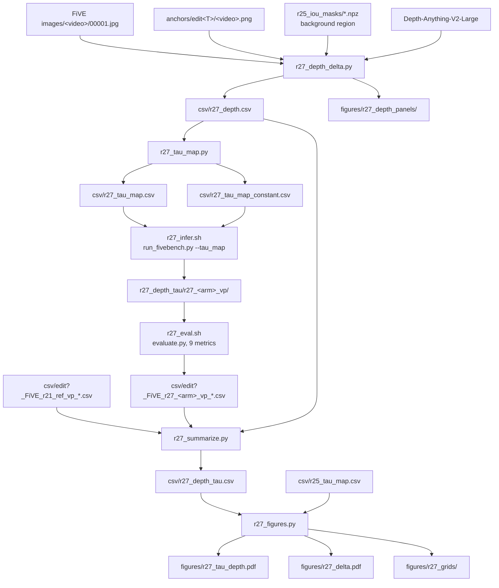

# R27: Depth-Delta Adaptive Tau

## Context

StreamGVE's blender rate (Eq. 4) is implemented at [causal_model.py:334](../Self-Forcing_StreamEdit/wan/modules/causal_model.py#L334) as `blender_rate = 1 - t_{i+1} ** blend_power`, i.e. a source-anchoring weight

$$W^{src}(t_i) = t_i^{\tau}, \qquad r = 1 - W^{src}$$

with a single global exponent `tau = blend_power = 2`. Large tau releases the source anchor fast; small tau holds it.

R25 made that exponent per-video, driven by the IoU between the object region in the source first frame and in the Qwen anchor. The defect R27 addresses is that **IoU responds to covered surface, not to demanded shape change**: adding a small hat barely moves the IoU, so it routes to nearly the same tau as a pure colour edit and then fails for want of detachment. R27 replaces the signal with a depth-based magnitude,

$$D = \operatorname*{mean}_{p \in L} \bigl| \Delta\mathrm{Depth}(p) \bigr|, \qquad L = \{\, p : |\Delta\mathrm{Depth}(p)| > 3\sigma \,\}$$

measured once on clean pixels before any denoising, between the depth map of the source first frame and that of the anchor. Averaging over `L` alone is what makes it surface-independent.

**Done when:** the two arms are scored over the same 22 pairs as R25, and the verdict states (i) whether the depth signal ranks the cases differently from IoU, (ii) whether the adaptive arm beats the constant-tau control, and (iii) whether the per-case gain tracks `|tau - 2|` rather than forming the flat cloud R25 measured.

## Execution steps

| # | Step id | Type | What it does | sets_status |
|---|---------|------|--------------|-------------|
| — | *(prep)* | todos | `r27_depth_delta.py`, `r27_tau_map.py`, `r27_infer.sh`, `r27_eval.sh`, `r27_summarize.py`, `r27_figures.py` | — |
| 1 | `fetch-model` | local | Cache Depth-Anything-V2-Large (needs network) | — |
| 2 | `depth` | srun | Depth delta per case → `r27_depth.csv` + panels | — |
| 3 | `check-depth` | manual | Alignment, aspect, localisation, **boundary condition**, motivating case | — |
| 4 | `taumap` | local | Budget-linear map + constant control map | — |
| 5 | `check-taumap` | manual | Coverage, endpoints, hand-check one budget row | — |
| 6 | `infer` | sbatch | Two arms × 6 edit types, 22 clips each | `running` |
| 7 | `wait-infer` | manual | 22 dirs/arm, `failures: 0`, tau echoed per pair | `finished` |
| 8 | `eval` | sbatch | 9-metric evaluation, both arms | — |
| 9 | `wait-eval` | manual | 6 `_avg.csv`/arm, no `Error:`/OOM, no column shift | — |
| 10 | `summarize` | local | Three-way table vs stored Eq. 4 reference | — |
| 11 | `figures` | local | Mapping, per-case delta, qualitative grids | — |
| 12 | `verdict` | manual | Record the two contrasts + caveats in `daily.md` | `analyzed` |

Invoke with `/run-step R27 <step-id>`, e.g. `/run-step R27 depth`. Bare `/run-step R27` takes the first `pending` step whose `wait_for` is satisfied.

## Decisions

| Question | Locked choice | Why |
|---|---|---|
| Signal | Mean over a **zero-padded fixed-size** top slice (largest 0.5% of frame) of `\|ΔDepth\|/IQR(D_src)`, taken over `erode(L, r=3)` | *Revised twice.* First from `mean over L` (threshold was the conditioning event, inflating D mechanically). Then, 2026-08-31, erosion added: the anchor is a re-synthesis so object OUTLINES shift sub-pixel and blaze at depth discontinuities; those halos are 1–3 px wide and an erosion removes them. Zero-padding the slice (denominator always n) is what makes a halo-only case score ≈ 0 rather than averaging its few extreme survivors. **Colour/swap separation 0.95× → 56.8×**, `frac_in_top` failures **2 → 0**, and both colour edits now land at `tau` 2.01 |
| Signed or absolute | **Absolute** | A hat moves depth toward the camera, a removal away; sign would cancel |
| Alignment | Least-squares affine `a·D_edit + b → D_src` over background | Monocular relative depth is scale/shift ambiguous per image |
| Background region | `NOT(m_src ∪ m_edit)` from `evaluation/figures/r25_iou_masks/` | Already on disk from R25, already on the source grid |
| Comparison grid | **Anchor grid (480×832)**; images resized bilinear before depth, masks nearest | *Corrected at build time.* The plan said source grid; `run_fivebench.py:225` does `transforms.Resize((480,832))`, an anisotropic squeeze, so the anchor already carries the squeezed geometry and stretching it back to 864 adds a 3.7% warp that was never in the data. `--grid source` reproduces the old wording |
| `L` and its threshold | `thr = max(6σ, 0.10·IQR(D_src))`, σ = `1.4826 · MAD` of the **signed** background residual | MAD not std (depth error clusters at edges); signed not folded (the residual is zero-mean over the background by construction). The `min_effect` floor exists because σ is estimated on the BACKGROUND only, so a featureless background collapses it — `0091_A_hawk` gave `MAD = 0` exactly. ⚠ **`L` is NO LONGER diagnostic-only**: since 2026-08-31 it is the candidate set the routed slice is drawn from, so `D` depends on `thr`. Measured: `D` is EXACTLY invariant for most cases (median rel. change 0.00% across `mad_k` {3,6} × `min_effect` {0.02,0.10}) because a real region-level change leaves far more than 1997 px after erosion — but **highly sensitive for low-signal cases** (`0017_kid-football` 0.012 → 0.372 when `min_effect` drops to 0.02). `mad_k` is nearly irrelevant; **`min_effect = 0.10` is load-bearing** |
| 🛑 **BLOCKED 2026-08-31** | The depth signal cannot produce the required ordering; `taumap` onward is on hold pending a synthesis-sensitive signal | Target is colour/material < 5, swap ~10, add/remove 30–50, i.e. **add/remove ABOVE swap**. Measured class means put **addition BELOW swap** under every statistic tested (A: add 0.906 vs swap 1.346; B: 0.554 vs 0.841). Budget-linear is monotone, so no `tau_min`/`tau_max`/curvature/`D_lo`/`D_hi` choice can invert that order — this is not a calibration gap. Separately, the targets need add/remove at `m ∈ [0.976, 1.0]` (the top 2.4% of the range) while the measured distribution tops out at `m = 0.74`. Root cause: a depth delta measures how far depth MOVED, bounded for an addition by the added object's own extent, whereas the requirement is about SYNTHESIS — content with no counterpart in the source |
| ⚠ Premise risk | The depth signal systematically **under-rates ADDITIONS**, the class R27 exists to rescue | All three type-5 cases sit below the swap median (`guitar-violin` 1.062, `car-turn` 0.871, `lucia_e5` 0.784). Geometrically correct — an addition displaces depth only over the added object's extent, a swap over the union of two silhouettes, a removal over the whole vacated region — but R27's premise was that additions need detachment because content must be SYNTHESISED, which a displacement measure cannot see. **No `D_hi` choice repairs it**: `0011_lucia_e5` would need `D_hi = 0.977` to reach `tau = 10`, at which point 15 of 22 cases clip. Decision: proceed and let the render adjudicate |
| ⚠ Known weakness | `min_effect = 0.10` was chosen by inspecting `frac_L_in_mask`, and now determines a headline result | The colour edits' `tau` 2.01 — the evidence for the `tau_min` boundary condition — depends on this constant. It has a physical reading (a change under 10% of the scene's depth span is not a shape change) but was not selected independently of the outcome. **The verdict must report the colour cases at `min_effect` ∈ {0.05, 0.10} so the claim's dependence is visible** |
| Validity gate | `frac_in_top` ≥ 0.5, computed on the same eroded slice `D` uses | **22/22 pass, median 1.000** (was 20/22). Fraction of the routed slice inside the edit region; low ⇒ the anchor differs from the source somewhere other than where it was asked to |
| `D_lo` (m = 0) | **0** | Chosen 2026-08-31. The planned "case's own noise floor" has no referent under `topq`, which always returns a positive top slice. A matched null (same statistic over the background) was measured and rejected: it makes the boundary condition fire cleanly on both colour edits, but `0016_horsejump-high`'s under-covering mask contaminates its own null and drops a genuine swap to `tau` 2.00. `D_lo = 0` has no dependence on mask quality |
| Routed quantity | `D_norm = D_raw / IQR(D_src)` | DAv2 min-max normalises per image; without this a shallow scene reads small `D` regardless of the edit |
| Depth model | `depth-anything/Depth-Anything-V2-Large-hf` | Deterministic single pass; Marigold is stochastic and would inject variance into `tau` |
| `D_lo` (m = 0) | The case's own noise floor | Makes `m = 0` the statistical-indistinguishability point, not a dataset minimum |
| `D_hi` (m = 1) | **`--d_hi_case auto`**: the case with the maximum measured `D_norm` | *Revised 2026-08-31 after the calibration preview.* `0011_lucia_e5` read `D_norm = 0.395`, rank 13 of 21, so anchoring there clipped **11 of 21** cases to `tau_max`. `auto` resolves to the argmax (currently `0011_lucia_e2`, person → lion, `D_norm = 1.202`), which by construction clips nobody. The resolved VALUE is written into the map header as an absolute constant, so the map stays reproducible and defined for a single new video even though the anchor was picked from this set |
| Mapping `f` | **Budget-linear**: interpolate `A(τ)=Σ_i t_i^τ`, invert | `tau` is an exponent whose effect saturates; linear over `[2,50]` puts `m=0.5` at `tau=25.5` |
| `tau_min` | **2.0**, fixed | Boundary condition, not a tuned floor: `m=0` ⇒ Eq. 4 exactly. Zero free parameters at the low end; the method strictly contains the baseline |
| `tau_max` | **50.0** | Stated assumption from the `0011_lucia_e5` observation — **not swept** |
| Schedule | `--step 15`, recorded in the map header | `A` is schedule-dependent; at `--step 7`, `tau=50` is degenerate (`W^src ≈ 4e-4`) |
| Arms | `depth` + `constant` (realized mean tau) | Separates "routing helps" from "a better constant helps" — what R25 phase 1 could not do |
| Reference | Stored `r21_ref_vp`, re-averaged over these 22 cases | Never its 419-pair mean |
| Metrics | Same explicit 9-metric `--metrics` list as R25/R26 | Comparability is the point; `config.yaml`'s `metrics:` key is vestigial (`evaluate.py:200`) |
| Conda env | `streamgve` for `depth` and `infer`; `five-bench` for `eval` | Matches R25/R26. Activate EXPLICITLY — `PATH` can point at an env's python while `CONDA_DEFAULT_ENV` still says `base`, which is how `fetch-model` ran |
| Cases | The same 22 pairs of `evaluation/cases.json` | Directly comparable with the R25 arm and its controls |
| Out of scope | Sweeping `tau_max`; fitting the curvature from per-clip optima; temporal metrics | Time-boxed; recorded as caveats in `verdict` |

## Step commands

### fetch-model

```bash
python -c "
from transformers import AutoImageProcessor, AutoModelForDepthEstimation
m='depth-anything/Depth-Anything-V2-Large-hf'
AutoImageProcessor.from_pretrained(m); AutoModelForDepthEstimation.from_pretrained(m)
print('cached:', m)"
```

### depth

```bash
source ~/anaconda3/etc/profile.d/conda.sh && conda deactivate && conda activate streamgve
srun --partition=L40S --gres=gpu:1 --mem=32G --time=01:00:00 --pty \
  env HF_HUB_OFFLINE=1 python evaluation/r27_depth_delta.py \
    --cases evaluation/cases.json \
    --data_root ~/Data/FiVE-Fine-Grained-Video-Editing-Benchmark \
    --anchor_root /projects/dataggen/outputs/five_bench/anchors \
    --mask_dir evaluation/figures/r25_iou_masks \
    --mad_k 6.0 --min_effect 0.10 --erode_radius 3 \
    --viz_dir evaluation/figures/r27_depth_panels \
    -o evaluation/csv/r27_depth.csv
```

### taumap

```bash
python evaluation/r27_tau_map.py --assign depth \
  --depth_csv evaluation/csv/r27_depth.csv \
  --d_hi_case auto --tau_min 2.0 --tau_max 50.0 --step 15 \
  -o evaluation/csv/r27_tau_map.csv

python evaluation/r27_tau_map.py --assign constant \
  --depth_csv evaluation/csv/r27_depth.csv \
  --d_hi_case auto --tau_min 2.0 --tau_max 50.0 --step 15 \
  -o evaluation/csv/r27_tau_map_constant.csv
```

### infer

```bash
R27_ARM=depth    sbatch --export=R27_ARM=depth    slurm_scripts/five_bench/r27_infer.sh
R27_ARM=constant sbatch --export=R27_ARM=constant slurm_scripts/five_bench/r27_infer.sh
```

### eval

```bash
R27_ARM=depth    sbatch --export=R27_ARM=depth    slurm_scripts/five_bench/r27_eval.sh
R27_ARM=constant sbatch --export=R27_ARM=constant slurm_scripts/five_bench/r27_eval.sh
```

### summarize

```bash
python evaluation/r27_summarize.py \
  --arms depth constant \
  --ref_csv_glob 'evaluation/csv/edit?_FiVE_r21_ref_vp_frame_stride8.csv' \
  --depth_csv evaluation/csv/r27_depth.csv \
  --tau_map evaluation/csv/r27_tau_map.csv \
  -o evaluation/csv/r27_depth_tau.csv
```

### figures

```bash
python evaluation/r27_figures.py \
  --summary_csv evaluation/csv/r27_depth_tau.csv \
  --r25_tau_map evaluation/csv/r25_tau_map.csv \
  --clip_col clip_similarity_target_image \
  --lpips_col lpips_unedit_part \
  --tau_baseline 2.0 \
  --out_dir evaluation/figures
```

## Pipeline



## Code to touch

| File | Status | Change |
|---|---|---|
| `evaluation/r27_depth_delta.py` | **written, verified 22/22** | images → anchor grid → DAv2 → background affine alignment → `\|ΔD\|/IQR` → erode(L, 3) → zero-padded top-0.5% mean. Flags: `--erode_radius`, `--magnitude`, `--top_q`, `--min_effect`, `--mad_k`, `--grid`, `--fold_mad` |
| `evaluation/r27_tau_map.py` | new | `D_norm` → `m` → budget-linear `tau`; `--assign {depth,constant}`; emits R25's CSV schema |
| `slurm_scripts/five_bench/r27_infer.sh` | new | Array 0-5, `ARM=${R27_ARM:-depth}`, L40S, `--exclude=node52`, 22-pair coverage preflight |
| `slurm_scripts/five_bench/r27_eval.sh` | new | Single task, `L40S,A100`, explicit 9-metric `--metrics` list |
| `evaluation/r27_summarize.py` | new | Two arms vs re-averaged Eq. 4 reference; both contrasts + per-case sign tests |
| `evaluation/r27_figures.py` | new | `r27_tau_depth.pdf`, `r27_delta.pdf`, `r27_grids/` |
| `evaluation/run_fivebench.py` | **unchanged** | `--tau_map` (R25) already carries a per-pair `blend_power`; R27 needs no pipeline change |
| `Self-Forcing_StreamEdit/**` | **unchanged** | `blend_power` at `causal_model.py:334` is the only exponent knob and is already reachable |

Budget-linear inversion, for reference (`--step 15`, `t_next = [0.933, 0.866, …, 0.066, 0]`):

```python
A     = lambda tau: sum(t**tau for t in T)          # source-anchoring budget
A_m   = (1 - m) * A(tau_min) + m * A(tau_max)       # linear in m
tau   = brentq(lambda x: A(x) - A_m, 0.0, 400.0)    # invert the monotone A
# check: A(2)=4.5062, A(50)=0.0320; m=0.6 -> A_m=1.8217 -> tau=5.53
```
