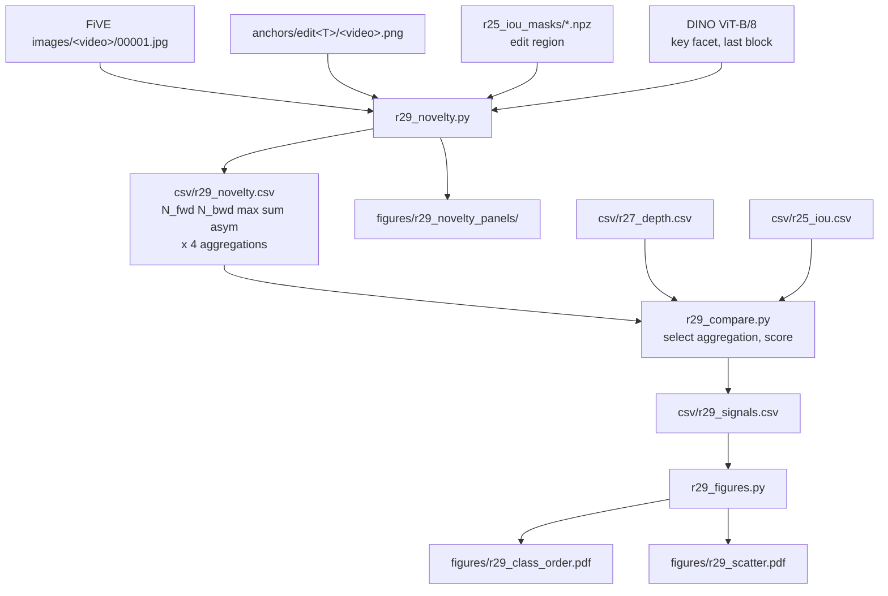

# R29: Synthesis-Driven Adaptive Tau

## Context

R27 measures how far depth *moved* between the source first frame and the Qwen anchor. That quantity is bounded, for an addition, by the added object's own extent — a hat displaces almost nothing — so additions measured **below** swaps (0.906 vs 1.346) while the required `tau` ordering puts them above. Budget-linear interpolation is monotone, so no choice of `tau_min`, `tau_max`, curvature, `D_lo` or `D_hi` can invert an order. R27 is blocked at `taumap` for that reason.

R29 measures a different quantity: **synthesis demand**, how much of an edit's content has no counterpart in the source at all. For dense DINO ViT-B/8 patch features,

$$N_{\rightarrow}(p) = 1 - \max_{q} \cos\bigl(F_{\text{edit}}(p), F_{\text{src}}(q)\bigr), \qquad
N_{\leftarrow}(q) = 1 - \max_{p} \cos\bigl(F_{\text{src}}(q), F_{\text{edit}}(p)\bigr)$$

with each maximum taken over the **whole** other image. A patch scores high only when nothing anywhere in the other image resembles it — which is blind to displacement by construction, and is exactly the property the depth signal lacks.

**Done when:** the verdict states, for the 22 shared cases, whether any quantity derived from `N` puts add/remove above swap; whether the pre-registered prediction that it would not held; and how R29's Spearman against the expected semantic ordering compares with R27's depth (+0.577, p = 0.005) and R25's IoU.

**This task is validation only.** It emits no `tau` map and renders nothing.

## Execution steps

| # | Step id | Type | What it does | sets_status |
|---|---------|------|--------------|-------------|
| — | *(prep)* | todos | `r29_novelty.py`, `r29_compare.py`, `r29_figures.py` | — |
| 1 | `novelty` | local (GPU) | `N_fwd`/`N_bwd` + all candidate aggregations → `r29_novelty.csv` + panels | — |
| 2 | `check-novelty` | manual | Correspondence sanity, addition probe, removal probe, localisation | — |
| 3 | `compare` | local | Select aggregation, score every quantity, three-way signal comparison | — |
| 4 | `figures` | local | Class-ordering plot, R29-vs-R27 scatter | — |
| 5 | `verdict` | manual | Does any quantity order add/remove above swap? Decision on R27 | `analyzed` |

Invoke with `/run-step R29 <step-id>`, e.g. `/run-step R29 novelty`. Bare `/run-step R29` takes the first `pending` step whose `wait_for` is satisfied.

## Decisions

| Question | Locked choice | Why |
|---|---|---|
| Quantity | Two per-token MAPS on the 60×104 grid: `N_fwd(p) = 1 − max_q S[p,q]` (one value per **anchor** token, row-wise) and `N_bwd(q) = 1 − max_p S[p,q]` (one value per **source** token, column-wise), where `S = F_edit F_srcᵀ`; plus the derived `max`, `sum` and `\|N_fwd − N_bwd\|` | Displacement-blind by construction, which is what R27 lacked. ⚠ `N_fwd` indexes the ANCHOR grid and `N_bwd` the SOURCE grid — same 60×104 shape, and token `p` is the same spatial LOCATION in both, but not the same content. Combining them is therefore a **positional** pairing, reading as "at location `x`, either something new appeared or something disappeared" — not a correspondence pairing |
| Why BOTH directions | `N_fwd` alone cannot see a removal | Remove the gym ball and the anchor shows background, which matches background elsewhere in the source, so `N_fwd ≈ 0`; only `N_bwd` fires, on the vacated region. With removals targeted at `tau` 30–50, a one-directional measure would floor the one removal case. Mechanistically both also argue for detachment: the blend pulls generation toward the source latent, so content that must be **erased** is content the anchor actively fights, exactly as much as content that must be **created** |
| Correspondence test | **Max similarity only** — cycle consistency considered and rejected | `N_fwd`/`N_bwd` are the forward/backward occlusion test of the optical-flow literature: `N_bwd` high = occlusion (content disappeared), `N_fwd` high = disocclusion (content appeared). That literature's stronger test is **mutual nearest neighbour** (`p → q* → p*`, novel if `p* ≠ p`), which handles displacement correctly since it tests identity not position. **Rejected because it fails in textureless/repetitive regions**: many grass patches are near-identical, so the cycle lands on a different-but-equally-good patch and reports false novelty. This benchmark's backgrounds are grass (`lucia`), sky and water (`planes-water`), open sky (`hawk`) — the same cases that broke R27's σ estimate. Max similarity is immune: a grass patch has an excellent match, so `N_fwd ≈ 0` |
| Search domain | **Whole other image** | Strictest reading of "no counterpart"; background inside the edit region correctly scores ≈ 0 because it matches background elsewhere. No margin parameter to justify |
| Features | DINO ViT-B/8, **key facet, last block** | Cached at `~/.cache/torch/hub` (85.8 M params, 768-dim, patch 8) so it runs offline; keys are the standard choice for semantic correspondence and are less dominated by the CLS objective |
| Grid | Anchor grid 480×832 → 60×104 = 6240 tokens | R27's convention. The pipeline builds the anchor via `transforms.Resize((480,832))`, an anisotropic squeeze, so resampling to 864×480 would re-introduce a 3.7% warp |
| Normalisation | **None** | Cosine distance is already bounded in [0,2] and unitless — R27's `÷ IQR` existed only because a depth residual has arbitrary per-image units |
| Erosion | **Not ported by default** | R27 needed it for sub-pixel boundary halo at depth discontinuities; DINO tokens are 8× downsampled, so a 1-px shift is ⅛ of a token. To be confirmed at `check-novelty`, not assumed |
| Boundary-token control | Moot for the primary; retained on the region-relative columns | The `O(k^{-1/2})` boundary-fraction argument applies to aggregation over a region of `k` tokens. The whole-frame top-`n` slice does not aggregate over a region at all, so the boundary term does not arise — it is kept only on the region-relative columns that exist to exhibit dilution |
| Surface-independence | **Fixed-count top slice over the WHOLE FRAME** — `S = mean of the largest n of all 6240 tokens`. `n` is **swept in `compare`, not fixed here** | ⚠ Region-relative aggregation is surface-DEPENDENT and was nearly adopted in error: `R = M_src ∪ M_edit` holds the unchanged source object too, so the novel fraction of `R` spans 15× within the addition class alone (hat 4.3%, dog 46%, flamingo 63%) — worst for exactly the class R29 serves. A whole-frame pool is a CONSTANT 6240 tokens, so the percentile is identical across cases by construction and any fully-novel object above `n` tokens fills the slice to the same level |
| Choice of `n` | Swept over {10, 20, 32, 50} in `compare`; **hard admissibility bound `n ≤ 49`** | ⚠ The 0.005 fraction was inherited from R27, where it was swept on a DEPTH residual against a different binding constraint, and has no independent justification here. The constraint for `N` is that `n` must not exceed the smallest novel object, or the slice fills with non-novel tokens and dilutes. Measured per direction: `N_bwd` is bound by `0091_A_hawk` (the hawk, 3122 px = **49 tokens**), `N_fwd` by `0007_guitar-violin` (the added hat, ~4448 px = **70 tokens**). R27's carried-over `n = 32` leaves only a **1.5× margin** on the binding case. Against that, small `n` is noisy — averaging 12 tokens is a poor estimate — so the trade is real and is settled by the same pre-registered criteria as the aggregation, not by assertion |
| Surface-independence TEST | `corr(signal, area)` computed **WITHIN the 12 form swaps**, not across all 22 | Measured: across all 22 the depth signal reads +0.188, but within the swaps alone — one homogeneous class, 4.8× area spread — it reads **+0.230**. Class and area are confounded across the full set (swaps are larger on average), so the across-class figure FLATTERS the signal. +0.230 is the number R29 must beat |
| Aggregation | **Selected at `compare`**, not chosen now | Primary is the whole-frame top-`n` slice (see the Surface-independence row). The region-relative family (region mean, region median, top-20% of region, region mean after a 1-token erosion) is still emitted **as evidence of the dilution effect, not as candidates to adopt** — the hat-vs-flamingo spread should be visible in those columns and is worth showing. R27's median × coverage is emitted for comparability only. All in the same pass. Criteria fixed **in advance**: Spearman vs expected ordering, then `\|corr(area)\|` as tie-break |
| Expected ordering | colour 1 < material 2 < addition 3 < form swap 4 < removal 5 | Assigned from edit **semantics**, not FiVE type codes: `0057_dog` → robotic dog and `0074_rhino` → robotic dinosaur are material, not swaps |
| Region | R25's frame-0 union mask, area-downsampled to the token grid, threshold 0.5 | Already on disk; no new segmentation. Type 6's `M_edit` is empty by construction, so the region is where the ball **was** — correct for `N_bwd` |
| Pre-registered prediction | `N` magnitude will **NOT** put add/remove above swap | A swap fires both directions, an addition one. Written before measuring so the asymmetry fallback is not a post-hoc rescue |
| Scope | Validation only — **no tau map, no render** | R27's block was caused by committing to a signal before checking its ordering; this task exists not to repeat that |
| Cases | The same 22 pairs of `evaluation/cases.json` | Direct comparability with R27 depth and R25 IoU |
| Out of scope | `tau` mapping, arms, evaluation, any render | Follow-up, and only if the verdict says the ordering works |

## Step commands

### novelty

```bash
source ~/anaconda3/etc/profile.d/conda.sh && conda deactivate && conda activate streamgve
TORCH_HOME=~/.cache/torch HF_HUB_OFFLINE=1 python evaluation/r29_novelty.py \
  --cases evaluation/cases.json \
  --data_root ~/Data/FiVE-Fine-Grained-Video-Editing-Benchmark \
  --anchor_root /projects/dataggen/outputs/five_bench/anchors \
  --mask_dir evaluation/figures/r25_iou_masks \
  --facet key --layer -1 \
  --viz_dir evaluation/figures/r29_novelty_panels \
  -o evaluation/csv/r29_novelty.csv
```

### compare

```bash
source ~/anaconda3/etc/profile.d/conda.sh && conda deactivate && conda activate streamgve
python evaluation/r29_compare.py \
  --novelty_csv evaluation/csv/r29_novelty.csv \
  --depth_csv evaluation/csv/r27_depth.csv \
  --iou_csv evaluation/csv/r25_iou.csv \
  --primary max --n_sweep 10,20,32,50 \
  -o evaluation/csv/r29_signals.csv
```

### figures

```bash
source ~/anaconda3/etc/profile.d/conda.sh && conda deactivate && conda activate streamgve
python evaluation/r29_figures.py \
  --signals_csv evaluation/csv/r29_signals.csv \
  --out_dir evaluation/figures
```

## Pipeline



## Code to touch

| File | Status | Change |
|---|---|---|
| `evaluation/r29_novelty.py` | **written, smoke-tested 4/4** | DINO ViT-B/8 key tokens on the anchor grid → 6240×6240 cosine → row/col maxima → 5 quantities × 6 aggregations + top-200 npz for the `n` sweep. Flags: `--facet`, `--layer`, `--top_n`, `--viz_dir`, `--dump_top` |
| `evaluation/r29_compare.py` | new | Select aggregation by pre-registered criteria, score every quantity, three-way Spearman vs R27 depth and R25 IoU |
| `evaluation/r29_figures.py` | new | `r29_class_order.pdf`, `r29_scatter.pdf` |
| `evaluation/r27_depth_delta.py` | **unchanged** | Reused only as a data source (`r27_depth.csv`) and for `load_frame0_masks` / `resize_nearest` |
| `evaluation/run_fivebench.py` | **unchanged** | R29 renders nothing |

Feature extraction and correspondence, for reference:

```python
# keys of the last attention block, the standard facet for semantic correspondence
feats = model.get_intermediate_layers(img, n=1)[0][:, 1:]   # drop CLS -> (1, 6240, 768)
F = torch.nn.functional.normalize(feats[0], dim=-1)
S = F_edit @ F_src.T                       # (6240, 6240) cosine, both L2-normalised
N_fwd = 1.0 - S.max(dim=1).values          # per anchor token: nothing in src resembles it
N_bwd = 1.0 - S.max(dim=0).values          # per source token: nothing in edit resembles it
```
