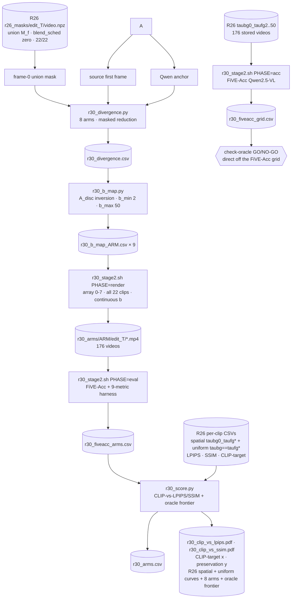

# R30: Static Anchor-Divergence Blend Routing

## Context

Measure edit strength from **anchor-vs-source divergence alone** — no rollout feedback — and determine which of eight divergence definitions best predicts the blend rate `b` each clip needs. Stage 1 needs **no rollout** — R26's pass 1 already dumped the union masks under exactly this specification — so it computes the eight static divergences between the source first frame and the Qwen anchor and maps each to a `b`. Stage 2 scores every arm against the constant-`b` operating curve that R26's stored sweep already provides.

Foreground pixels (the union mask) receive the adaptive source intervention controlled by `b`; background pixels receive the source Q/K unchanged (`--tau_bg 0`).

**Done when** `evaluation/csv/r30_arms.csv` reports, for all eight arms, mean `clip_similarity_target_image`, `lpips_unedit_part`, and `ssim_unedit_part` over the 22 clips, and `r30_clip_vs_lpips.pdf` / `r30_clip_vs_ssim.pdf` (CLIP-target on x, preservation on y) plot R26's spatial curve, R26's uniform baseline, the 8 arms, and a per-clip oracle frontier (alpha-sweep, see the Decisions table's "Oracle frontier" row) together — **or** the task stops at `check-oracle` with a recorded NO-GO if the FiVE-Acc grid shows no per-clip headroom at all. ⚠ The discrete FiVE-Acc operating curve + dominance/gap/Spearman/McNemar rating this task originally also produced (`r30_curve.pdf`, `r30_b_scatter.pdf`) was removed 2026-09-11 as unsatisfying — see stage2-final.

**Follow-up (added 2026-09-11, beyond the original plan's scope): is the oracle itself trustworthy?** Once the panels above landed, three further checks were run, in order. (1) `diagnostic-grids` — visual pages per (arm, clip) and per clip, so a reader can SEE what each arm's divergence measured and routed, not just its aggregate score. (2) `rank-check` — Spearman(`d_arm`, oracle `b*(alpha)`) for alpha in {0, 0.25, 0.5, 0.75, 1}: **no arm's raw divergence reliably ranks clips the way the oracle would** at any single alpha (`|rho| < 0.35` throughout, sign flips across the sweep — see the "Rank check" Decisions row). Since Spearman is monotone-invariant, this cannot be a mapping artefact. (3) `human-validation`, prompted directly by (2) reading like a dead end — a human rated each clip's own best constant `b` by eye (`r30_human_b_template.csv`, 21/22 clips, `0042_gym-ball` excluded as already-known-degenerate) and that rating was Spearman-correlated the same two ways. **Result: a reversal.** The human agrees weakly with the algorithmic oracle (rho ≤ 0.22 at every alpha) but MODERATELY with several arms' raw divergence (`selfsim`/`clip_prompt` 0.570, `depth` 0.529 — see the "Human-rating validation" Decisions row). Read together, (2)+(3) point at the oracle's own definition (`alpha*CLIP-target + (1-alpha)*LPIPS`, argmax per clip) as a plausible weak link, not necessarily the eight divergence measures.

Two further checks then settled how to read those numbers. (4) `human-retest` — the same 21 clips re-rated **blind** (shuffled, `case_id` and per-arm `m`/`b` labels stripped, key held outside the repo) gives a **noise ceiling of rho = 0.942** (14/21 exact, 19/21 within one grid notch). That is decisive in two directions: the rated quantity is real and stable rather than rater noise, which *hardens* the reversal above (the oracle's ≤0.22 can no longer be excused as a noisy human); but the best arm's 0.554 is only ~59% of that ceiling, which *kills* any reading in which the metrics are already as good as they could be. **Both** the evaluation axis and the routing signal are inadequate. (5) `metric-redundancy` — the free, no-fitting precondition for trying to fix (4) with a combination: the eight arms correlate **0.40–0.92 with each other** (mean ~0.63) while correlating only **0.17–0.55 with the rater**, i.e. they are largely one shared factor measured eight ways. The most complementary pair (`clip_prompt` + `depth`, mutual 0.414) projects to ~0.62 against 0.554 for the best single — a gain LOO-CV at n=21 would likely erase. **Conclusion: a different KIND of signal is needed, not a better mixture of these eight.** All of this rests on one rater and 21 clips; more raters are required before any of it is a claim rather than a lead.

## Execution steps

| # | Step id | Type | What it does | Status |
|---|---------|------|--------------|--------|
| – | *(prep)* | code | `patch-taumap-fg`, `stage1-div`, `stage1-bmap`, `stage2-score` scripts + both `.sh` | pending |
| 1 | `stage1-div` | sbatch | Eight divergences + eight `b` maps, over **R26's existing masks** | pending |
| 2 | `check-div` | manual | Alignment, geometry, coverage, spread gates | pending |
| 3 | `stage2-acc` | sbatch | FiVE-Acc over R26's 176 stored videos | pending |
| 4 | `check-oracle` | manual | **GO/NO-GO** — does the oracle clear `N_curve(P_oracle)`? | **completed — GO** (+2.00/42, 21/22 clips after excluding the 1 non-monotone; ⚠ corrected 2026-09-10 from an initial +3.90/44 that had not applied the exclusion — see `r30_score.py`) |
| 5 | `stage2-render` | sbatch | Array 0-7 over arms, **all 22 clips each**, continuous `b` | pending |
| 6 | `stage2-eval` | sbatch | FiVE-Acc + 9-metric harness on the 176 rendered videos | pending |
| 7 | `stage2-final` | local | CLIP-vs-LPIPS/SSIM panels: spatial curve, uniform baseline, arms, oracle frontier | pending |
| 8 | `diagnostic-grids` | local | Per-(arm,clip) and per-clip visual grids (see Decisions: "Diagnostic grids") | **completed** |
| 9 | `rank-check` | local | Spearman(d_arm, oracle b\*(alpha)) sweep + explicit per-clip table | **completed — no arm's `d` reliably ranks clips like the oracle at any alpha** (\|rho\|<0.35 throughout, sign flips across the sweep) |
| 10 | `human-validation` | local | Human's own best-`b` picks vs. the oracle and vs. each arm's `d` | **completed — REVERSAL: human agrees weakly with the oracle (rho≤0.22) but moderately with several arms' raw `d`** (`selfsim`/`clip_prompt` 0.570, `depth` 0.529; n=21, one rater) |
| 11 | `human-retest` | local | Blind re-rating of the same 21 clips ⇒ the **noise ceiling** | **completed — ceiling rho = 0.942** (14/21 exact, 19/21 within one notch). Best arm reaches only ~59% of it, so the metrics are **not** at ceiling; the oracle's disagreement is **not** rater noise |
| 12 | `metric-redundancy` | local | Are the 8 arms independent enough for a combination to help? | **completed — no.** Inter-arm rho 0.40–0.92 (mean ~0.63) vs. human agreement only 0.17–0.55: the arms agree with each other far more than with the rater. Best pair `clip_prompt`+`depth` projects to ~0.62 vs 0.554 single ⇒ **regression not worth it** |

```
/run-step R30 stage1-div
/run-step R30 check-div
/run-step R30 stage2-acc
/run-step R30 check-oracle
/run-step R30 stage2-render
/run-step R30 stage2-eval
/run-step R30 stage2-final
/run-step R30 diagnostic-grids
/run-step R30 rank-check
/run-step R30 human-validation
/run-step R30 human-retest
/run-step R30 metric-redundancy
```

## Decisions

| Question | Choice |
|----------|--------|
| Mask convention | **Union everywhere.** `trg_fg_mask` is already `M^src \| M^trg` (`edit_causal_inference.py:623`); dump the union only, no separability, no pipeline change |
| Stage-1 masks | **Reused from R26, not re-dumped.** `r26_dump.sh` ran the identical spec — `--blend_sched zero --union_dump_dir --vp_mode vp --first_frame_edit_dir $ANCHOR_ROOT --cases_json evaluation/cases.json --step 15 --fg_boost_factor 4 --seed 0` — covering 22/22 cases (1/13/2/2/3/1 per edit type), dumped 2026-08-27 *after* `cases.json`'s final append on 2026-08-26. Path: `/projects/dataggen/outputs/five_bench/r26_masks`. R30's stage 1 therefore runs **no diffusion rollout at all** |
| Intervention region | Union mask (foreground), **R26's RAW npz, unopened**; background gets source Q/K via `--tau_bg 0` |
| Measurement region | The same union **NPZ**, for all four spatial arms — but **NOT pixel-identical to the intervention region** (confirmed with user, 2026-09-10). `r30_divergence.py` applies one round of morphological opening (see 'Mask post-processing' below) before measuring; `run_fivebench.py --union_mask_dir` at render time reads the npz directly and never opens it. Deliberate: R30's whole scoring methodology rests on comparing its 8 rendered arms against R26's constant-`b` curve with everything but `b`-selection held fixed, and R26's 176 stored videos were rendered on the raw mask — opening the render-time mask too would confound "better `b`" with "different intervention region" and break that comparison. So measurement gets a de-speckled read of "how much does this edit demand", while the actual blend during generation stays exactly as R26 defined it |
| Depth alignment region | Union's **complement** |
| Stage-1 unblending | `--blend_sched zero` ⇒ `s(p)=0` ⇒ `blender_rate=1.0`, no-opping both the previous- and current-chunk blends |
| Arms (8) | `lpips`, `dino_cls`, `dino_patch`, `clip_image`, `clip_prompt`, `depth`, `normals`, `selfsim`. **`miou` dropped** — it needs a separate anchor-side mask, which the union-only dump does not provide, and standing it up would mean a segmenter dependency for one arm |
| Spatial-arm reduction | **Masked** (union). Area is not the axis that sets edit demand, and spatial selectivity is already carried by the stage-2 mask, so `b` need only encode per-pixel intensity. Global recorded as a second column, not a rollout arm |
| DINO backbone | DINOv2 ViT-B/14 **with registers**, one backbone for `dino_cls`/`dino_patch`/`selfsim`; dims divisible by 14 (476×826 → 34×59); strip register tokens |
| Normal estimator | **Marigold Normals** via `diffusers.MarigoldNormalsPipeline` (diffusers 0.36.0 is already installed, weights are HF-hosted ⇒ no vendored model code). DSINE/Omnidata are deterministic and arguably better suited, but ship as GitHub repos needing a few hundred lines vendored for one arm. ⚠ Marigold is **diffusion-based, hence stochastic**: fix the seed (`--seed 0`, repo-wide), use `ensemble_size ≥ 5` so the map returned is an average not a sample, and record seed / steps / ensemble_size in the CSV header. Finite-differencing Depth-Anything stays rejected — after background alignment both maps carry the **source's** scale, which is per-pair (the estimator normalises each image), so angular error would live in a per-pair-distorted space and not be comparable across pairs |
| `d → b` mapping | Budget-linear on the **discrete** grid: `A_disc(b) = mean_i t_i**b`, inverted by bisection |
| Why not `1/(1+b)` | It integrates `t ∈ [0,1]` while the sampler tops out at `t = 0.933`. Fictitious mass: 13% at `b=1`, 34% at `b=5`, 77% at `b=20`, **97.1% at `b=50`**. The error grows with `b`, so the injected source is not linear in `d` — the one property the scheme exists to provide |
| Endpoints | `b_min = 2`, `b_max = 50` ⇒ `A_max = 0.300`, `A_min = 0.0021` at `--step 15`. Recompute per step count |
| Why `b_max = 50` | `0011_lucia_e5` (add a dog) is flat to four decimals for `b ≤ 10` and only edits at `b = 50` (+2.56 edit CLIP). Aggregate flatness above `b=4` means high `b` rescues a few clips and costs the rest — the case for routing, not against the range |
| Normalisation | Per-arm dataset min/max as floor/ceiling, with `argmin_video`/`argmax_video` recorded and raw `d` stored per clip |
| "Edit achieved" | **FiVE-Acc** (Qwen2.5-VL), `(yn_acc, mc_acc)` ⇒ achievement axis 0–44 over 22 clips |
| "Best arm" | ⚠ REMOVED 2026-09-11 — no arm-ranking verdict is computed any more (was: "lands above the constant-`b` operating curve", scored by captured fraction of a curve→oracle gap). The two panels are now read qualitatively: where does an arm's point sit relative to the spatial curve, the uniform baseline, and the oracle frontier |
| Curve axes | ⚠ REMOVED 2026-09-11 (was the discrete FiVE-Acc curve's axes, x = mean `lpips_unedit_part`, y = Σ(`yn_acc` + `mc_acc`)). The only axes now are CLIP-target (x) vs. LPIPS or SSIM (y) — see "Oracle frontier" below |
| Panels (`r30_clip_vs_lpips.pdf` / `r30_clip_vs_ssim.pdf`) | **Rewritten 2026-09-11** (previously "secondary", added once N/44's integer counts proved too coarse to discriminate arms — McNemar `b+c=0` for all 8; now the ONLY panels this task produces, `r30_curve.pdf`/`r30_b_scatter.pdf` removed). Each plots R26's SPATIAL constant-`b` curve, R26's UNIFORM baseline (`b_bg==b_fg`, the plain scalar Eq. 4 rho — free, already stored, no new render), the 8 rendered arms, and the oracle frontier (see below). **Axis convention matches `r26_tradeoff_figure.py` exactly**: x = `clip_similarity_target_image` (WHOLE-FRAME, never the `_edit_part` variant), y = preservation (`lpips_unedit_part`, lower better, or `ssim_unedit_part`, higher better) |
| Arms produced | **All eight rendered in full** at continuous `b`, 22 clips each (176 rollouts). Every arm's point is measured directly from its own 22 rendered videos — no interpolation, no brackets, no ambiguity logic |
| Vocabulary — constant-`b` policy | One of R26's eight `taubg0_taufg{2,3,4,6,8,10,20,50}_vp` arms: background exponent **fixed at 0** (pinned to source), foreground exponent constant **across clips**. "Constant" refers to across-clip, not to `b_bg == b_fg`. R26's `taubg2_taufg2` (`is_control`) is the uniform Eq.4 case with no fg/bg split and is **not** in the reference set |
| Oracle frontier | **Rewritten 2026-09-11**, replacing the discrete single-point oracle (was: smallest grid `b` reaching each clip's own FiVE-Acc max, excluding non-monotone clips). Now follows `r26_tradeoff_figure.py`'s own `oracle_frontier` convention exactly, adapted from its 2-D `(tau_bg, tau_fg)` grid to R30's 1-D 8-`b` grid: for alpha swept over `[0, 1]`, each clip independently argmaxes `alpha*CLIP_norm + (1-alpha)*Y_norm` over its own 8 `b`'s (per-clip min-max normalized, direction-corrected for LPIPS so "higher normalized" always means "more preferred"), and the winning `b`'s raw `(CLIP, Y)` is averaged across all 22 clips per alpha to trace the frontier. The ceiling an all-knowing per-clip policy could reach on the 8-point grid — optimistically biased (selected on the same metrics it's plotted in), not a candidate setting. No non-monotone exclusion needed: unlike the removed discrete oracle, this never touches `yn_acc`/`mc_acc`, only continuous per-clip metrics |
| Rating framework (dominance / gap / Spearman / McNemar) | ⚠ REMOVED 2026-09-11. Built, run, and dropped as unsatisfying: McNemar came back `b+c=0` (zero discordant clips) for every one of the 8 arms against its matched comparator, so no significance test was ever computable on this data, and the discrete oracle it was normalized against was a single, none-too-informative point. No arm-ranking or significance claim is made any more — the two CLIP-vs-LPIPS/SSIM panels are read qualitatively instead |
| Stage-2 plumbing | Reuse `--union_mask_dir` + `--tau_bg 0` + `--tau_map` (the `tau` column carries `b`); one small patch so the map drives `tau_fg` |
| Array layout | `--array=0-7` over arms for the render phase |
| Reference | R26's `taubg0_taufg{2,3,4,6,8,10,20,50}_vp`, same 22 clips, same sampler/anchors/mask — R30's mechanism at eight constant `b` |
| Out of scope | Global-reduction rollout arms; target-only masks; any pre-labelled reference ordering |
| Mask post-processing | **Morphological OPENING, 1 round, 8-connected, on the latent grid (REVISED 2026-09-10, reversing the 2026-09-10 "None" call above).** The union is cross-attention response to the trigger word thresholded at `mask_soft > 0` (`wan/modules/model.py`'s `obtain_mask` path) — any spatial token with even faint attention toward the trigger word crosses threshold, so background texture (bark, pavement, shadows) routinely speckles in alongside the real object. DILATION is still rejected for the reason above (one step nearly doubles coverage by growing the noisy region outward); OPENING is the opposite fix — erode-then-dilate erases anything smaller than the structuring element outright (a lone speckle token has no interior to restore) while returning anything large enough to have one close to its original extent. Measured on the 22 cases: `0001_bus` 0.50→0.27 (47 connected components→3), `0090_A_deer` 0.56→0.23, `0011_lucia_e5` (already compact) 0.112→0.096 — i.e. real objects are barely touched, noise is mostly gone. `0042_gym-ball` (union = 100% of frame, the depth-disqualifying case) is UNCHANGED by opening (erosion peels one token ring, dilation restores it exactly since the interior survives) — this fix does not rescue `depth` on that clip, which was never a speckle problem. `r30_divergence.py --mask_open 0` reproduces the "exactly as dumped" behaviour |
| Degenerate-target fallback | **`M_src` alone, for `0042_gym-ball` only (settled 2026-09-10).** `0042_gym-ball` (edit_type 6, the one REMOVAL case) has `trg_word` = "without a heavy gym ball" — a NEGATION with no visual referent anywhere in the frame — so `M_trg` never localizes and saturates instead. Confirmed by patching `edit_causal_inference.py` to dump `M_src`/`M_trg` SEPARATELY (before the OR that makes `M_f`) and running it once for this one clip: `M_trg` reads **exactly 1.0 on every one of its 18 frames**; `M_src` (the concrete "with a heavy gym ball") is a normal, compact 0.16–0.23. Not a speckle problem (opening cannot fix a region this large — see the row above) and not fixable by `--fg_boost_factor`: verified in the model code that boosting (`apply_enhance`) and mask computation (`obtain_mask`) are separate branches sharing only `q`/`k`, so re-dumping at a different `fg_boost_factor` would produce a bit-identical mask. `r30_divergence.py --split_mask_dir` reads a per-clip `M_src`/`M_trg` file when one exists and falls back to `M_src` alone whenever `M_trg`'s own coverage exceeds `--trg_degenerate_frac` (default 0.90); only `0042_gym-ball` has such a file, so every other clip is byte-for-byte unaffected. Rescued `depth`: disqualified through job 988820 (union 100% ⇒ zero background for the affine fit), full 22/22 coverage after the fix (`bg_frac` 0.871, `depth_a` 0.968 — a healthy fit). **Measurement-only, same principle as opening**: the render (stage 2) still reads R26's raw, un-split union for this clip, so `depth`'s eventual render there stays exactly as comparable to R26's other 8 constant-b arms on the same clip as every other clip already is |
| Budget-response pre-check | **Discarded 2026-09-10.** R26's 176 stored videos already trace the curve at zero GPU cost: N/44 vs `A_disc(b)` departs from the endpoint straight line by at most 2.0 of a 9-point span (22%) ⇒ **ramp, not knee**. ⚠ dead zone at `b ∈ [4, 8]` (N = 34/34/34, so deciles `d = 0.5/0.6/0.7` buy nothing); ⚠ edit CLIP flat above `b = 4`. Not bought: the per-clip continuous strength curve |
| Diagnostic grids (added 2026-09-11) | **Two complementary visual pages**, requested once the numeric panels alone were judged insufficient to trust. `r30_arm_grids.py`: one page per (arm, clip) — 176 total — source / [raw divergence map, spatial arms only] / this arm's own routed-`b` output / the 8 constant-`b` references, `F=6` frame columns; the arm's map is RECOMPUTED (never persisted elsewhere), so this is the one R30 script that needs GPU. `r30_video_grids.py`: the transpose — one page per clip (22 total), source / all 8 arms (each labelled `m`, its own min-max-normalized `d` from `r30_b_map_{arm}.csv`, and its inferred `b`) / the 8 constants; needs no model inference, every value and frame already exists on disk |
| Rank check (added 2026-09-11) | **Spearman(`d_arm`, oracle `b*(alpha)`)** for alpha in `{0, 0.25, 0.5, 0.75, 1}` (`r30_rank_check.py`; explicit per-clip table in `r30_b_star_table.py`). Chosen because Spearman is invariant to any monotonic rescaling of `d`, so it isolates whether the MEASURE ranks clips correctly independent of `r30_b_map.py`'s specific mapping. **Result: no arm clears `\|rho\|=0.35` at any alpha, and most flip sign across the sweep** (`lpips`: +0.21 at alpha=0.25 → −0.35 at alpha=0.75) — not fixable by remapping, since Spearman already discounts monotonic remaps. `n_distinct_b` climbs 2/4/6/8/8 across the sweep (alpha=0 collapses nearly every clip onto `b=2`), so the weak numbers are not merely an artefact of low variance at the extremes |
| Human-rating validation (added 2026-09-11) | **A validity check on the oracle itself**, prompted by the rank check reading like a dead end for every arm. A human rated each clip's own best constant `b` by eye, straight off `r30_video_grids.py`'s pages (`r30_human_b_template.csv`; `0042_gym-ball` rated `None` and excluded — the one removal-type clip, already known degenerate: its `trg_word` negation has no visual referent, so it never grounds regardless of `b`). `r30_human_rank_check.py` then computes Spearman(human, oracle `b*(alpha)`) and Spearman(human, `d_arm`)/Spearman(human, routed `b`) — the latter two land BYTE-IDENTICAL per arm, confirming `r30_b_map.py`'s mapping is rank-preserving and adds no scrambling of its own. **Result, a reversal of the rank check's framing: human agreement with the algorithmic oracle stays weak at every alpha (rho ≤ 0.22, even at alpha=1) while agreement with several arms' raw `d` is moderate** — `selfsim`/`clip_prompt` 0.570, `depth` 0.529, `dino_patch` 0.420, `dino_cls` 0.350, `lpips` 0.346, `clip_image` 0.290, `normals` 0.200 (`r30_human_vs_metric_rho.csv`, n=21). Reads together with the rank check as evidence the bottleneck may be the oracle's own `alpha*CLIP-target + (1-alpha)*LPIPS` definition, not (only) the eight divergence measures — though n=21 and a single, non-repeated rater keep this suggestive rather than confirmatory |
| Noise ceiling (added 2026-09-11) | **Blind re-rating, all 21 clips, not a 10-clip subset.** At n=10 the standard error on a correlation is ~±0.38, which cannot separate a 0.6 ceiling from a 0.9 one and defeats the purpose; n=21 gives ~±0.24. Blinding is enforced at the STIMULUS level, not by asking the rater to forget: `r30_video_grids.py --label_map --anonymize` strips the `case_id` from the title and the per-arm `m`/`b` numbers from the row labels (each is per-clip unique and would identify a clip on its own), renders as `trial_NN.png` in shuffled order, and the key is written to the session scratchpad **outside the repo** so it cannot be opened by accident. Everything else about the page is left identical, so pass 2 is the same task as pass 1. **Result: rho = 0.942** — the rated quantity is real, and every human-vs-metric rho must be read as a fraction of it |
| Metric redundancy (added 2026-09-11) | **Checked BEFORE fitting anything, precisely because it is free.** A monotone remap of one metric cannot change its ranking (so no `d→b` regression can lift a single arm's rho — confirmed: `d` and routed `b` give identical numbers); only a function of ≥2 metrics can reorder clips, and only if they carry independent information. The pairwise Spearman matrix among the arms answers that with no model and no overfitting risk. **Result: the arms correlate 0.40–0.92 with EACH OTHER (mean ~0.63) but only 0.17–0.55 with the rater** — one shared factor measured eight ways. Best complementary pair `clip_prompt`+`depth` (mutual 0.414) projects to ~0.62 vs 0.554 single, which LOO-CV at n=21 would likely erase. **Decision: the multivariate regression is NOT worth running**; the deficiency is the shared factor itself, not the mixture. ⚠ Note this revised a conceptual prior — `clip_prompt`+`selfsim` looked complementary on paper (text intent vs pixel structure) but measure at 0.635 mutual, i.e. substantially redundant |
| Open dependency | none |

## Step commands

### stage1-div

```bash
sbatch slurm_scripts/five_bench/r30_stage1.sh
```

### check-div

```bash
python - <<'PY'
import csv
r=list(csv.DictReader(open('evaluation/csv/r30_divergence.csv')))
for a in ["lpips","dino_cls","dino_patch","clip_image","clip_prompt","depth","normals","selfsim"]:
    v=[float(x[f"d_{a}_masked"]) for x in r]
    print(f"{a:<12} n_distinct={len(set(v))} min={min(v):.4f} max={max(v):.4f}")
PY
```

### stage2-acc

```bash
R30_PHASE=acc sbatch slurm_scripts/five_bench/r30_stage2.sh
```

### check-oracle

⚠ `--fiveacc_grid` and `--oracle_only` were removed from `r30_score.py` on 2026-09-11 along with the discrete FiVE-Acc curve/oracle framework (see stage2-final) — this exact command is no longer runnable. The GO/NO-GO decision it produced (recorded in the Execution steps table, row 4) still stands as history; it does not depend on which figure the later analysis was drawn into.

```bash
# historical command, no longer runnable:
python evaluation/r30_score.py --fiveacc_grid evaluation/csv/r30_fiveacc_grid.csv --oracle_only
```

### stage2-render

```bash
R30_PHASE=render sbatch slurm_scripts/five_bench/r30_stage2.sh
```

### stage2-eval

```bash
R30_PHASE=eval sbatch slurm_scripts/five_bench/r30_stage2.sh
```

### stage2-final

```bash
python evaluation/r30_score.py \
  --fiveacc_arms evaluation/csv/r30_fiveacc_arms.csv \
  --r26_csv_dir evaluation/csv \
  -o evaluation/csv/r30_arms.csv \
  --fig_dir evaluation/figures
```

### diagnostic-grids

```bash
python evaluation/r30_arm_grids.py \
  --data_root ~/Data/FiVE-Fine-Grained-Video-Editing-Benchmark \
  --anchor_root /projects/dataggen/outputs/five_bench/anchors \
  --n_frames 6 --out_dir evaluation/figures/r30_arm_grids

python evaluation/r30_video_grids.py \
  --data_root ~/Data/FiVE-Fine-Grained-Video-Editing-Benchmark \
  --n_frames 6 --out_dir evaluation/figures/r30_video_grids
```

### rank-check

```bash
python evaluation/r30_rank_check.py -o evaluation/csv/r30_rank_check.csv
python evaluation/r30_b_star_table.py --alpha 0.5 \
  -o evaluation/csv/r30_b_star_table_alpha0.5.csv
```

### human-validation

```bash
# fill in evaluation/csv/r30_human_b_template.csv's human_b column by eye first,
# from evaluation/figures/r30_video_grids/{case_id}.png
python evaluation/r30_human_rank_check.py \
  --human_csv evaluation/csv/r30_human_b_template.csv
```

## Pipeline



⚠ `r30_curve.pdf` and `r30_b_scatter.pdf` (previously produced by `M`, fed by `L` directly) were removed 2026-09-11 along with the discrete FiVE-Acc curve/dominance/Spearman/McNemar framework — see the Decisions table. `L` (`r30_fiveacc_grid.csv`) now only feeds `check-oracle`'s GO/NO-GO, not `r30_score.py`.

## Code to touch

| File | Change |
|------|--------|
| `evaluation/run_fivebench.py` | When `--union_mask_dir` + `--tau_bg` + `--tau_map` are all present, the map's `tau` column supplies **`tau_fg` per pair** instead of the scalar `--tau_fg`; existing precedence otherwise unchanged so R25/R26/R27 stay bit-identical. Refuse to start on `--tau_map` + `--union_mask_dir` without `--tau_bg`. **Added 2026-09-10**: `--split_mask_dump_dir`, mirroring `--union_dump_dir` but writing `M_src`/`M_trg` separately (see the pipeline row below); mutually exclusive with `--union_mask_dir` (pass 2 reads a stored field and computes no mask at all, so there is nothing to split) |
| `Self-Forcing_StreamEdit/pipeline/edit_causal_inference.py` | **NEW 2026-09-10, diagnostic.** `inference()`/`rollout_inference()` gain an optional `split_dump`/`split_dump_path`, mirroring `union_dump`/`union_dump_path` exactly (same buffers, same per-window overlap trim, same stitch-and-save shape) but capturing `src_fg_mask_bin` and the trg-only mask **separately, before** the `|` that produces `M_f`. New `_save_split_mask` helper, schema `M_src`/`M_trg` alongside the existing `_save_union_mask`'s `M`. None of the three call sites' existing behaviour changes when the new params are left at their default `None` — verified: a cross-check run with both `--union_dump_dir` and `--split_mask_dump_dir` active reproduced R26's original `0042_gym-ball` union **bit-identically**. Only `run_fivebench.py`'s new `--split_mask_dump_dir` calls it; every other caller (R25/R26/R27, all of R30's own renders) is untouched |
| `evaluation/r30_divergence.py` | **New.** **Eight** divergences (`lpips`, `dino_cls`, `dino_patch`, `clip_image`, `clip_prompt`, `depth`, `normals`, `selfsim` — `miou` was dropped); masked reduction over the union for `lpips`/`dino_patch`/`depth`/`normals`, global column alongside; `union_frac` per clip (the coverage ratio is not computable — gate dropped); optional `--viz_dir` panels. Mask handling **revised twice on 2026-09-10** from the original "exactly as dumped": (1) **one round of morphological opening** (see Decisions, below) to remove cross-attention speckle; (2) **degenerate-target fallback** via `--split_mask_dir`/`--trg_degenerate_frac` — for `0042_gym-ball` (the one removal-type clip, `trg_word` a negation with no visual referent) the union falls back to `M_src` alone, since `M_trg` reads exactly 1.0 on every frame and opening cannot fix a region that large. Both are measurement-only; the actual render still reads R26's raw, unmodified union |
| `evaluation/r30_b_map.py` | **New.** `A_disc(b) = mean_i t_i**b` + bisection inversion; per-arm min/max normalisation with provenance; emits the `tau_map` schema so no new pipeline flag is needed |
| `evaluation/r30_score.py` | **New, then substantially rewritten 2026-09-11 (twice).** First version: discrete FiVE-Acc operating curve, per-clip oracle `b*` (non-monotone clips flagged and excluded), per-arm dominance set / vertical gap / captured fraction / Spearman, McNemar vs the matched comparator, `r30_curve.pdf`, `r30_b_scatter.pdf`, `--oracle_only` for the GO/NO-GO. Then added two secondary continuous-metric panels (`r30_clip_vs_lpips.pdf`, `r30_clip_vs_ssim.pdf`) once McNemar came back uninformative (`b+c=0` for all 8 arms), fixing an initial CLIP-metric/axis-order bug along the way (see git history). **Final rewrite (same day): the entire discrete FiVE-Acc curve/oracle/dominance/Spearman/McNemar framework is REMOVED** — `r30_curve.pdf`, `r30_b_scatter.pdf`, `--oracle_only`, `--fiveacc_grid`, `--divergence`, `load_fiveacc_grid`, `compute_oracle`, `oracle_stats`, `nonmonotone`, `build_curve`/`n_curve`/`p_curve_inv`, `spearman`, `binom_two_sided_exact`, `holm_correct` are all gone. The single discrete oracle point is replaced by a per-clip **oracle frontier** (`oracle_frontier`, `_minmax`): following `r26_tradeoff_figure.py`'s own convention exactly (adapted from its 2-D `(tau_bg, tau_fg)` grid to R30's 1-D 8-`b` grid), alpha is swept over `[0, 1]`, each clip independently argmaxes `alpha*CLIP_norm + (1-alpha)*Y_norm` over its own 8 `b`'s (per-clip min-max, direction-corrected for LPIPS), and the winning `b`'s raw `(CLIP, Y)` is averaged across clips per alpha to trace a green frontier line on both panels — no non-monotone exclusion needed since it never touches `yn_acc`/`mc_acc`. `r30_arms.csv` now carries just `arm, n_clips, clip_target, lpips, ssim` per arm — no `N`, dominance, Spearman, or McNemar columns. `load_r26_metric`/`load_r26_lpips`/`load_fiveacc_arms`/`build_join_tables` are unchanged. `draw_curve_scatter` is simplified to always draw the spatial curve, uniform baseline, arms, and the frontier (no more conditional `oracle_xy` branch) |
| `slurm_scripts/five_bench/r30_stage1.sh` | **New.** Single phase, single task: the eight divergences + eight `b` maps over R26's existing masks. No diffusion model — just LPIPS / DINOv2 / Depth-Anything / normals. One GPU, L40S, `--mem=64G`, `--exclude=node52` |
| `slurm_scripts/five_bench/r30_stage2.sh` | **New.** `R30_PHASE ∈ {acc, render, eval}`; `acc` and `eval` need H100-class memory for Qwen2.5-VL, `render` is `--array=0-7` over arms rendering all 22 clips per arm on L40S. **`--output`/`--error` must be overridden on the sbatch command line for `render`** (`%A_%a`, not the file's default `%j`) — an array job's `%j` resolves to the same value across every task, so without the override all 8 tasks silently clobber one shared log file (found on job 988820, 2026-09-10) |
| `evaluation/r30_arm_grids.py` | **New, 2026-09-11.** One page per (arm, clip) — 176 total. Imports `r30_divergence.py` directly for its model loaders and `measure_case`/per-map branch logic (duplicated at the smallest scope for a single arm's map, `_recompute_one_map`, so one arm's failure doesn't cost the other three their map for that clip) — the ONLY R30 script needing GPU besides `r30_divergence.py` itself, since raw divergence maps are never persisted elsewhere. Rows: source, [divergence map if `arm in SPATIAL_ARMS`], this arm's routed-`b` output, 8 constant-`b` references; `F` frame columns sampled by FRACTION of each row's own length (rendered arms run a few frames short of the source mp4). `VideoRow` abstracts an mp4 or a PNG-frame directory behind one `.frame(frac)` call |
| `evaluation/r30_video_grids.py` | **New, 2026-09-11.** The transpose of the above — one page per clip (22 total), not per arm. Rows: source, all 8 arms (each labelled `m` and `b` read straight from `r30_b_map_{arm}.csv`, no recomputation), the 8 constants — 17 rows, deliberately tall. No GPU, no model import: reuses its own small `VideoRow`/frame-sampling copy rather than importing the GPU-heavy `r30_divergence.py`, so this script runs in any Python env with cv2/PIL/matplotlib |
| `evaluation/r30_rank_check.py` | **New, 2026-09-11.** `oracle_b_star(clips, clip_target, lpips, bs, alpha)`: per-clip argmax winner at one alpha (same normalization as `r30_score.py`'s `oracle_frontier`, imported from there along with `ARMS`/`CONST_BS`/`build_join_tables`/`load_r26_metric`/`_minmax`, so both stay numerically identical by construction). Own `spearman()` (ties by average rank, no scipy — matches this codebase's established convention). `load_divergence_by_arm` reads `d_{arm}_masked` straight from `r30_divergence.csv`. Prints and optionally writes an arm×alpha rho table plus each cell's `n_distinct_b` (how much real variation the oracle offers at that alpha, so a near-zero rho at a near-constant-b alpha isn't over-read) |
| `evaluation/r30_b_star_table.py` | **New, 2026-09-11.** The per-clip listing `r30_rank_check.py`'s aggregate table is computed from, at one fixed `--alpha`: oracle `b*` next to every arm's actual routed `b` (from `r30_fiveacc_arms.csv`'s `b` column), sorted by `b*` |
| `evaluation/r30_retest.py` | **New, 2026-09-11.** Un-scrambles pass 2 through the scratchpad-held key and reports Spearman(pass1, pass2) — the noise ceiling — plus exact-agreement and within-one-grid-notch rates, since `b` is an 8-point ordinal grid where "off by one notch" and "off by four" are different errors a correlation alone hides. Then re-reports every arm's human agreement against pass 1, pass 2, and the two-pass MEAN, each as a percentage of the ceiling, so no arm's rho is ever read in isolation again. Reuses `spearman`/`load_divergence_by_arm` from `r30_rank_check.py` |
| `evaluation/r30_metric_redundancy.py` | **New, 2026-09-11.** Pairwise Spearman among the 8 arms (over all 22 clips — metric-vs-metric redundancy does not involve the human ratings at all), each arm's agreement with the human two-pass mean, and all 28 pairs ranked by complementarity (`mutual_rho − min_human_rho`, so weak-mutual/strong-individual pairs sort to the top). Deliberately fits nothing: it is the precondition that decides whether a regression is worth running, and it must carry no overfitting risk of its own. Reuses `load_key`/`load_pass1`/`load_pass2` from `r30_retest.py` |
| `evaluation/r30_video_grids.py` (amended 2026-09-11) | Gained `--label_map` (case_id→label CSV; renders only the listed cases, names and titles each page by its label) and `--anonymize` (drops the per-arm `m`/`b` numbers from row labels). Together these produce the blind re-rating set; `build_page` gained an optional `title` override. Default behaviour is unchanged when neither flag is passed |
| `evaluation/r30_human_rank_check.py` | **New, 2026-09-11.** Reads `evaluation/csv/r30_human_b_template.csv` (`case_id, human_b, grid_path` — the last column points at the matching `r30_video_grids.py` page); rows with `human_b` blank or `"None"` are DROPPED from every downstream calculation rather than tracked via a separate exclusion list, which is how `0042_gym-ball` opts itself out. Computes Spearman(human, oracle `b*(alpha)`) for the same alpha sweep, plus Spearman(human, `d_arm`) and Spearman(human, routed `b`) per arm, reusing `oracle_b_star`/`spearman`/`load_divergence_by_arm` from `r30_rank_check.py` and `load_routed_b` from `r30_b_star_table.py` |

Implementation notes:

- `A_disc` is monotone decreasing in `b`, so bisection over `[1e-6, 500]` converges in ~40 iterations; store the step count in the map header since `A_disc` is schedule-dependent.
- LPIPS masking: `spatial=True` + `retPerLayer=True`, mask-average each returned map; per-layer profile is a diagnostic column, not a sub-arm.
- DINOv2 self-similarity needs a forward hook on `blocks[-1].attn.qkv` and a q/k/v split; `S` is ~2006² at 34×59, ~16 MB fp32.
- Pre-download on a **login node** — jobs run with `HF_HUB_OFFLINE=1`, so a cache miss fails the job at model load rather than fetching. **Verified cached:** Depth-Anything-V2-Large-hf, openai/clip-vit-large-patch14, `dino_vitbase8_pretrain.pth`, alexnet (LPIPS), Qwen2.5-VL-7B. **Still MISSING:** DINOv2-with-registers and Marigold Normals.
- Each arm's point on `r30_clip_vs_lpips.pdf` / `r30_clip_vs_ssim.pdf` is measured directly from its own 22 rendered videos (mean `clip_similarity_target_image`, `lpips_unedit_part`/`ssim_unedit_part`). Only the constant-`b` and uniform-baseline curves are interpolated, and only between their 8 aggregate points; the oracle frontier is not interpolated at all — it's an independent per-alpha computation over the raw per-clip grid.
- `selfsim` is indexed by absolute position, so a pure translation permutes `S` and reads as structure change; inspect the top-scoring clips to confirm they are genuine reshapes.
