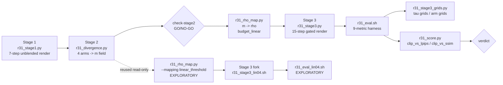

# R31 -- Spatial Divergence Routing

**IMPORTANT -- FILE RECOVERY NOTE (2026-09-15):** this plan file, `daily.md`, and several
production scripts (`r31_rho_map.py`, `r31_stage3_grids.py`, `r31_score.py`,
`r31_stage3.sh`, `r31_stage3_lin04.sh`, `r31_eval_lin04.sh`) were found **deleted from
disk** by a process external to this session -- no destructive command (`rm`,
`git clean`, `git checkout`) appears in any tracked shell/terminal history, and the
underlying render/eval **data** (`r31_arms/`, `r31_rho/`, `r31_arms_lin04/`,
`r31_rho_lin_t0.4/`, all `evaluation/csv/r31_*.csv`, all `evaluation/figures/r31_*`)
was untouched. This file has been **reconstructed from conversation context**, not
recovered byte-for-byte (none of `.claude/`, `evaluation/`, `slurm_scripts/`, or
`daily.md` are git-tracked, so there was no history to restore from). Job IDs, statuses,
and file paths above are believed accurate; narrative prose below may not match the
original plan's exact wording. **Recommend committing `.claude/plans/` and `daily.md`
to git going forward** so a future occurrence of this is a `git checkout` away instead
of a from-memory rebuild. This reconstruction was itself cross-checked against the
actual job logs/CSVs on disk (2026-09-15, later pass): several details did not survive
memory intact -- `check-stage2`'s hint invoked a `--which m` flag that never existed on
`r31_div_grid.py`, `check-stage1` (a real step, with a real finding) was dropped
entirely, and `stage3-grids-lin04`'s command invoked `--out_root`/`--method_suffix`/
`--arms_out_dir`, none of which exist on `r31_stage3_grids.py` -- confirmed against that
script's surviving COMPILED BYTECODE (`evaluation/__pycache__/r31_stage3_grids.cpython-312.pyc`),
since its source is one of two files still missing (`r31_score.py` is the other, with no
bytecode to recover from). All fixed in place below; `daily.md` itself is not just
missing R31 content but reverted to a snapshot from before R30 started.

## Motivation

R26 gates the Q/K blend release with a single scalar exponent per region, chosen from a
grounding-mask union (foreground vs. background -- two values, one boundary). R31 asks: if
we can measure *how much a token actually changed* between the unblended target and the
source, per patch, per frame, can we route the release exponent continuously off that
signal instead of off a hand-drawn mask boundary? This plan builds the 3-stage pipeline to
test that, across 4 different notions of "how much a token changed" (LPIPS, DINO patch
distance, surface-normal delta, raw latent distance).

## Pipeline

### Stage 1 -- unblended reference render

7-step rollout, Q/K blend fully OFF, so the source never leaks in. The last (6th, 0-indexed)
step is the fully-denoised target used as the divergence measurement's reference -- this is
"what the edit looks like with no source injection at all", the ceiling case R31's routing
is trying to approximate the good parts of without paying its full artefact cost.

### Stage 2 -- per-token divergence measurement

For each of 4 arms (`lpips`, `dino_patch`, `normals`, `latent` -- `depth` was dropped
2026-09-11, it needs an affine alignment R31 has no mask to fit), measure a per-pixel
divergence between the stage-1 target and the source frame, then spatially pool onto the
30x52 latent token grid (`GRID_H=30`, `GRID_W=52`, `FRAME_SEQ_LENGTH=1560`) and reduce
temporally to match the latent frame count. Per-clip min-max normalise to `m in [0,1]`.

### check-stage2 -- manual GO/NO-GO

Before spending GPU time on stage 3: `evaluation/r31_div_grid.py` (no `--which` flag --
it builds its fixed 12-row image/latent page unconditionally) for the visual read, plus
`evaluation/r31_div_stats.py` for the numeric one (AUC of `m` vs. R26's mask, per-region
variance, inter-arm correlation -- see check-stage2's frontmatter entry for the actual
numbers). Does `m` light up on the edited region, per arm, or is it just noise? This is
the gate that would have caught a broken arm before an 8-hour render job, not after.

### Stage 3 -- spatially-gated render

`r31_rho_map.py` inverts stage 2's `m` into a per-token exponent field `rho` via
**budget-linear** interpolation (not linear-in-the-exponent -- see the script's own
docstring for why: linear-in-the-exponent hides 34-97% fictitious released source mass,
per R30's own measurement). `tau_min=2` (m=0, least release) to `tau_max=50` (m=1, most
release), inverted against the **stage-3** 15-step schedule (not stage 1's 7). `r31_stage3.py`
then runs the full blended 15-step rollout for all 4 arms x 6 edit types, `--dump_steps all`
so every intermediate step's video is available alongside the final one.

### Evaluation and scoring

`r31_eval.sh` scores every arm's renders with the same 9-metric FiVE-Bench harness used for
R26/R30 (`structure_distance`, `psnr/lpips/mse/ssim_unedit_part`, 3x `clip_similarity_*`,
`niqe_target_image`). `r31_score.py` then overlays R31's 4 arms (one star-marker point each)
onto R26's reference clip_target-vs-LPIPS and clip_target-vs-SSIM curves and oracle frontier
(reusing `r30_score.py`'s loading/frontier code), to see whether continuous per-token routing
beats the two-value mask-union gate at matched edit strength. `r31_stage3_grids.py` builds
two kinds of qualitative grids: `--which tau` (per-clip `m` vs. mapped `tau`, colorbar
annotated with the schedule's own `tau(m=0.5)`) and `--which arms` (source vs. rendered
outputs, all 4 arms side by side).

### Exploratory branch -- `linear_threshold` tau mapping

User-requested comparison mapping (2026-09-15): `tau = 0` for `m < 0.4` (background fully
pinned to source, no release at all below threshold), then **linear in the exponent** from
0 to 50 for `m` in `[0.4, 1]` -- deliberately the "naive" mapping style the budget-linear
docstring argues against, built to see side-by-side what it looks like. Stage 2 does not
need to be recomputed (divergence measurement is mapping-independent); only the rho-mapping
and stage-3 render are forked, into non-overwriting paths (`r31_rho_lin_t0.4/`,
`r31_arms_lin04/`, `r31_tau_grids_lin_t0.4/`, `r31_*_lin04*.csv`) so nothing from the
calibrated run is touched. This branch does not gate `verdict`.

## Code to touch

| File | Role |
|---|---|
| `Self-Forcing_StreamEdit/pipeline/utils.py` | `blender_rate_from_rho` vectorized -- present, bit-parity verified |
| `Self-Forcing_StreamEdit/pipeline/edit_causal_inference.py` | `rho_frames` plumbing -- present, bit-parity verified (job 993108) |
| `evaluation/r31_test_blender_rate.py` | Regression test for the vectorized blend rate -- present |
| `evaluation/r31_bitparity.py` | `rho_frames=None` bit-identity verification tool -- present |
| `evaluation/r31_stage1.py` | Stage 1 unblended reference render |
| `slurm_scripts/five_bench/r31_stage1.sh` | Stage 1 sbatch wrapper |
| `evaluation/r31_divergence.py` | Stage 2 per-token divergence measurement, 4 arms |
| `slurm_scripts/five_bench/r31_stage2.sh` | Stage 2 sbatch wrapper |
| `evaluation/r31_div_grid.py` | check-stage2 manual GO/NO-GO grids |
| `evaluation/r31_div_stats.py` | Stage 2 summary stats |
| `evaluation/r31_rho_map.py` | m -> rho mapping (budget_linear, linear_threshold) |
| `evaluation/r31_stage3.py` | Stage 3 spatially-gated render |
| `slurm_scripts/five_bench/r31_stage3.sh` | Stage 3 sbatch wrapper |
| `slurm_scripts/five_bench/r31_eval.sh` | Evaluation sbatch wrapper (9-metric harness) |
| `evaluation/r31_stage3_grids.py` | Qualitative grids (tau, arms) -- ✅ **REBUILT 2026-09-15 (by the user) and smoke-tested by re-running it**: `--which tau` (both budget_linear and linear_threshold rho roots) and `--which arms` all produce correct, sane figures on a 2-clip sample. Its CLI is a FRESH implementation, not a byte-for-byte restore -- flags are `--out_root`/`--method_suffix`/`--arms_out_dir`/`--tau_out_dir`/`--tau_n_frames`/`--cmap_m`/`--cmap_tau` (NOT the `--arms_root`/`--out_dir`/`--step_dir` recovered from the now-superseded bytecode of the pre-deletion version -- that bytecode described a DIFFERENT, no-longer-relevant implementation). Also fixes a real bug proactively: `tau(m=0.5)` is now computed per-clip from each npz's own stored mapping metadata (`_tau_at_m_half`) instead of a hardcoded budget_linear-only constant -- verified to print 4.5 for budget_linear and 8.3 for linear_threshold, matching each mapping's own formula exactly |
| `evaluation/r31_score.py` | R31-vs-R26 clip_target tradeoff plots -- ✅ **REBUILT 2026-09-15 (by the user) and VERIFIED by actually running it**: reproduces the pre-existing `r31_arms.csv` to full float precision (27.890228873671905 etc.). Also caught a real, previously-unknown bug: `evaluate.py`'s own top-level `r31_{arm}_avg.csv` / `r26_taubg{X}_taufg{Y}_vp_avg.csv` files are **NOT** a correct mean over the 22 cases -- confirmed directly (`edit1_FiVE_r31_lpips_frame_stride8.csv` row 1: `lpips_unedit_part=0.1978`; the corresponding `_avg.csv`: `196.35`, and R26's own per-clip file shows the same pattern, `0.195` vs. its `_avg.csv`'s `194.24` -- not a clean unit-scale bug, a genuinely different and wrong aggregation across the 6 edit types' uneven clip counts). This script (like `r30_score.py`) reads the per-edit-type per-clip CSVs directly and never touches the top-level avg CSV -- see the Verdict section below, which had to be corrected once this was caught |
| `slurm_scripts/five_bench/r31_stage3_lin04.sh` | EXPLORATORY stage-3 fork, linear_threshold |
| `slurm_scripts/five_bench/r31_eval_lin04.sh` | EXPLORATORY eval fork, linear_threshold |
| `evaluation/r31_score.py` (2nd pass) | **Selectable achievement axis**, for the `fiveacc-score-script` todo. New `--x_metric` with choices `clip_similarity_target_image` (**default**, must reproduce every current output byte-for-byte) / `yn_acc` / `mc_acc`, and new `--fig_stem` defaulting to `r31_clip` so the existing filenames are unchanged. `--fig_stem` combines with the existing `{tag}` (`f"{fig_stem}_vs_lpips{tag}.pdf"`), so the `_lin04` fork still cannot collide. Seven hardcoded sites to parametrize: the `clip_target` / `uniform_clip_target` loads (lines 153-154, 159-161), the four `*_curve` list comprehensions built from them (lines 164-174), the two `oracle_frontier` calls (lines 176-179), `load_r31_metric`'s own `clip_similarity_target_image` load (lines 119-120), the `row["clip_target"]` scatter read (line 250), the hardcoded `"$\alpha$=1\n(CLIP)"` frontier annotation (line 260), and the two `x_label` strings (lines 276, 284). Follow `r33_score.py`'s convention exactly: keep the internal dict key generic and name only the **CSV column** after the metric that filled it, so the `out_rows` key `clip_target` becomes the metric name and the `fieldnames` list follows. |
| ↳ where the FiVE-Acc x-values come from | **R33's CSVs, not a new R31 eval.** R31's own 9-metric harness never ran `five_acc`, and R33 already scored every arm this figure needs. The two R26 reference families come from `r33_axis_compare.load_fiveacc_metric(..., method_fmt=...)` — already written, already used by `r33_report_figures.py` — replacing the `load_r26_metric` calls for x only; the y-side `load_r26_metric` calls for LPIPS/SSIM are untouched. R31's own 4 arms come from `load_stem_metric`, promoted to `r30_score.py` by R33's `fiveacc-aggregate-script` todo (see that plan's Code to touch), called with `stem=f"r33_fiveacc_r31_{arm}"`, `stride=8`. **Do this after R33's promotion lands**, otherwise the function is still only importable from `r34_score.py` and R31 would take a backward dependency on R34. `load_r31_metric` / `load_r31_percli_metric` cannot be reused for the FiVE-Acc x because they glob the `r31_{arm}{suffix}` stem and R33's FiVE-Acc lives under `r33_fiveacc_r31_{arm}`; they stay as-is for LPIPS/SSIM. |
| ↳ column names | R33's FiVE-Acc CSVs carry `evaluate.py`'s raw column names, so the `yn_acc` / `mc_acc` labels map to `five_acc_yes_no` / `five_acc_multi_choice` before being passed to either loader. (R33's plan documents the counterpart trap on its side: `r30_fiveacc_arms.csv` uses the short labels verbatim. R31 reads no R30 file, so only the raw names apply here.) |

## Decisions

- **Budget-linear over linear-in-exponent for the calibrated mapping.** R30 measured that
  interpolating the exponent directly (R26's own formula, made continuous) hides 34% (at
  b=5) to 97.1% (at b=50) of fictitious released source mass versus interpolating the
  actual discrete budget `A_disc(b)` and inverting. "m halfway" should mean "half the
  source budget", not "halfway between two numbers that don't mean anything linearly".
- **`depth` dropped as a 5th arm (2026-09-11).** Needs an affine alignment between source
  and target depth maps that R31 has no mask to fit against (R26's arm used the grounding
  mask for exactly this fit).
- **Stage 3 schedule (15 steps) is pinned in `r31_rho_map.py`, independent of stage 1's 7.**
  `A_disc` is schedule-dependent; the calibrated `tau_min=2 / tau_max=50` pair is only valid
  against the grid the *blend* actually runs on.
- **`linear_threshold` is exploratory, not a replacement.** Built on explicit user request
  to see the "naive" mapping style next to the calibrated one; does not gate `verdict` and
  intentionally writes to entirely separate output paths.
- **Per-arm sbatch launches for eval, not a single array, once an arm's stage-3 render
    finished** -- `normals` (Marigold ensemble) is consistently the slowest arm across stage
    2 and stage 3, so eval was launched per-arm as each became ready rather than waiting for
    all 4 to block behind the slowest one.
- **FiVE-Acc x is READ from R33, never recomputed (2026-09-22).** A deliberate cross-task
  dependency: R31's 9-metric harness never ran `five_acc`, and R33's `fiveacc` step already
  scored exactly the arms this figure needs -- R26's 16 constant-`b` arms and R31's own 4 --
  at the same `frame_stride 8` as every stored LPIPS/SSIM column. Re-running it under an
  `r31_` stem would burn 440 videos of Qwen2.5-VL time to reproduce numbers that are already
  on disk, and would risk the two runs disagreeing. The `fiveacc-figures` step is therefore
  local-only and needs no GPU.
- **`yn_acc` primary, `mc_acc` secondary (2026-09-22).** Measured over the 22 clips, ordered
  by `b`: `yn_acc` SPATIAL runs 0.545 -> 0.818 (spread 0.273, monotone) and UNIFORM 0.500 ->
  0.864 (spread 0.364, monotone), while `mc_acc` SPATIAL saturates from `b`=4 (spread 0.136)
  and UNIFORM is outright non-monotone. So `yn_acc` takes the plain `r31_fiveacc_vs_*.pdf`
  filenames and `mc_acc` is drawn alongside it under `r31_fiveacc_mc_vs_*.pdf` as a
  robustness variant, to be read as a null result rather than a curve.
- **`0040_tennis` stays in, all 22 clips.** FiVE-Acc is immune to the EOT-truncation bug that
  forces its exclusion from the CLIP-family axes -- the bug corrupts the *text* embedding, and
  FiVE-Acc never embeds the prompt (R33's `AXES` table marks these axes `tennis_immune=True`).
  So these panels carry 22 clips per arm where R33's CLIP-D panels carry 21.
- **Defaults must stay byte-for-byte.** `--x_metric` defaults to `clip_similarity_target_image`
  and `--fig_stem` to `r31_clip`, so `stage3-score` and `stage3-score-lin04` re-run unchanged.
  That is the regression check for this edit: re-run `python evaluation/r31_score.py` and diff
  against the existing `evaluation/csv/r31_arms.csv` to full float precision, exactly as the
  2026-09-15 rebuild was verified.

## Verdict

⚠️ **`daily.md`'s run log -- this section's original pointer for the numeric read-out --
is confirmed EMPTY of all R30 and R31 content** (currently `Last updated: 2026-09-01`,
nothing past R29 exists in the file at all; it reverted to a pre-R30 snapshot, not just a
partial R31 loss).

⚠️ **CORRECTED 2026-09-15, second pass.** The comparison originally written here used
`evaluation/csv/r31_{arm}_avg.csv` and `r26_taubg{X}_taufg{Y}_vp_avg.csv` directly. Once
`r31_score.py` was rebuilt and actually run, its own per-clip loading path (identical to
`r30_score.py`'s, proven correct across the whole R26/R30 program) caught that those
top-level `_avg.csv` files are **not a correct mean over the 22 cases** -- see the
Code-to-touch row for `r31_score.py` for the exact numbers proving this. The comparison
below replaces the earlier one entirely; it is read directly off the regenerated
`evaluation/figures/r31_clip_vs_{lpips,ssim}.pdf` (viewed, not hand-matched from a table).

**Reading the actual figures**: on BOTH the CLIP-vs-LPIPS and CLIP-vs-SSIM panels, all
four calibrated-run star markers sit at or above (worse-or-equal preservation for their
achieved CLIP) R26's own `constant-b SPATIAL curve` in the `b=3`–`b=4` region:

| arm | `clip_target` | `lpips_unedit_part` | `ssim_unedit_part` | vs. R26 curve |
|---|---|---|---|---|
| R26 spatial `b=3` | 27.59 | 0.2094 | 0.8547 | (reference) |
| R26 spatial `b=4` | 28.06 | 0.2111 | 0.8527 | (reference) |
| R26 uniform `b=4` | 27.90 | 0.2126 | -- | (reference) |
| **lpips** | 27.89 | 0.2165 | 0.8448 | dominated (worse LPIPS+SSIM at ~matched CLIP) |
| **dino_patch** | 27.95 | 0.2231 | 0.8374 | dominated (clearly worse on both cost axes) |
| **normals** | 27.94 | 0.2115 | 0.8499 | sits ON the curve, essentially tied |
| **latent** | 27.82 | 0.2115 | 0.8502 | sits ON the curve, essentially tied |

Confirmed by eye on both PDFs: the green/orange stars (lpips, dino_patch) sit visibly
above the black spatial curve; the red/green stars (latent, normals) sit essentially on
top of it. **None of the four sit below it** -- no arm Pareto-beats R26's existing sweep.
The `linear_threshold` exploratory run is worse, not better: `normals_lin04`/`latent_lin04`
land at `clip_target≈26.3`, BELOW R26's own `b=2` floor (26.92) -- off the tested range
entirely on the under-edited side, where low LPIPS is free because so little was changed,
not a preservation win -- and `dino_patch_lin04` sits on the uniform baseline with no edge.

**Reading**: this is now a CLEAN negative result, not an ambiguous "no clear win" --
consistent with this plan's own stated prior (R26 already closed the single-global-cell
direction, R30 found no divergence measure ranks clips like an oracle). Two of four arms
are strictly dominated; the other two do not beat anything, they land on a point R26
already had. The per-token, continuous formulation did not produce a single arm that
Pareto-improves on R26's constant-`b` two-value gate on this evidence.

---

⚠️ **AMENDED 2026-09-22, at R33's `verdict` step.** The `clip_target` axis every number
above is read against (`clip_similarity_target_image`) was measured by R33 to not rank
renders by edit strength on this case set at all: `Spearman(b, clip_target)` = +0.098
mean, positive on only 11/22 clips -- a coin flip, dominated by the ~85%-shared
src/trg prompt text CLIP is source-agnostic to. R33 replaced it with **CLIP-D**
(`cos(E_img(render)-E_img(src), E_txt(trg)-E_txt(src))`), which actually tracks `b`
(+0.408 mean, 17/22 positive) -- see
`.claude/plans/r33-edit-alignment-metric-validation_7b2e4f91.plan.md`.

Re-read on the corrected axis (R26 SPATIAL curve interpolated in `clip_d_prompt`,
each R31 arm's own achieved `(clip_d_prompt, lpips_unedit_part)` compared against the
curve's LPIPS at that same x, not at matched `clip_target`):

| arm | `clip_d_prompt` | `lpips_unedit_part` | curve LPIPS at that `clip_d_prompt` | delta | verdict |
|---|---|---|---|---|---|
| **lpips** | 0.2257 | 0.2165 | 0.2166 (b=6-8) | −0.0002 | TIED |
| **dino_patch** | 0.2312 | 0.2231 | 0.2234 (b=10-20) | −0.0003 | TIED |
| **normals** | 0.2210 | 0.2115 | 0.2129 (b=4-6) | −0.0013 | TIED |
| **latent** | 0.2155 | 0.2115 | 0.2108 (b=3-4) | +0.0008 | TIED |

**The severity changes, the top-line conclusion does not.** `lpips` and `dino_patch` --
called "strictly dominated" above -- were only worse-looking because the incumbent
`clip_target` axis placed them at the WRONG x-position: `clip_target` barely tracks `b`
at all, so "matched clip_target" was not matching edit strength, and the two arms that
happened to score lower `clip_target` for reasons unrelated to `b` were charged for it
on the LPIPS axis too. Read against `clip_d_prompt` -- an axis that actually tracks
edit strength -- **all four arms land within ±0.0013 LPIPS of R26's own curve**, inside
plotting/measurement noise: not dominated, but not beating it either. **No arm
Pareto-improves on R26's constant-`b` gate still holds** -- the finding is now "four
arms tied with the existing curve" rather than "two dominated, two tied", which is a
WEAKER, more defensible negative than the original text states, not a reversal of it.
