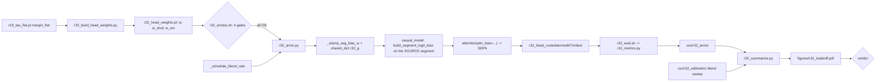

# R32: Head-Routed Source-KV Injection

## Context

StreamEdit anchors the target branch to the source with a **global Q/K blend**
applied identically to every head. Rescoring the R20 blend sweep on 2026-09-15
showed what that costs: across the full rate range, edit-region LPIPS moves
0.025 -> 0.049 and edit-region PSNR 30.4 -> 21.3 dB (**18/18 clips agree on the
direction**), while motion fidelity falls 83.88 -> 69.66. At maximum anchoring
the edit region is SSIM 0.970 to the source -- the edit substantially does not
happen. Every setting of that one scalar lands somewhere on a single
edit-vs-motion trade-off curve.

R32 removes the blend entirely and reintroduces the source as **one appended
K/V segment**, then reduces its influence per head and per step. Spatial heads
early see the source whole; temporal heads late see none of it. Goal: land
**off** the trade-off curve rather than somewhere on it.

**Done when:** all 12 arms are rendered on the 22 `cases.json` clips, scored on
edit strength and motion separately, and a GO / NO-GO / SATURATION verdict is
recorded against the stored blend-sweep curve, with the claim-2 permutation
control reported alongside.

## Execution steps

| # | id | type | what | sets_status |
|---|----|------|------|-------------|
| — | *(prep)* | — | `todos`: head weights, bridge, schedule, driver, smoke, slurm, summarize | — |
| 0 | smoke | sbatch | four blocking gates; G4 fixes the noise floor | — |
| 1 | wait-smoke | manual | all gates `-OK`, floor recorded | — |
| 2 | launch-infer | sbatch | array over 12 arms x 22 clips | `running` |
| 3 | wait-infer | manual | 12 x 22 frame dirs, failures 0 | `finished` |
| 4 | launch-eval | sbatch | `r10_metrics.py` over all arms | — |
| 5 | wait-eval | manual | 12 per-arm CSVs, no nan | — |
| 6 | summarize | local | trade-off figure vs the stored blend curve | — |
| 7 | verdict | manual | GO / NO-GO / SATURATION | `analyzed` |

```
/build-step head-weights R32     # then bridge-source-bias, pipeline-schedule,
                                 # driver, smoke, slurm, summarize
/run-step R32 smoke
/run-step R32 launch-infer
/run-step R32 summarize
```

## Decisions

| Decision | Choice |
|---|---|
| Base configuration | `blend_off=True` **and** `src_kv_full=True`. Both flags already exist. Together they give key set `[trg_prev \| src_current \| trg_current]` with pure-target prev/current and the **full** source current chunk appended at **every** step -- source enters the target branch at exactly one place |
| Why the existing injection gate is not inherited | The default source-KV path fires only on `current_timestep_index > total_timestep // 2`, i.e. the **low-noise** half. That is the opposite shape to Eq. 4's documented rationale (*"anchor hard at high noise and release as the sample resolves"*). Inheriting it would supply source exactly when structure is already fixed and appearance is being painted. `src_kv_full=True` bypasses the gate; `g(i)` then reinstates the correct shape |
| Bias form | **Additive, two independent factors**: `b_src[h,i] = -(alpha*w(h) + beta*g(i))`. Additive in logits = multiplicative on attention weight, and the two causes compose without interacting. `alpha=0` isolates the schedule, `beta=0` isolates head routing, both `0` is uniform full injection |
| Sign of the knob | One-sided: `b <= 0` always, so the bias only ever **reduces** source below its natural level, never amplifies. Worst case degrades toward "no source", which is a measured arm (`noblend_nosrc`), not an unknown |
| `w(h)` | `w = (1 + tanh(margin_flat/T))/2`, `T = 0.5`, from `evaluation/r19_tau_flat.pt`. `w=0` strongly spatial, `w=1` strongly temporal. Continuous, not thresholded: R19's margin histogram is **not** bimodal (~20% of mass within \|margin\|<0.2), so any cut is arbitrary, and the 183 DENSE + 11 MIXED heads land mid-range rather than being forced to a side |
| Sign convention, asserted not assumed | Negative margin = spatial, positive = temporal. Verified in `r19_tau_flat.pt`: all 117 SPATIAL heads in [-0.997, -0.159], all 49 TEMPORAL in [+0.184, +1.000]. The builder **re-asserts** this against the labels, because an inverted experiment still runs and still produces plausible numbers |
| `g(i)` | `g = 1 - _schedule_blend_rate(g_sched, i, n_steps)`, default `g_sched = cos_full`, so `g` rises 0 -> 1 over the schedule. Reuses the R20-validated helper verbatim, which also makes `cos_half`/`cos_third` free variants and gives two degenerate references: `const` => `g == 0` (beta inert), `zero` => `g == 1` (uniform `-beta`) |
| Source token set | Source **current chunk only**, foreground included. No `src_prev`: with blending off it would be the only past-side source signal, doubling the past key count and moving every head's softmax denominator -- a second mechanism, out of scope here |
| Arms (12) | `paper` (StreamEdit reference) · `noblend_nosrc` (motion floor) · `uniform` (a=0,b=0: mechanism only) · `head_a1/a2/a4` (b=0) · `time_b1/b2/b4` (a=0) · `full` (a*,b*) · `full_shuf` · `full_rev` |
| Controls, both required | `full_shuf` = the exact `w` multiset permuted across heads at a fixed seed -- **ideas.tex claim 2's stated falsifier** (head type must not be a proxy for injecting less). `full_rev` = `1-w`; symmetric degradation of `full` and `full_rev` means saturation, which is a different finding from "routing does not work" |
| Reference arm is `uniform`, not `paper` | A biased arm cannot run on FlashAttention, so every routed arm pays an SDPA kernel change; zeros-bias SDPA is not bitwise equal to `attn_mask=None` SDPA. `uniform` carries an explicit zero bias through the identical path. `paper` is the external reference, `uniform` the internal one, and GATE4 measures the gap between kernels as the readability floor |
| Coverage | The 22 `evaluation/cases.json` clips, edit types 1/2/5/6 -- the same set as R20/R21/R26/R30/R31, so the stored blend-sweep curve is directly comparable. Single-window path, clips truncated to 81 pixel frames |
| Edit-strength metric | `lpips_edit_part`, `psnr_edit_part`, `ssim_edit_part`, `structure_distance_edit_part` -- LPIPS/PSNR/SSIM between **source and target inside the edit mask**. Already implemented in `evaluate.py` and merely absent from the default `--metrics` list, which is why no prior run scored it. Demonstrated 18/18 clip agreement on the blend sweep; CLIP was only 4/18 and is demoted to a secondary column |
| Motion + preservation metrics | `motion_fidelity_score`; `structure_distance`, `psnr/lpips/mse/ssim_unedit_part`; `clip_similarity_target_image(_edit_part)` secondary |
| Sweep protocol | Two stages in one array: `head_a*` and `time_b*` fix the scales independently, then `full` runs at the (`a*`,`b*`) pair with the largest single-axis effect. Controls run at that same pair |
| Out of scope | The reference KV bank / `I^ref` routing (ideas.tex L3); `src_prev` injection; head-typed **query** routing (ideas.tex L1's `r^T=0`, subsumed here by removing the blend globally); per-token spatial gating (R26/R30/R31 own that axis); R11's general `patched_attn` refactor, explicitly dropped |

## Step commands

### smoke

```bash
cd ~/Code/StreamEdit_bigchantier
sbatch slurm_scripts/five_bench/r32_smoke.sh
```

### wait-smoke

```bash
tail -40 logs/r32_smoke_{job_id}.out    # four GATEn-OK lines; record GATE4's floor
```

### launch-infer

```bash
sbatch slurm_scripts/five_bench/r32_infer.sh
```

### wait-infer

```bash
sacct -j {job_id} --format=JobID,State
ls -d /projects/dataggen/outputs/five_bench/r32_head_routed/*/edit*/*/ | wc -l   # expect 264
grep -h "done:" logs/r32_infer_*.out
```

### launch-eval

```bash
sbatch slurm_scripts/five_bench/r32_eval.sh
```

### wait-eval

```bash
ls evaluation/csv/r32_arms/r32_*_avg.csv | wc -l      # expect 12
grep -l nan evaluation/csv/r32_arms/r32_*_avg.csv     # expect none
```

### summarize

```bash
python evaluation/r32_summarize.py \
  --arms_csv evaluation/csv/r32_arms \
  --blend_curve evaluation/csv/r32_editmetric \
  --out_csv evaluation/csv/r32_summary.csv \
  --out_fig evaluation/figures/r32_tradeoff.pdf
```

### verdict

```bash
# Read evaluation/figures/r32_tradeoff.pdf FIRST.
#  GO         : `full` sits OFF the blend curve by more than GATE4's floor,
#               AND beats `full_shuf` (ideas.tex claim 2)
#  NO-GO      : `full` lands ON the curve -- routing buys nothing a global
#               scalar could not
#  SATURATION : `full` and `full_rev` degrade symmetrically -- no headroom in
#               the margin; NOT the same finding as "routing does not work"
# Record verdict + outcome bullet in daily.md; update ideas.tex claim-1/2 status.
```

## Pipeline



## Code to touch

**Already landed, needs retargeting** — a per-head additive-bias SDPA path
exists and is verified (head isolation exact, segment restriction 4.88e-04,
8.60 ms vs flash 4.01 ms on the cutlass memory-efficient backend, 0.31 GiB).
It currently biases the `trg_prev` segment; R32 needs it on the **source**
segment and per-step.

- `Self-Forcing_StreamEdit/wan/modules/attention.py` — no change. `attn_bias`
  already refuses a head axis of 1 rather than broadcasting it, which is the
  failure mode GATE1 exists to catch.
- `Self-Forcing_StreamEdit/wan/modules/causal_model.py` — record segment indices
  as `b_key_list` is built; read `seg_bias_w` / `seg_bias_ab` / `shared_dict['r32_g']`;
  form `row = -(alpha*w + beta*g)` and target the **source** segment.
  Keep `build_segment_logit_bias` (its `.view(-1, 1)` is load-bearing: a bare
  `[Nh]` row broadcasts along the key axis and raises unless `len == Nh`).
  `seg_bias_w is None` must reach the untouched baseline call.
- `Self-Forcing_StreamEdit/pipeline/edit_causal_inference.py` — add `g` to
  `shared_dict_dual` beside `blender_rate`; `_stamp_seg_bias_w` mirroring
  `_stamp_vp` with layer- and head-count guards, plus its defensive clear.

**New**

- `evaluation/r32_build_head_weights.py` — w / w_shuf / w_rev + the sign assert.
- `evaluation/r32_arms.py` — driver, per `r10_vp_arms.py`.
- `evaluation/r32_summarize.py` — arms as points against the stored blend curve.
- `slurm_scripts/five_bench/r32_smoke.sh` — the four gates.
- `slurm_scripts/five_bench/r32_infer.sh` — array over 12 arms.
- `slurm_scripts/five_bench/r32_eval.sh` — `r10_metrics.py`, metric list per Decisions.
