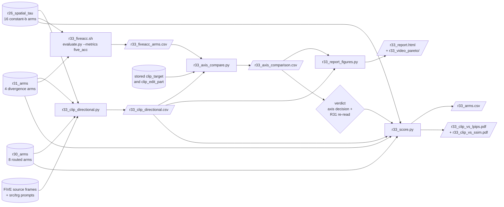

# R33: Edit-Alignment Metric Validation

## Context

FiVE-Bench's `clip_similarity_target_image` is the achievement axis every R26/R30/R31
trade-off figure is plotted against, and on this case set it does not rank renders by edit
strength. Measured per clip over R26's own 8-`b` SPATIAL sweep: `Spearman(b, clip_target)`
= **+0.098** mean, positive on only **11/22** clips — a coin flip — while
`Spearman(b, niqe_target)` = −0.530 (quality *improves* with `b`, on 18/22) and
`Spearman(niqe, clip)` = −0.093 (CLIP tracks quality no better than it tracks `b`).

The cause is measured, not assumed: `cos(E_txt(src_prompt), E_txt(trg_prompt))` = **0.846**
mean, up to 0.970. Source and target prompts differ by one noun inside a ~35-token scene
description, and CLIP is source-agnostic — a regenerated tree is still a tree — so the
shared majority is satisfied identically at every `b`. It dominates the embedding while
contributing no gradient. The confound is **render-level, not frame-level**, so the
harness's averaging over strided frames does not reduce it.

This is a metric-design problem, not a harness bug: CLIPScore was reimplemented
independently and reproduces the stored `clip_similarity_source_image` exactly (6/8 probe
clips to 0.000).

**Done when:** CLIP-D and FiVE-Acc CSVs exist for all arms; `Spearman(b, axis)` is reported
for every candidate axis on the same footing; a decision is recorded on which axis the paper
uses; R31's verdict is re-read on it; the per-video Pareto panels and HTML report are
regenerated on the chosen axis; and the aggregate (mean-over-22-clip) CLIP-D-vs-LPIPS/SSIM
trade-off figures exist for all 28 arms, superseding `r30_clip_vs_lpips.pdf` /
`r31_clip_vs_lpips.pdf` on the corrected axis; and — added 2026-09-22 — the same aggregate
pair exists on the FiVE-Acc axis (originally `r33_fiveacc_vs_lpips.pdf` / `_vs_ssim.pdf`
on `yn_acc`, plus the `r33_fiveacc_mc_*` variant); and — added 2026-09-22, later the same
day — the per-video Pareto panels exist per achievement axis in their own subfolder
(`r33_video_pareto/clipd/`, `r33_video_pareto/fiveacc/`), not just as an aggregate; and
— added 2026-09-22, later still — `r33_report.html` shows every one of those per-video
panels together, one section per clip, not split across files: CLIP-D, `yn_acc`,
`mc_acc`, and the combined `five_acc = (yn+mc+union+inter)/4` (own subfolder each,
`fiveacc/`/`fiveacc_mc/`/`fiveacc_combined/`), four `<figure>` panels per section; and —
added 2026-09-22, later still again — the AGGREGATE FiVE-Acc figures got the same
combined `five_acc` axis and an unambiguous rename: the bare `r33_fiveacc_vs_*.pdf` /
`r33_arms_fiveacc.csv` now mean the combined axis (not silently `yn_acc`), that former
`yn_acc` run moved to `r33_fiveacc_yn_vs_*.pdf` / `r33_arms_fiveacc_yn.csv`, and
`r33_fiveacc_mc_*` is unchanged — three unambiguous aggregate pairs total, matching the
per-video subfolder split; and — added 2026-09-22, finally — `five_acc` is a full 7th
row in `r33_axis_comparison.csv` too (not just the figures), and the axis choice was
formally re-checked against it: unchanged, `clip_d_prompt` remains chosen.

## Execution steps

| # | Step id | Type | What | wait_for | sets_status |
|---|---------|------|------|----------|-------------|
| — | *(prep)* | — | `/build-step` the six `todos` — scripts do not all exist yet | — | `implemented` |
| 1 | `clip-d` | sbatch | Directional CLIP over 28 arms (R26 16 + R30 8 + R31 4) | — | `running` |
| 2 | `wait-clip-d` | manual | 616 rows, 28 methods, no MISSING; check `delta_img_norm` at low `b` | `clip-d` | — |
| 3 | `fiveacc` | sbatch | FiVE-Acc array, 20 arms × 22 clips = 440 videos | `clip-d` | `running` |
| 4 | `wait-fiveacc` | manual | 20 tasks COMPLETED, zero `Error:` lines | `fiveacc` | `finished` |
| 5 | `axis-compare` | local | `Spearman(b, axis)` per candidate axis, incumbent included | `wait-fiveacc` | — |
| 6 | `figures` | local | Per-video Pareto panels + HTML on the chosen axis | `axis-compare` | — |
| 7 | `verdict` | manual | Record the axis decision; re-read R31's verdict on it | `figures` | `analyzed` |
| 8 | `aggregate-figures` | local | Aggregate CLIP-D-vs-LPIPS/SSIM figures, all 28 arms, superseding `r30_`/`r31_clip_vs_*.pdf` | `verdict` | — |
| 9 | `fiveacc-figures` | local | The same aggregate pair on the **FiVE-Acc** axis instead of CLIP-D — `yn_acc` then `mc_acc`, 4 PDFs + 2 CSVs | `aggregate-figures` | — |
| 10 | `video-pareto-split` | local | Re-run `figures` with `--pareto_out` pointed at a `clipd/` subfolder, so CLIP-D's per-video panels are no longer flat in `r33_video_pareto/` | `figures` | — |
| 11 | `video-pareto-fiveacc` | local | Per-video Pareto panels for FiVE-Acc's `yn_acc` axis, one PNG per clip, written to a sibling `fiveacc/` subfolder — the per-clip analogue of `fiveacc-figures`' aggregate | `video-pareto-split` | — |
| 12 | `report-dual` | local | Regenerate `r33_report.html` with BOTH axes' per-video panels in one section per clip (`--x_metric2`), superseding the split single-axis reports | `video-pareto-fiveacc` | — |
| 13 | `report-multi` | local | Add `mc_acc` and a new combined `five_acc` axis, per-video: `r33_report.html` now carries FOUR panels per clip, not two | `report-dual` | — |
| 14 | `fiveacc-figures-relabel` | local | Fix `fiveacc-figures`' misleading AGGREGATE filenames: bare `r33_fiveacc_vs_*` now means the combined `five_acc` axis (was silently `yn_acc`); that data moves to `r33_fiveacc_yn_vs_*` | `report-multi` | — |
| 15 | `axis-compare-fiveacc` | local | Add `five_acc` to the Spearman(b, axis) validation table (`AXES`), not just the figures — re-run `axis-compare` | `fiveacc-figures-relabel` | — |
| 16 | `verdict-fiveacc-reread` | manual | Confirm `five_acc` doesn't change the axis choice — high mean (+0.59) but 15/22 flat, same failure mode as `yn_acc`/`mc_acc` | `axis-compare-fiveacc` | — |
| 17 | `fiveacc-figures-titlewrap` | local | Fix a real bug the user spotted: `five_acc`'s aggregate panels rendered visibly shorter than CLIP-D's — long `XNOTE` strings were silently widening the saved PDF page | `verdict-fiveacc-reread` | — |

Step 9 was **added 2026-09-22, after `aggregate-figures`**, at the user's request for a
FiVE-Acc-vs-LPIPS/SSIM aggregate pair alongside the CLIP-D one. It needs no new jobs —
this task's own `fiveacc` step already scored R26's 16 and R31's 4 arms, and R30's 8 were
never re-run because `r30_fiveacc_arms.csv` already holds them (see the Decisions row on
why R30's FiVE-Acc cannot draw a reference curve — it still cannot; R30's arms remain
scatter points here, exactly as on the CLIP-D panels).

Steps 10–11 were **added 2026-09-22, after `fiveacc-figures`**, at the user's request to
give FiVE-Acc the same per-video (not just aggregate) treatment CLIP-D already had, and to
stop the two axes' per-video PNGs sharing one flat folder under generic-looking names.
Both are `local` and need no new jobs — `r33_report_figures.py` was already parametrized
over `--x_metric`/`--pareto_out`/`--out`, so this is two more invocations of an existing
script, not new code (see the `video-pareto-split`/`video-pareto-fiveacc` step notes for
why a re-run was used over a manual file move, and for the real finding step 11 surfaced:
most single clips' `yn_acc` is flat across the whole `b`-sweep, which is the per-clip
mechanism behind the coarseness already reported at the aggregate level).

Step 12 was **added 2026-09-22, after `video-pareto-fiveacc`**, at the user's request:
`r33_report.html` has to show both per-video axes, not send a reader to two separate
files. Needed one script change first (`--x_metric2`/`--pareto_out2` + `write_html_dual`
on `r33_report_figures.py`, see Code to touch) but no new jobs or CSVs — steps 10–11 had
already produced every PNG this step's HTML links to. `r33_report_fiveacc.html` (step
11's standalone file) is now redundant and was deleted.

Step 13 was **added 2026-09-22, after `report-dual`**, at the user's request for two more
per-video axes: `mc_acc` (FiVE-Acc's other accuracy column, already usable as
`--x_metric`) and a new combined `five_acc = (yn_acc+mc_acc+union+inter)/4` — evaluate.py's
own verdict, verified against its source rather than recomputed (see Decisions and the
step's own note). No new GPU work: every column this step reads was already on disk from
the `fiveacc` step. Required generalising `report-dual`'s 2-axis-only script interface to
N axes first (`--x_metric_more`/`--pareto_out_more`, `write_html_multi`; see Code to touch,
2nd pass) since a third and fourth panel per clip needed adding, not just swapping two.

Step 14 was **added 2026-09-22, after `report-multi`**, when the user pointed out that
`fiveacc-figures`' AGGREGATE `r33_fiveacc_vs_lpips.pdf`/`_vs_ssim.pdf` were misleading:
the bare, unqualified name implied "FiVE-Acc" broadly but the figure only ever plotted
`yn_acc`. Fixed by making `five_acc` (the combined axis `report-multi` just added for
per-video) a real `--x_metric` on `r33_score.py` too, computing it for R30's arms from
existing columns since `r30_fiveacc_arms.csv` has no precomputed `five_acc` column (see
Code to touch and the step's own note), then re-running under corrected names: the bare
name now means the combined axis, `yn_acc`'s figures moved to an explicit `_yn` suffix,
and `mc_acc`'s were already correct. No new GPU work — same inputs `fiveacc-figures`
already had on disk.

Steps 15–16 were **added 2026-09-22, after `fiveacc-figures-relabel`**, at the user's
request: `five_acc` had been added to the aggregate and per-video FIGURES (steps
13–14) but never to `r33_axis_compare.py`'s `AXES` table, so it had no
`Spearman(b, axis)` row and never went through the actual axis-CHOICE test the other
five candidates did. One-line script addition, then a re-read against the same bar the
original `verdict` step used. RESULT: no change — `five_acc` fails the same
high-mean/low-coverage test `yn_acc`/`mc_acc` already failed (expected, since it's a
deterministic function of them), and `clip_d_prompt` remains the chosen axis.

Step 17 was **added 2026-09-22, after `verdict-fiveacc-reread`**, when the user noticed
`five_acc`'s panels in the report's 4.1 rendered visibly shorter than CLIP-D's at the
same display width. Traced to a real bug in `draw_curve_scatter` (see Code to touch and
the step's own note): an unwrapped title plus `bbox_inches="tight"` let a long `XNOTE`
string silently widen the saved PDF page, not just for `five_acc` — every FiVE-Acc axis
had a wider-than-CLIP-D page, in proportion to how long its `XNOTE` string was. Fixed
with `textwrap.fill`, then all four `--x_metric` variants re-run so nothing is left
inconsistent.

```
/run-step R33 clip-d
/run-step R33 wait-clip-d
/run-step R33 fiveacc
/run-step R33 wait-fiveacc
/run-step R33 axis-compare
/run-step R33 figures
/run-step R33 verdict
/run-step R33 aggregate-figures
/build-step R33 fiveacc-figures
/run-step R33 fiveacc-figures
/run-step R33 video-pareto-split
/run-step R33 video-pareto-fiveacc
/build-step R33 report-dual
/run-step R33 report-dual
/build-step R33 report-multi
/run-step R33 report-multi
/build-step R33 fiveacc-figures-relabel
/run-step R33 fiveacc-figures-relabel
/build-step R33 axis-compare-fiveacc
/run-step R33 axis-compare-fiveacc
/run-step R33 verdict-fiveacc-reread
/build-step R33 fiveacc-figures-titlewrap
/run-step R33 fiveacc-figures-titlewrap
```

## Decisions

| Question | Choice |
|---|---|
| CLIP-D scope | **28 arms**: R26's 16 constant-`b` (8 spatial `taubg0_taufg{b}` + 8 uniform `taubg{b}_taufg{b}`) + R30's 8 routed arms + R31's 4 divergence arms. R31's `lin04` branch excluded. |
| FiVE-Acc scope | **Full**: R26's 16 + R31's 4 = 20 arms × 22 clips = **440 videos**. R30 already has `r30_fiveacc_arms.csv` and is not re-run. |
| Why R30's FiVE-Acc cannot substitute | Its 8 arms each use a **per-clip routed `b`** (161 distinct values over 176 rows), so it contains no constant-`b` arm and cannot draw a reference curve. |
| `0040_tennis` EOT bug | **Document + exclude from aggregates.** No rescore, no CSV patch. See the `tennis-note` todo for the mechanism. |
| CLIP-D formula | `cos(E_img(render) − E_img(src), E_txt(trg_prompt) − E_txt(src_prompt))`, embeddings L2-normalised **before** the subtraction. |
| CLIP-D sign | **Kept, not clamped.** Absolute CLIPScore uses `max(cos, 0)`; here a negative value means the edit moved the wrong way, which is the most informative thing an over-released arm can report. |
| CLIP-D second column | `clip_d_word` from `src_word`→`trg_word` alongside `clip_d_prompt`. The word pair is more separable (mean cos 0.71 vs 0.85) and costs nothing. |
| Degeneracy guard | `delta_img_norm` column: at low `b` the render barely differs from the source, so `Δ_img` is short and its direction ill-conditioned. Must be inspected before trusting the low-`b` end. |
| `clip-d` job shape | **Single task, not arrayed.** The script loops clips OUTER / methods INNER, so each clip's source frames are embedded once (211 total) and reused by all 28 methods: 6,119 embeds for the whole job. Arraying by arm re-embeds the sources in every task → 11,816 embeds, **+93% GPU**, plus 28 model loads, to parallelise a job that needs one GPU for well under an hour. Documented fallback if it ever runs long: split by task group (R26-spatial / R26-uniform / R30 / R31, `--array=0-3`), which holds source redundancy at 4×. |
| `frame_stride` | **8**, matching every R26/R30/R31 eval. CLIP-D is only comparable with the stored LPIPS/SSIM/CLIP columns if it describes the same frames. |
| CSV reading | Per-edit-type per-clip files (`edit{T}_FiVE_{stem}_frame_stride8.csv`). **Never** the top-level `{stem}_avg.csv` — evaluate.py's own averaging step is broken (off by ~100× on some columns; see R31's plan). |
| FiVE-Acc isolation | Run with `--metrics five_acc` **alone**. R20's GPU exhaustion was Qwen2.5-VL-7B + CoTracker co-residency, not five_acc's own cost. |
| FiVE-Acc coarseness | ⚠️ Expected to tie: 6 of R30's 8 arms share `mc_acc` = 0.818 (18/22 clips). At n=22 it is an accuracy, so it yields vertical bands, **not** a continuous Pareto x-axis. |
| Conda env | `five-bench` (not `streamgve` — the R2 env bug: `.bashrc` auto-activates `streamgve` and `conda activate five-bench` alone does not pop it). |
| Naming | All task files take the `r33_` prefix. The two drafts written during R31's debugging (`r31_clip_directional.{py,sh}`) are **renamed**, not copied. |
| Out of scope | Re-running the 9-metric harness; `motion_fidelity_score`; R31's `lin04` branch; any change to R31's renders. |
| FiVE-Acc aggregate axis (2026-09-22) | **`yn_acc` primary, `mc_acc` secondary.** Measured over the 22 clips, ordered by `b`: `yn_acc` SPATIAL 0.545 → 0.818 (spread 0.273, monotone) and UNIFORM 0.500 → 0.864 (spread 0.364, monotone), while `mc_acc` SPATIAL is saturated from `b`=4 (spread 0.136) and UNIFORM is outright **non-monotone** (0.727 0.773 0.818 0.773 0.864 0.818 0.818 0.818). So `yn_acc` takes the requested `r33_fiveacc_vs_*.pdf` filenames; `mc_acc` is drawn too, under `r33_fiveacc_mc_vs_*.pdf`, as a robustness variant that should be read as a null result rather than a curve. |
| Aggregate curves vs. the per-clip coarseness row | **Not a contradiction.** The FiVE-Acc-coarseness row above ("6 of 8 R30 arms share `mc_acc` = 0.818") is a *per-clip* statement about a 0/1 metric; averaging 22 clips per arm smooths it into the monotone aggregate curves quoted above. |
| Residual quantisation caveat | Averaging 22 binary clips quantises x to multiples of 1/22, so **arms still collide exactly**: on `yn_acc` SPATIAL, `b` = 4, 6, 8 all sit at 0.727. Points overplot and the figure reads as a vertical band, not a clean ranking — the same failure mode as the coarseness row, one order of magnitude weaker. Do not read arm order off the x-axis at ties; read it off the `b` labels. |
| No new GPU work for these figures | Every x-value already exists on disk: `edit{T}_FiVE_r33_fiveacc_{method}_frame_stride8.csv` (R26's 16, this task's `fiveacc` step, job 1004302), `edit{T}_FiVE_r33_fiveacc_r31_{arm}_frame_stride8.csv` (R31's 4, same job), `evaluation/csv/r30_fiveacc_arms.csv` (R30's 8). y-values (`lpips_unedit_part` / `ssim_unedit_part`) are unchanged from the CLIP-D panels — only the x pairing differs. |
| Distinct `-o` and `--fig_stem` are mandatory | `r33_score.py` names its CSV column after the x-metric, so reusing the default `-o` would silently overwrite `r33_arms.csv`'s `clip_d_prompt` table with a `yn_acc` one. Hence four output paths, four figure stems. |
| `0040_tennis` on the FiVE-Acc panels | **Kept, all 22 clips.** The exclusion above applies to the CLIP family only: the EOT-truncation bug corrupts the text embedding, and FiVE-Acc never embeds the prompt (`r33_axis_compare.py`'s `AXES` table already marks these axes `tennis_immune=True`). The FiVE-Acc panels therefore carry 22 clips per arm where the CLIP-D panels carry 21. |
| Per-video panels: one subfolder per axis (2026-09-22) | **`r33_video_pareto/clipd/` and `r33_video_pareto/fiveacc/`, not one flat folder.** `r33_report_figures.py` is parametrized over `--x_metric`, so a second axis run into the same flat directory would sit under filenames distinguished only by the `AXIS_STEM` suffix (`_clipd_vs_lpips.png` vs `_fiveacc_yn_vs_lpips.png`) — technically non-colliding, but easy to misread as one mixed set when browsing the folder. Split at the user's request; regenerated via a re-run with `--pareto_out` changed, not a manual file move (see `video-pareto-split`'s step note for why that matters: `write_html`'s `` is computed from the actual returned path, so a re-run keeps `r33_report.html` correct automatically). |
| Per-video FiVE-Acc axis scope | **`yn_acc` only, not `mc_acc`.** Mirrors the aggregate-level call (`FiVE-Acc aggregate axis` row above): `mc_acc` is already an established null result, so a per-video panel for it would not be new evidence. If `mc_acc` per-video panels are ever wanted, `video-pareto-fiveacc`'s command is the template — swap `--x_metric yn_acc` for `mc_acc` and give it its own `--pareto_out`/`--out`. |
| One merged `r33_report.html`, not two single-axis reports (2026-09-22) | **User's explicit request.** `video-pareto-split`/`video-pareto-fiveacc` had already produced a correct CLIP-D report (`r33_report.html`) and a correct but separate FiVE-Acc-only report (`r33_report_fiveacc.html`). `report-dual` merges them into one: every clip's section now shows both per-video panels side by side, captioned by axis. The standalone FiVE-Acc report was deleted once the merge was verified, so there is exactly one canonical per-video report on disk, not two that could drift out of sync on a future re-run. |
| `write_html_dual` lives in `r33_report_figures.py`, not `r31_html_report.py` | `r31_html_report.write_html` accepts one `pareto_by_case` dict and renders one `` per section — extending it to two would change its signature for R31/R34's own (single-axis) call sites too. A local dual-panel writer in R33's own script keeps that shared function untouched, consistent with this task's standing rule of reusing R31's code unmodified (see the figures-script todo). |
| `five_acc` formula (2026-09-22) | **`(yn_acc + mc_acc + union + inter) / 4`, exactly evaluate.py's own combined column, not a new derived metric.** Verified against `evaluation/fivebench/evaluate.py` (~line 519-527), not assumed: `union = int(yn_acc or mc_acc)`, `inter = int(yn_acc and mc_acc)`, `five_acc = mean([yn_acc, mc_acc, union, inter])`. Already computed at job time and sitting in every R26/R31 per-clip CSV from this task's own `fiveacc` step (`*\|five_acc` column) — reading it needed zero new scoring. |
| `five_acc` per-video scope | **R26/R31 only, same as `yn_acc`/`mc_acc`'s existing per-video scope — R30 out of scope.** `r30_fiveacc_arms.csv` has `union`/`inter` columns (so a `five_acc` value is *computable* for R30's 8 arms) but no precomputed `five_acc` column, and `r33_report_figures.py` never reads R30's per-video data for any axis (R30 only appears as scatter points on the aggregate `r33_score.py` panels) — no gap here, just noting why R30 isn't part of this. |
| `five_acc` NOT added to the axis-comparison / verdict test | **Per-video panel only, at the user's explicit request — not wired into `r33_axis_compare.py`'s `AXES` table.** It has no `Spearman(b, axis)` row in `r33_axis_comparison.csv` and played no part in the `verdict` step's axis choice. If it's ever wanted there too, `AXES` just needs one more `("five_acc", "fiveacc", "five_acc", True)` tuple — `load_fiveacc_metric` already reads arbitrary `*\|<metric>` columns generically, no new loader needed. |
| CLI generalised to N per-video axes (2026-09-22) | **`--x_metric_more`/`--pareto_out_more` (repeatable, paired positionally), replacing the same-day `--x_metric2`/`--pareto_out2`.** Two flags rather than a packed `"metric:path"` string, to match the script's existing plain-flag style. Chosen once a *third* axis (`five_acc`, alongside `yn_acc` and `mc_acc`) was requested for the same report — a fixed two-slot interface would have needed a second special-cased rename instead of one generalisation. |
| `r33_fiveacc_vs_*`/`r33_arms_fiveacc.csv` naming (2026-09-22, corrected) | **Bare "fiveacc" means the combined `five_acc` axis, not `yn_acc`.** `fiveacc-figures` originally used the bare name for the `yn_acc` run — reasonable in isolation, but misleading once a genuinely combined axis existed, since "FiVE-Acc" is the name of the whole 4-column family. `fiveacc-figures-relabel` renamed that run to an explicit `_yn` suffix and put the combined `five_acc` axis under the bare name instead, matching the per-video subfolder naming `report-multi` already used (`fiveacc_combined` for per-video is arguably the odd one out now — not renamed here since the per-video user request didn't ask for it, but worth aligning if this comes up again). `r33_fiveacc_mc_*` was already correctly qualified and untouched. |
| R30's `five_acc` is computed, not read (2026-09-22) | **`r30_fiveacc_arms.csv` has `yn_acc`/`mc_acc`/`union`/`inter` columns but no precomputed `five_acc` one** (unlike R26/R31's CSVs, where `evaluate.py` writes a `five_acc` column directly at scoring time — confirmed by reading `r30_fiveacc_arms.csv`'s header before writing code, not assumed). `load_r30_arms`'s new `five_acc` branch computes `(yn_acc+mc_acc+union+inter)/4` per clip from those four existing columns — same formula, no rescore, no new file. |
| `five_acc` added to the axis-CHOICE test too (2026-09-22) | **Not just the figures — `r33_axis_compare.py`'s `AXES` table too, per the user's explicit request.** Confirms rather than changes the earlier verdict: `five_acc` mean_rho=+0.5916 (high) but only 7/22 clips non-flat (15 flat) — the same high-mean/low-coverage failure `yn_acc` (+0.7113, 16 flat) and `mc_acc` (+0.4638, 18 flat) already showed, expected since `five_acc` is a deterministic function of them (see `r33_report_figures.py`'s per-video note on the 3-value coarseness: 0, 0.5, 1.0). `clip_d_prompt` (+0.4080, 0 flat, full 22/22 coverage) remains the only axis that both clears the incumbent and avoids this trap — unchanged axis choice, formally re-confirmed rather than left implicit. |

## Step commands

### clip-d

```bash
sbatch slurm_scripts/five_bench/r33_clip_directional.sh
```

### wait-clip-d

```bash
sacct -j {job_id} --format=JobID,State,Elapsed
python -c "import csv;r=list(csv.DictReader(open('evaluation/csv/r33_clip_directional.csv')));print(len(r),'rows',len({x['method'] for x in r}),'methods')"
grep -c MISSING logs/r33_clipd_{job_id}.out
```

### fiveacc

```bash
sbatch slurm_scripts/five_bench/r33_fiveacc.sh
```

### wait-fiveacc

```bash
sacct -j {job_id} --format=JobID,State,Elapsed | head -25
ls evaluation/csv/edit*_FiVE_r33_fiveacc_*_frame_stride8.csv | wc -l
grep -c 'Error:' logs/r33_fiveacc_{job_id}_*.out
```

### axis-compare

```bash
python evaluation/r33_axis_compare.py
```

### figures

```bash
python evaluation/r33_report_figures.py --x_metric clip_d_prompt
```

### verdict

```bash
column -s, -t < evaluation/csv/r33_axis_comparison.csv
```

### aggregate-figures

```bash
python evaluation/r33_score.py -o evaluation/csv/r33_arms.csv --fig_dir evaluation/figures
```

### fiveacc-figures

```bash
python evaluation/r33_score.py --x_metric yn_acc \
  --fig_stem r33_fiveacc -o evaluation/csv/r33_arms_fiveacc.csv --fig_dir evaluation/figures
python evaluation/r33_score.py --x_metric mc_acc \
  --fig_stem r33_fiveacc_mc -o evaluation/csv/r33_arms_fiveacc_mc.csv --fig_dir evaluation/figures
```

### video-pareto-split

```bash
python evaluation/r33_report_figures.py --x_metric clip_d_prompt \
  --pareto_out evaluation/figures/r33_video_pareto/clipd
```

### video-pareto-fiveacc

```bash
python evaluation/r33_report_figures.py --x_metric yn_acc \
  --pareto_out evaluation/figures/r33_video_pareto/fiveacc \
  --out evaluation/figures/r33_report_fiveacc.html
```

### report-dual

```bash
python evaluation/r33_report_figures.py --x_metric clip_d_prompt --x_metric2 yn_acc \
  --pareto_out evaluation/figures/r33_video_pareto/clipd \
  --pareto_out2 evaluation/figures/r33_video_pareto/fiveacc \
  --out evaluation/figures/r33_report.html
```

### report-multi

```bash
python evaluation/r33_report_figures.py --x_metric clip_d_prompt \
  --pareto_out evaluation/figures/r33_video_pareto/clipd \
  --x_metric_more yn_acc --pareto_out_more evaluation/figures/r33_video_pareto/fiveacc \
  --x_metric_more mc_acc --pareto_out_more evaluation/figures/r33_video_pareto/fiveacc_mc \
  --x_metric_more five_acc --pareto_out_more evaluation/figures/r33_video_pareto/fiveacc_combined \
  --out evaluation/figures/r33_report.html
```

### fiveacc-figures-relabel

```bash
python evaluation/r33_score.py --x_metric yn_acc \
  --fig_stem r33_fiveacc_yn -o evaluation/csv/r33_arms_fiveacc_yn.csv \
  --fig_dir evaluation/figures
python evaluation/r33_score.py --x_metric five_acc \
  --fig_stem r33_fiveacc -o evaluation/csv/r33_arms_fiveacc.csv \
  --fig_dir evaluation/figures
```

### axis-compare-fiveacc

```bash
python evaluation/r33_axis_compare.py
```

### verdict-fiveacc-reread

```bash
column -s, -t < evaluation/csv/r33_axis_comparison.csv
```

### fiveacc-figures-titlewrap

```bash
python evaluation/r33_score.py -o evaluation/csv/r33_arms.csv --fig_dir evaluation/figures
python evaluation/r33_score.py --x_metric yn_acc \
  --fig_stem r33_fiveacc_yn -o evaluation/csv/r33_arms_fiveacc_yn.csv --fig_dir evaluation/figures
python evaluation/r33_score.py --x_metric mc_acc \
  --fig_stem r33_fiveacc_mc -o evaluation/csv/r33_arms_fiveacc_mc.csv --fig_dir evaluation/figures
python evaluation/r33_score.py --x_metric five_acc \
  --fig_stem r33_fiveacc -o evaluation/csv/r33_arms_fiveacc.csv --fig_dir evaluation/figures
```

## Pipeline



FiVE-Acc axis (step 9). Same script, same y-sources, x swapped — the only structural
difference is that R30's arms come from a CSV that already carries `yn_acc` / `mc_acc`
columns, so they need no loader at all:

```mermaid
flowchart LR
  F26[(edit{T}_FiVE_r33_fiveacc_{method}\n_frame_stride8.csv\nR26 16 arms)] --> L1[load_fiveacc_metric\nb-swept families, exists]
  F31[(edit{T}_FiVE_r33_fiveacc_r31_{arm}\n_frame_stride8.csv\nR31 4 arms)] --> L2[load_stem_metric\nsingle arm, exists\nmoves to r30_score.py]
  F30[(r30_fiveacc_arms.csv\nyn_acc / mc_acc columns\nR30 8 arms)] --> L3[existing else-branch\nreads the column directly]
  L1 --> FAGG[r33_score.py\n--x_metric yn_acc / mc_acc]
  L2 --> FAGG
  L3 --> FAGG
  FAGG --> FCSV[/r33_arms_fiveacc.csv\n+ r33_arms_fiveacc_mc.csv/]
  FAGG --> FFIG[/r33_fiveacc_vs_lpips.pdf\n+ r33_fiveacc_vs_ssim.pdf\n+ the two _mc_ variants/]
```

## Code to touch

| File | Change |
|---|---|
| `evaluation/r31_clip_directional.py` | **Rename** to `evaluation/r33_clip_directional.py` (`git mv`). Already written and sanity-checked: reverse direction scores exactly −1.0, two distinct edits are orthogonal (−0.018), source-vs-itself returns `nan`. |
| `evaluation/r33_clip_directional.py` | Add `--r30_root` (default `/projects/dataggen/outputs/five_bench/r30_arms`) and extend `method_specs()` with R30's 8 arms. Add a `delta_img_norm` column: mean over paired frames of `‖E_img(render) − E_img(src)‖` measured **before** the per-frame normalisation in `clip_d()`, so the degeneracy guard reflects the real magnitude. |
| `slurm_scripts/five_bench/r31_clip_directional.sh` | **Rename** to `r33_clip_directional.sh`; update `--which`/root flags for the 28-arm scope, the output path to `r33_clip_directional.csv`, the log stem to `r33_clipd_%j`, and the row assertion from 440 to **616** (28 × 22). Keep the existing guard that fails loudly when `/projects/dataggen` is not mounted on the assigned node. |
| `slurm_scripts/five_bench/r33_fiveacc.sh` | **New.** `#SBATCH --array=0-19`, partition `L40S,A100`, `--exclude=node52`, 1 GPU, `--mem=64G`, `--time=06:00:00`. A bash array maps task id → `(stem, full_dir)`; R26 entries are `r26_spatial_tau/{arm}/`, R31 entries are `r31_arms/r31_{arm}/step14/`. Calls `evaluate.py --metrics five_acc --tgt_layout edit_video --result_path evaluation/csv/r33_fiveacc_{stem}.csv`. Reuse r31_eval.sh's post-run guards verbatim: assert 22 real frame dirs (excluding the `_resize` siblings evaluate.py writes), and `grep -c 'Error:'` the teed metrics log, since evaluate.py swallows per-metric exceptions and still exits 0. |
| `evaluation/r33_axis_compare.py` | **New.** Reuses `r30_score.build_join_tables` / `load_r26_metric` for the joins. For each axis in {`clip_similarity_target_image`, `clip_similarity_target_image_edit_part`, `clip_d_prompt`, `clip_d_word`, `yn_acc`, `mc_acc`}: per-clip `Spearman(b, axis)` over `CONST_BS`, then mean and `#rho > 0`. Drops `0040_tennis` from the CLIP-family rows only, and states the exclusion in the output. Writes `evaluation/csv/r33_axis_comparison.csv`. |
| `evaluation/r33_report_figures.py` | **New.** `--x_metric` selects the achievement axis; imports `crop_arm_rows`, `extract_baseline_row`, `label_strip` from `evaluation/r31_html_report.py` instead of duplicating the strip logic. Writes `evaluation/figures/r33_video_pareto/` and `evaluation/figures/r33_report.html`. |
| `evaluation/r31_html_report.py` | Export the three strip helpers unchanged (they are already module-level functions — no edit expected; confirm no import-time side effects before relying on it). |
| `evaluation/r33_score.py` | **New**, added 2026-09-22 post-verdict. Aggregate (mean-over-22-clip) CLIP-D-vs-LPIPS/SSIM trade-off figures for **all 28 CLIP-D arms**, superseding `r30_clip_vs_lpips.pdf`/`r31_clip_vs_lpips.pdf` on the corrected axis (the plan originally scoped only the per-video panels in `r33_report_figures.py`, not this aggregate figure). `draw_curve_scatter` merged from `r30_score.py` and `r31_score.py`: R26 SPATIAL curve + UNIFORM baseline + oracle frontier unchanged (x swapped `clip_target` → `clip_d_prompt`); R30's 8 arms as SQUARE markers (`r30_score.py`'s convention); R31's 4 arms as STAR markers (`r31_score.py`'s convention). x-values from `r33_clip_directional.csv`'s `clip_d_prompt` column (via `r33_axis_compare.load_clipd_metric`); y-values (`lpips_unedit_part`/`ssim_unedit_part`) from R26's own per-edit-type CSVs for the curves, `evaluation/csv/r30_arms.csv` for R30's 8 arms, and `r31_score.load_r31_percli_metric` for R31's 4 — none of these y-sources change, only the x pairing does. Writes `evaluation/csv/r33_arms.csv` (28 rows: `arm, source, clip_d_prompt, lpips, ssim, n_clips`) + `evaluation/figures/r33_clip_vs_lpips.pdf` + `r33_clip_vs_ssim.pdf`. |
| `evaluation/r33_score.py` (2nd pass) | **Widen `--x_metric` to the FiVE-Acc axes**, for the `fiveacc-aggregate-script` todo. This is dispatch-widening, not new structure — the script was already parametrized. Five edits: (1) add `yn_acc` / `mc_acc` to the `--x_metric` `choices` (line 404) and to `XSHORT` / `XNOTE` / `XLABEL` (lines 62-73); (2) `_x_r26` (line 76) gains a FiVE-Acc branch returning `r33_axis_compare.load_fiveacc_metric(r33_csv_dir, idx2vid, name2case, CONST_BS, col, method_fmt=method_fmt)` — note it takes the **bare** `method_fmt`, not the `"r26_" + method_fmt` the CLIP-D branch prepends, because it builds the stem `edit{T}_FiVE_r33_fiveacc_{method}_frame_stride8.csv` itself; (3) `load_r31_arms`'s `else` branch (lines 168-173) gains a FiVE-Acc branch calling the promoted `load_stem_metric` with `stem=f"r33_fiveacc_r31_{arm}"`, `stride=8` — the current `load_r31_percli_metric(..., arm, "", x_metric)` call cannot be reused here because it globs the `r31_{arm}` stem, and R33's FiVE-Acc lives under the `r33_fiveacc_r31_{arm}` stem; (4) nothing else. |
| `load_r30_arms` — **no change needed for `yn_acc`/`mc_acc`** | Because `yn_acc` / `mc_acc` are not in `XM_CLIPD`, x already falls through to the `else` branch at lines 113-118, which reads `r30_perclip_csv` (= `evaluation/csv/r30_fiveacc_arms.csv`) and does `float(r[x_metric])`. That file's columns are *literally* named `yn_acc` and `mc_acc`, and it is the same file the lpips/ssim loop below it already reads, so both axes stay filtered by the identical `case_id` set. Verify before editing — do not "fix" this branch. **UPDATE, 2026-09-22: `five_acc` DID need a change** — see the `r33_score.py` (2nd pass) row below. This original row's claim still holds exactly as written for `yn_acc`/`mc_acc`; it just isn't the whole function's story anymore. |
| ⚠️ The one real trap: **the column name differs by source** | R26's and R31's FiVE-Acc CSVs are written by `evaluate.py` and carry its raw column names `five_acc_yes_no` / `five_acc_multi_choice` (matched suffix-wise, as `step14\|five_acc_yes_no`). `r30_fiveacc_arms.csv` carries the short labels `yn_acc` / `mc_acc`. So a label→column map (`{"yn_acc": "five_acc_yes_no", "mc_acc": "five_acc_multi_choice"}`) is needed in the `_x_r26` and `load_r31_arms` branches **and must not be applied in `load_r30_arms`**, which wants the label verbatim. Applying it uniformly is the failure mode to guard against: it raises `no *\|five_acc_yes_no column` on R30 rather than failing silently, but only after the other 20 arms have already loaded. |
| `evaluation/r34_score.py` → `evaluation/r30_score.py` | **Promote `load_stem_metric` (r34_score.py lines 89-130) into `r30_score.py`; leave a re-export in `r34_score.py`.** No behaviour change, pure relocation. Rationale: `r30_score.py` is already the shared base that `r31_score.py`, `r33_score.py`, `r33_axis_compare.py`, `r34_score.py` and `r34_report_figures.py` all import from (`CONST_BS`, `build_join_tables`, `load_r26_metric`, `oracle_frontier`), so both this task's `load_r31_arms` branch and R31's `fiveacc-score-script` can reach it without either script importing the other or R33/R31 taking a backward dependency on R34. The re-export keeps R34's existing call sites and `r34_report_figures.py`'s import untouched. **Verified read-only that the function already reads the FiVE-Acc single-arm files with no change**, because its column lookup is `endswith(f"\|{metric}")` and so tolerates R31's rows being keyed `step14\|five_acc_yes_no`: `load_stem_metric(..., "r33_fiveacc_r31_lpips", 8, "five_acc_yes_no")` returns 22 clips, mean 0.7273; with `five_acc_multi_choice`, 22 clips, mean 0.7727; and on `("r31_lpips", 8, "lpips_unedit_part")` it is bit-identical to `load_r31_percli_metric`. Keep its docstring's naming-collision warning verbatim on the move — it is the reason the function takes a fully-resolved stem rather than a format string, and the `r31_` / `r34_r31_` collision it guards against is exactly the one the `r33_fiveacc_r31_` stem would otherwise walk into. Update the two `[r34_score]` strings in its error messages to a neutral prefix. |
| `evaluation/r33_report_figures.py` (2026-09-22) | **Added `--x_metric2`/`--pareto_out2` and a new `write_html_dual` function**, so `r33_report.html` can show both achievement axes' per-video panels in one section instead of one axis per report. `main()` refactored: a local `load_axis(x_metric)` closure (curve + R31 points) is now called once for `--x_metric` and, if given, again for `--x_metric2`; `r31_lpips` (axis-independent) is loaded once and shared by both `build_video_pareto` calls. When `--x_metric2` is set, `write_html_dual` (defined in this file, not `r31_html_report.py` — that module's `write_html` only accepts one pareto image per section) replaces the existing `_r31_write_html` + sentinel-string-patch path; that path is otherwise unchanged and still what the single-axis `--pareto_out` runs (`video-pareto-split`, `video-pareto-fiveacc`) use. `SystemExit` guard added: `--x_metric2` without `--pareto_out2` fails loudly rather than silently mixing the second axis's PNGs into `--pareto_out`. |
| `evaluation/r33_report_figures.py` (2nd pass, 2026-09-22, same day) | **Generalised the dual-axis pass above to N axes, and added `five_acc` as a candidate axis.** (1) `AXIS_COLUMN`/`AXIS_LABEL`/`AXIS_STEM` gain a `"five_acc": "five_acc"` entry each (label equals column name — no renaming needed, unlike `yn_acc`/`mc_acc`); `"five_acc"` added to both FiVE-Acc-family dispatch tuples in `load_axis_curve`/`load_axis_r31_point` (routes through the already-generic `*\|<metric>` suffix-matching loader — no new loader function). (2) `--x_metric2`/`--pareto_out2` **removed**, replaced by repeatable `action="append"` `--x_metric_more`/`--pareto_out_more`, paired positionally with a count-mismatch `SystemExit` guard. (3) `write_html_dual` **removed**, replaced by `write_html_multi(cases, strips_by_case, panels, out_path, root)` where `panels` is an ordered `[(label, pareto_by_case), ...]` of any length — the 2-panel case is now just a 1-element `panels` list, not a separate code path. (4) `main()`'s per-axis data (curve + R31 points + `pareto_out`) collected into one `axis_data` list (primary axis first, then each `--x_metric_more` in order) and the per-case loop iterates it, writing into `pareto_by_axis[x_metric]` — replaces the hand-duplicated `pareto_by_case`/`pareto2_by_case` pair from the first pass. `r31_lpips` still loaded once, shared by every axis, unchanged from the first pass. |
| `evaluation/r33_score.py` (2nd pass, 2026-09-22) | **Added `five_acc` as a third `--x_metric` choice, for the AGGREGATE (28-arm) figures — the counterpart of the per-video change above.** `XM_FIVEACC` gains `"five_acc": "five_acc"` (R26/R31 route through the already-generic `_x_r26`/`load_r31_arms` FiVE-Acc branches unchanged, same suffix-matching loader as `yn_acc`/`mc_acc`); `XSHORT`/`XNOTE`/`XLABEL` gain matching entries, `XNOTE["five_acc"]` stating the coarseness caveat directly on the rendered figure. `load_r30_arms` gains a new `elif x_metric == "five_acc":` branch (before the existing generic `else`, which stays untouched for every other axis) computing `(float(r["yn_acc"])+float(r["mc_acc"])+float(r["union"])+float(r["inter"]))/4` per clip from `r30_fiveacc_arms.csv`'s existing columns — that file has no precomputed `five_acc` column, unlike R26/R31's CSVs. `--x_metric`'s `choices` tuple extended to include it. |
| `evaluation/r33_axis_compare.py` (2026-09-22) | **Added `five_acc` to the `AXES` tuple: `("five_acc", "fiveacc", "five_acc", True)`.** One line — `kind="fiveacc"` already dispatches to `load_fiveacc_metric` with whatever column string is given, and `"five_acc"` is a real column on every R26/R31 per-clip CSV (evaluate.py writes it directly), so no new loader or dispatch branch was needed, unlike `r33_score.py`'s `load_r30_arms` (this script never reads R30's per-clip data at all — R30 has no row in `r33_axis_comparison.csv`, same as before). `tennis_immune=True` since FiVE-Acc never embeds the prompt. |
| `evaluation/r33_score.py` (3rd pass, 2026-09-22) | **Bug fix, not a feature addition: title text was silently controlling output image size.** `import textwrap` added; `draw_curve_scatter`'s `ax.set_title(title, fontsize=10)` changed to `ax.set_title(textwrap.fill(title, width=72), fontsize=10)`. Root cause: `title` embeds `XNOTE[x_metric]` as one unwrapped line, and `fig.savefig(out_path, bbox_inches="tight")` sizes the saved PAGE to fit it — so an axis with a long `XNOTE` (five_acc's coarseness caveat, the longest) got a much wider PDF page than CLIP-D's short one, same height, and read as visibly shorter once both were displayed at the same CSS width in the report. `width=72` matches CLIP-D's own title length so its output is unchanged; measured before and after on all four `--x_metric` variants (clip_d_prompt/yn_acc/mc_acc/five_acc): page aspect ratio went from {1.25, 1.48, 2.06, 2.26} to {1.25, 1.25, 1.25, 1.25}. |
