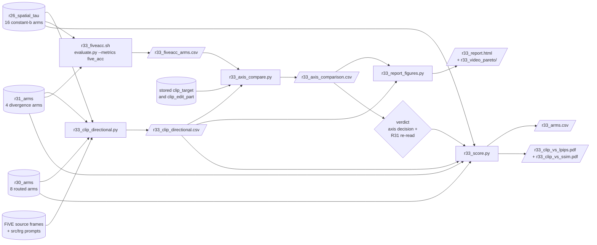

# R33: Edit-Alignment Metric Validation

## Context

FiVE-Bench's `clip_similarity_target_image` is the achievement axis every R26/R30/R31
trade-off figure is plotted against, and on this case set it does not rank renders by edit
strength. Measured per clip over R26's own 8-`b` SPATIAL sweep: `Spearman(b, clip_target)`
= **+0.098** mean, positive on only **11/22** clips — a coin flip — while
`Spearman(b, niqe_target)` = −0.530 (quality *improves* with `b`, on 18/22) and
`Spearman(niqe, clip)` = −0.093 (CLIP tracks quality no better than it tracks `b`).

The cause is measured, not assumed: `cos(E_txt(src_prompt), E_txt(trg_prompt))` = **0.846**
mean, up to 0.970. Source and target prompts differ by one noun inside a ~35-token scene
description, and CLIP is source-agnostic — a regenerated tree is still a tree — so the
shared majority is satisfied identically at every `b`. It dominates the embedding while
contributing no gradient. The confound is **render-level, not frame-level**, so the
harness's averaging over strided frames does not reduce it.

This is a metric-design problem, not a harness bug: CLIPScore was reimplemented
independently and reproduces the stored `clip_similarity_source_image` exactly (6/8 probe
clips to 0.000).

**Done when:** CLIP-D and FiVE-Acc CSVs exist for all arms; `Spearman(b, axis)` is reported
for every candidate axis on the same footing; a decision is recorded on which axis the paper
uses; R31's verdict is re-read on it; the per-video Pareto panels and HTML report are
regenerated on the chosen axis; and the aggregate (mean-over-22-clip) CLIP-D-vs-LPIPS/SSIM
trade-off figures exist for all 28 arms, superseding `r30_clip_vs_lpips.pdf` /
`r31_clip_vs_lpips.pdf` on the corrected axis.

## Execution steps

| # | Step id | Type | What | wait_for | sets_status |
|---|---------|------|------|----------|-------------|
| — | *(prep)* | — | `/build-step` the six `todos` — scripts do not all exist yet | — | `implemented` |
| 1 | `clip-d` | sbatch | Directional CLIP over 28 arms (R26 16 + R30 8 + R31 4) | — | `running` |
| 2 | `wait-clip-d` | manual | 616 rows, 28 methods, no MISSING; check `delta_img_norm` at low `b` | `clip-d` | — |
| 3 | `fiveacc` | sbatch | FiVE-Acc array, 20 arms × 22 clips = 440 videos | `clip-d` | `running` |
| 4 | `wait-fiveacc` | manual | 20 tasks COMPLETED, zero `Error:` lines | `fiveacc` | `finished` |
| 5 | `axis-compare` | local | `Spearman(b, axis)` per candidate axis, incumbent included | `wait-fiveacc` | — |
| 6 | `figures` | local | Per-video Pareto panels + HTML on the chosen axis | `axis-compare` | — |
| 7 | `verdict` | manual | Record the axis decision; re-read R31's verdict on it | `figures` | `analyzed` |
| 8 | `aggregate-figures` | local | Aggregate CLIP-D-vs-LPIPS/SSIM figures, all 28 arms, superseding `r30_`/`r31_clip_vs_*.pdf` | `verdict` | — |

```
/run-step R33 clip-d
/run-step R33 wait-clip-d
/run-step R33 fiveacc
/run-step R33 wait-fiveacc
/run-step R33 axis-compare
/run-step R33 figures
/run-step R33 verdict
/run-step R33 aggregate-figures
```

## Decisions

| Question | Choice |
|---|---|
| CLIP-D scope | **28 arms**: R26's 16 constant-`b` (8 spatial `taubg0_taufg{b}` + 8 uniform `taubg{b}_taufg{b}`) + R30's 8 routed arms + R31's 4 divergence arms. R31's `lin04` branch excluded. |
| FiVE-Acc scope | **Full**: R26's 16 + R31's 4 = 20 arms × 22 clips = **440 videos**. R30 already has `r30_fiveacc_arms.csv` and is not re-run. |
| Why R30's FiVE-Acc cannot substitute | Its 8 arms each use a **per-clip routed `b`** (161 distinct values over 176 rows), so it contains no constant-`b` arm and cannot draw a reference curve. |
| `0040_tennis` EOT bug | **Document + exclude from aggregates.** No rescore, no CSV patch. See the `tennis-note` todo for the mechanism. |
| CLIP-D formula | `cos(E_img(render) − E_img(src), E_txt(trg_prompt) − E_txt(src_prompt))`, embeddings L2-normalised **before** the subtraction. |
| CLIP-D sign | **Kept, not clamped.** Absolute CLIPScore uses `max(cos, 0)`; here a negative value means the edit moved the wrong way, which is the most informative thing an over-released arm can report. |
| CLIP-D second column | `clip_d_word` from `src_word`→`trg_word` alongside `clip_d_prompt`. The word pair is more separable (mean cos 0.71 vs 0.85) and costs nothing. |
| Degeneracy guard | `delta_img_norm` column: at low `b` the render barely differs from the source, so `Δ_img` is short and its direction ill-conditioned. Must be inspected before trusting the low-`b` end. |
| `clip-d` job shape | **Single task, not arrayed.** The script loops clips OUTER / methods INNER, so each clip's source frames are embedded once (211 total) and reused by all 28 methods: 6,119 embeds for the whole job. Arraying by arm re-embeds the sources in every task → 11,816 embeds, **+93% GPU**, plus 28 model loads, to parallelise a job that needs one GPU for well under an hour. Documented fallback if it ever runs long: split by task group (R26-spatial / R26-uniform / R30 / R31, `--array=0-3`), which holds source redundancy at 4×. |
| `frame_stride` | **8**, matching every R26/R30/R31 eval. CLIP-D is only comparable with the stored LPIPS/SSIM/CLIP columns if it describes the same frames. |
| CSV reading | Per-edit-type per-clip files (`edit{T}_FiVE_{stem}_frame_stride8.csv`). **Never** the top-level `{stem}_avg.csv` — evaluate.py's own averaging step is broken (off by ~100× on some columns; see R31's plan). |
| FiVE-Acc isolation | Run with `--metrics five_acc` **alone**. R20's GPU exhaustion was Qwen2.5-VL-7B + CoTracker co-residency, not five_acc's own cost. |
| FiVE-Acc coarseness | ⚠️ Expected to tie: 6 of R30's 8 arms share `mc_acc` = 0.818 (18/22 clips). At n=22 it is an accuracy, so it yields vertical bands, **not** a continuous Pareto x-axis. |
| Conda env | `five-bench` (not `streamgve` — the R2 env bug: `.bashrc` auto-activates `streamgve` and `conda activate five-bench` alone does not pop it). |
| Naming | All task files take the `r33_` prefix. The two drafts written during R31's debugging (`r31_clip_directional.{py,sh}`) are **renamed**, not copied. |
| Out of scope | Re-running the 9-metric harness; `motion_fidelity_score`; R31's `lin04` branch; any change to R31's renders. |

## Step commands

### clip-d

```bash
sbatch slurm_scripts/five_bench/r33_clip_directional.sh
```

### wait-clip-d

```bash
sacct -j {job_id} --format=JobID,State,Elapsed
python -c "import csv;r=list(csv.DictReader(open('evaluation/csv/r33_clip_directional.csv')));print(len(r),'rows',len({x['method'] for x in r}),'methods')"
grep -c MISSING logs/r33_clipd_{job_id}.out
```

### fiveacc

```bash
sbatch slurm_scripts/five_bench/r33_fiveacc.sh
```

### wait-fiveacc

```bash
sacct -j {job_id} --format=JobID,State,Elapsed | head -25
ls evaluation/csv/edit*_FiVE_r33_fiveacc_*_frame_stride8.csv | wc -l
grep -c 'Error:' logs/r33_fiveacc_{job_id}_*.out
```

### axis-compare

```bash
python evaluation/r33_axis_compare.py
```

### figures

```bash
python evaluation/r33_report_figures.py --x_metric clip_d_prompt
```

### verdict

```bash
column -s, -t < evaluation/csv/r33_axis_comparison.csv
```

### aggregate-figures

```bash
python evaluation/r33_score.py -o evaluation/csv/r33_arms.csv --fig_dir evaluation/figures
```

## Pipeline



## Code to touch

| File | Change |
|---|---|
| `evaluation/r31_clip_directional.py` | **Rename** to `evaluation/r33_clip_directional.py` (`git mv`). Already written and sanity-checked: reverse direction scores exactly −1.0, two distinct edits are orthogonal (−0.018), source-vs-itself returns `nan`. |
| `evaluation/r33_clip_directional.py` | Add `--r30_root` (default `/projects/dataggen/outputs/five_bench/r30_arms`) and extend `method_specs()` with R30's 8 arms. Add a `delta_img_norm` column: mean over paired frames of `‖E_img(render) − E_img(src)‖` measured **before** the per-frame normalisation in `clip_d()`, so the degeneracy guard reflects the real magnitude. |
| `slurm_scripts/five_bench/r31_clip_directional.sh` | **Rename** to `r33_clip_directional.sh`; update `--which`/root flags for the 28-arm scope, the output path to `r33_clip_directional.csv`, the log stem to `r33_clipd_%j`, and the row assertion from 440 to **616** (28 × 22). Keep the existing guard that fails loudly when `/projects/dataggen` is not mounted on the assigned node. |
| `slurm_scripts/five_bench/r33_fiveacc.sh` | **New.** `#SBATCH --array=0-19`, partition `L40S,A100`, `--exclude=node52`, 1 GPU, `--mem=64G`, `--time=06:00:00`. A bash array maps task id → `(stem, full_dir)`; R26 entries are `r26_spatial_tau/{arm}/`, R31 entries are `r31_arms/r31_{arm}/step14/`. Calls `evaluate.py --metrics five_acc --tgt_layout edit_video --result_path evaluation/csv/r33_fiveacc_{stem}.csv`. Reuse r31_eval.sh's post-run guards verbatim: assert 22 real frame dirs (excluding the `_resize` siblings evaluate.py writes), and `grep -c 'Error:'` the teed metrics log, since evaluate.py swallows per-metric exceptions and still exits 0. |
| `evaluation/r33_axis_compare.py` | **New.** Reuses `r30_score.build_join_tables` / `load_r26_metric` for the joins. For each axis in {`clip_similarity_target_image`, `clip_similarity_target_image_edit_part`, `clip_d_prompt`, `clip_d_word`, `yn_acc`, `mc_acc`}: per-clip `Spearman(b, axis)` over `CONST_BS`, then mean and `#rho > 0`. Drops `0040_tennis` from the CLIP-family rows only, and states the exclusion in the output. Writes `evaluation/csv/r33_axis_comparison.csv`. |
| `evaluation/r33_report_figures.py` | **New.** `--x_metric` selects the achievement axis; imports `crop_arm_rows`, `extract_baseline_row`, `label_strip` from `evaluation/r31_html_report.py` instead of duplicating the strip logic. Writes `evaluation/figures/r33_video_pareto/` and `evaluation/figures/r33_report.html`. |
| `evaluation/r31_html_report.py` | Export the three strip helpers unchanged (they are already module-level functions — no edit expected; confirm no import-time side effects before relying on it). |
| `evaluation/r33_score.py` | **New**, added 2026-09-22 post-verdict. Aggregate (mean-over-22-clip) CLIP-D-vs-LPIPS/SSIM trade-off figures for **all 28 CLIP-D arms**, superseding `r30_clip_vs_lpips.pdf`/`r31_clip_vs_lpips.pdf` on the corrected axis (the plan originally scoped only the per-video panels in `r33_report_figures.py`, not this aggregate figure). `draw_curve_scatter` merged from `r30_score.py` and `r31_score.py`: R26 SPATIAL curve + UNIFORM baseline + oracle frontier unchanged (x swapped `clip_target` → `clip_d_prompt`); R30's 8 arms as SQUARE markers (`r30_score.py`'s convention); R31's 4 arms as STAR markers (`r31_score.py`'s convention). x-values from `r33_clip_directional.csv`'s `clip_d_prompt` column (via `r33_axis_compare.load_clipd_metric`); y-values (`lpips_unedit_part`/`ssim_unedit_part`) from R26's own per-edit-type CSVs for the curves, `evaluation/csv/r30_arms.csv` for R30's 8 arms, and `r31_score.load_r31_percli_metric` for R31's 4 — none of these y-sources change, only the x pairing does. Writes `evaluation/csv/r33_arms.csv` (28 rows: `arm, source, clip_d_prompt, lpips, ssim, n_clips`) + `evaluation/figures/r33_clip_vs_lpips.pdf` + `r33_clip_vs_ssim.pdf`. |
