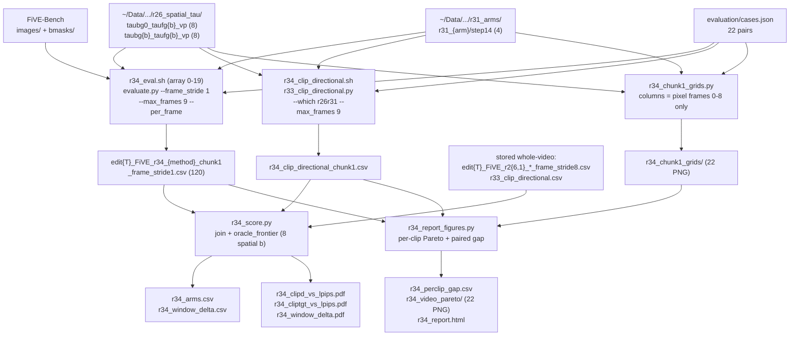

# R34: First-Chunk Metric Recomputation

## Context

Re-compute LPIPS, CLIP-D and CLIP-target on the **first chunk only** for four method families — the uniform blend-rate sweep, the constant spatial `b` sweep (fg region only), R31's Spatial Divergence Blend Routing, and a per-clip oracle — and report how the resulting picture differs from the stored whole-video one.

`num_frame_per_block: 3` (`Self-Forcing_StreamEdit/configs/self_forcing_dmd.yaml:48`) means 3 latent frames per chunk, so the **first chunk is latent frames 0-2 = pixel frames 0-8 (1 + 4 + 4)**. Clip *length* varies — `find_closest_num_frame(x, a=4, b=3)` returns `12m - 3`, so an 80-frame source renders 69 pixel frames (18 latent, 6 chunks), not 81 — but the first chunk is 9 pixel frames for every clip, which is why `--max_frames 9` is a constant rather than a per-clip quantity.

Every stored per-clip CSV was scored whole-video at `--frame_stride 8`, which cannot be sliced to that window after the fact, so the metrics must be recomputed from the render trees. Sbatch rather than local because LPIPS and CLIP need a GPU, not because of path visibility — `~/Data/dataggen` is readable from the login node too.

No new rendering: all 20 render trees already exist (R26's 52-arm sweep covers both `taubg0_taufg{b}_vp` and `taubg{b}_taufg{b}_vp` for the 8 `CONST_BS` values; R31's calibrated run covers 4 arms at `step14`).

**Done when** `evaluation/csv/r34_arms.csv` holds chunk-1 LPIPS / CLIP-target / CLIP-D for all 20 arms plus the per-clip oracle frontier, each row carrying its stored whole-video counterpart and the delta, and the two trade-off figures are drawn.

⚠️ FLAG carried in from R33: `clip_similarity_target_image` was measured **not** to rank these renders by edit strength (Spearman(b, clip_target) = +0.098, positive on 11/22 clips). It is recomputed here for continuity with R26/R30/R31, but any conclusion about achievement should rest on CLIP-D. If the two axes disagree on the first chunk, that disagreement is a result, not a bug to reconcile.

## Execution steps

| # | Step id | Type | What it does | Sets status |
|---|---------|------|--------------|-------------|
| 0 | *(prep)* | — | `/build-step` implements the three patches + three scripts in **Code to touch** | `implemented` |
| 1 | `smoke` | sbatch | One arm × one clip; asserts the per-frame CSV holds exactly 9 frame indices | — |
| 2 | `eval-chunk1` | sbatch | Array 0-19: `evaluate.py` at `--frame_stride 1 --max_frames 9`, LPIPS + CLIP-target | `running` |
| 3 | `clip-d-chunk1` | sbatch | Single GPU job: CLIP-D over R26's 16 + R31's 4 on the same 9 frames | — |
| 4 | `wait-jobs` | manual | Array + CLIP-D job finished, 120 CSVs present, no `Error:` lines | `finished` |
| 5 | `score` | local | Join, oracle frontier, whole-video delta, figures | `analyzed` |
| 6 | `chunk1-grids` | local | Per-clip qualitative grid, columns = pixel frames 0-8 only | — |
| 7 | `perclip-report` | local | Per-clip Pareto panels + paired-gap CSV + HTML report | — |

Steps 2 and 3 are independent and run concurrently; both only need `smoke` to have passed.

Steps 6-7 were **added 2026-09-22, after `score` reached `analyzed`**. Reason: `score`'s
arm-level means carry no dispersion, so they cannot say whether R31's `lpips`/`dino_patch`
sitting above the spatial envelope on this window is a real effect or the halved
achievement spread being converted into vertical distance by a steeper curve. A per-clip
prototype (paired gap vs each clip's own envelope) indicated the former and additionally
showed the whole-video "4 tied" reading to be an aggregation artefact — but on only 10-16
of 22 clips, because the rest fall outside their own curve's span. Steps 6-7 turn that
prototype into the same per-clip artefact R31 and R33 already ship, so the in-range
question is visible rather than buried in a caveat.

```
/run-step R34 smoke
/run-step R34 eval-chunk1
/run-step R34 clip-d-chunk1
/run-step R34 wait-jobs
/run-step R34 score
/run-step R34 chunk1-grids
/run-step R34 perclip-report
```

## Decisions

| Question | Choice |
|---|---|
| First chunk, in pixel frames | Latent frames 0-2 → **pixel frames 0-8 (9 frames)**, from `num_frame_per_block: 3` and `y = 12m - 3` |
| Frames scored in the window | **Stride 1, all 9** (`--frame_stride 1 --max_frames 9`) |
| Frame 0 | **Scored like any other frame** — it is re-generated by the rollout even though a VP anchor exists, so no with/without split |
| Metrics | **Exactly three**: `lpips_unedit_part`, `clip_similarity_target_image` (both from `evaluate.py`), `clip_d_prompt` (from `r33_clip_directional.py`). No SSIM / NIQE / structure-distance / FiVE-Acc / motion-fidelity |
| Uniform baseline arms | R26 `taubg{b}_taufg{b}_vp`, `b ∈ CONST_BS = (2,3,4,6,8,10,20,50)` — `tau_bg == tau_fg`, the plain scalar Eq. 4 `rho` path |
| Constant spatial arms | R26 `taubg0_taufg{b}_vp`, same 8 `b` — background fully released, blending in the fg region only |
| R31 arms | Calibrated `budget_linear` run only: `lpips`, `dino_patch`, `normals`, `latent` at `step14`. The `_lin04` `linear_threshold` fork is **out of scope** |
| Per-clip oracle | `r30_score.oracle_frontier` **verbatim** over the 8 **spatial** `b`'s, 21-point alpha sweep, per-clip min-max, ties on higher CLIP then better Y — same object R30/R31 already draw. Computed twice: (CLIP-D, LPIPS) and (CLIP-target, LPIPS) |
| Whole-video reference | **Joined in, not re-run.** LPIPS/CLIP-target from the stored `edit{T}_FiVE_r2{6,1}_*_frame_stride8.csv`; CLIP-D from `evaluation/csv/r33_clip_directional.csv` |
| Rendering | **None.** All 20 trees exist; R34 is scoring only |
| CSV stem convention | `r34_{method}_chunk1` → `edit{T}_FiVE_r34_{method}_chunk1_frame_stride1.csv`, where `method` is `taubg0_taufg{b}_vp`, `taubg{b}_taufg{b}_vp` or `r31_{arm}` |
| Render roots | **`~/Data/dataggen`, never `~/Data/dataggen`** — R26 `~/Data/dataggen/outputs/five_bench/r26_spatial_tau/{method}`; R31 `~/Data/dataggen/outputs/five_bench/r31_arms/r31_{arm}/step14`. R33 lost five rounds of jobs to a `/projects` mount regression that exclude-and-retry never converged on; the home copy is reliably mounted everywhere |
| Node exclusions | `--exclude=node01,node51,node52,node57` — node52 for the older gpu:8-but-no-device fault, the rest R33-confirmed bad, kept defensively |
| Case set | `evaluation/cases.json`, 22 pairs — unchanged from R26/R30/R31 |
| Qualitative frames | **Pixel frames 0-8 ONLY**, all 9, no even-subsampling over the clip. The strips must show the frames being scored; R31's/R33's grids sample the whole clip and cannot be reused |
| Grid rows | source · uniform `b=2` baseline (`taubg2_taufg2_vp`) · R31's 4 arms — same row intent as R31's report, minus the whole-video sampling |
| Per-clip gap definition | Paired: each clip compared against **its own** 8-`b` Pareto envelope, then mean/SE/n across clips. Clips whose arm CLIP-D falls outside their own envelope span are excluded and **counted**, not silently dropped |
| New grid script | **New `r34_chunk1_grids.py`, not a patch to `r31_stage3_grids.py`** — that one hardcodes R31's 4 arms, the `r31_{arm}/step14` tree shape, and `evenly_spaced()` over the whole clip; R26's arms sit one level shallower |
| Where steps 6-7 run | **Local, no GPU and no cluster** — neither script runs a model, and the render trees are on `~/Data`, readable from the login node |
| Achievement axis of record | **CLIP-D**; `clip_similarity_target_image` reported alongside as the axis R33 showed to be uninformative on this case set |

## Step commands

### smoke

```bash
sbatch slurm_scripts/five_bench/r34_smoke.sh
```

Runs one arm (`taubg0_taufg2_vp`) on one clip and fails loudly unless the per-frame CSV
contains exactly 9 distinct `frame_idx` values for each of the two metrics:

```bash
python evaluation/fivebench/evaluate.py \
  --config_path evaluation/fivebench/config.yaml \
  --metrics lpips_unedit_part clip_similarity_target_image \
  --src_image_folder "$DATA_ROOT" \
  --annotation_mapping_files "$DATA_ROOT"/edit_prompt/edit1_FiVE.json \
  --tgt_methods "$R26_ROOT/taubg0_taufg2_vp" \
  --tgt_layout edit_video \
  --cases_json evaluation/cases.json \
  --frame_stride 1 --max_frames 9 --per_frame \
  --result_path evaluation/csv/r34_smoke.csv
```

### eval-chunk1

```bash
sbatch slurm_scripts/five_bench/r34_eval.sh
```

`--array=0-19`; task id selects `(METHOD, DIR)` from the 20-entry table, then:

```bash
python evaluation/fivebench/evaluate.py \
  --config_path evaluation/fivebench/config.yaml \
  --metrics lpips_unedit_part clip_similarity_target_image \
  --src_image_folder "$DATA_ROOT" \
  --annotation_mapping_files "${ANNOTATIONS[@]}" \
  --tgt_methods "$DIR" \
  --tgt_layout edit_video \
  --cases_json evaluation/cases.json \
  --frame_stride 1 --max_frames 9 --per_frame \
  --result_path "evaluation/csv/r34_${METHOD}_chunk1.csv" \
  2>&1 | tee "$METRICS_LOG"
```

### clip-d-chunk1

```bash
sbatch slurm_scripts/five_bench/r34_clip_directional.sh
```

```bash
python evaluation/r33_clip_directional.py \
  --which r26r31 \
  --cases evaluation/cases.json \
  --r26_root ~/Data/dataggen/outputs/five_bench/r26_spatial_tau \
  --r31_root ~/Data/dataggen/outputs/five_bench/r31_arms \
  --frame_stride 1 --max_frames 9 \
  -o evaluation/csv/r34_clip_directional_chunk1.csv
```

### wait-jobs

```bash
sacct -j {job_id} --format=JobID,State,Elapsed | grep -v '\.batch'
ls evaluation/csv/edit*_FiVE_r34_*_chunk1_frame_stride1.csv | wc -l   # expect 120
grep -l 'Error:' logs/r34_eval_*.metrics.log                          # expect none
python - <<'PY'
import csv, glob
n = {r["method"] for f in ["evaluation/csv/r34_clip_directional_chunk1.csv"]
     for r in csv.DictReader(open(f))}
print(len(n), "methods in chunk-1 CLIP-D (expect 20)")
PY
```

### score

```bash
python evaluation/r34_score.py \
  --chunk1_csv_dir evaluation/csv \
  --clip_d_chunk1 evaluation/csv/r34_clip_directional_chunk1.csv \
  --clip_d_whole evaluation/csv/r33_clip_directional.csv \
  -o evaluation/csv/r34_arms.csv \
  --fig_dir evaluation/figures
```

### chunk1-grids

```bash
python evaluation/r34_chunk1_grids.py \
  --cases evaluation/cases.json \
  --r26_root ~/Data/dataggen/outputs/five_bench/r26_spatial_tau \
  --r31_root ~/Data/dataggen/outputs/five_bench/r31_arms \
  --out_dir evaluation/figures/r34_chunk1_grids
```

### perclip-report

```bash
python evaluation/r34_report_figures.py \
  --chunk1_csv_dir evaluation/csv \
  --clipd_csv evaluation/csv/r34_clip_directional_chunk1.csv \
  --grids_dir evaluation/figures/r34_chunk1_grids \
  --pareto_out evaluation/figures/r34_video_pareto \
  --gap_csv evaluation/csv/r34_perclip_gap.csv \
  --out evaluation/figures/r34_report.html
```

## Pipeline



## Code to touch

| File | Change |
|---|---|
| `evaluation/fivebench/evaluate.py` | **Modify** — add `--max_frames` (int, default `None`), applied after striding |
| `evaluation/r33_clip_directional.py` | **Modify** — add `--max_frames`; add `r26r31` to `--which` |
| `evaluation/r30_score.py` | **Modify** — `load_r26_metric` gains `stem_fmt` / `stride` kwargs |
| `slurm_scripts/five_bench/r34_smoke.sh` | **New** — single-arm window check |
| `slurm_scripts/five_bench/r34_eval.sh` | **New** — array 0-19 chunk-1 eval |
| `slurm_scripts/five_bench/r34_clip_directional.sh` | **New** — chunk-1 CLIP-D |
| `evaluation/r34_score.py` | **New** — join, oracle, delta, figures |
| `evaluation/r34_chunk1_grids.py` | **New** — per-clip grid, columns = pixel frames 0-8 only |
| `evaluation/r34_report_figures.py` | **New** — per-clip Pareto panels, paired-gap CSV, HTML report |

**`evaluate.py`** — one flag, two slices. `--max_frames` must be applied **after** the stride
slice, and to the source list *before* `masks` is built from it, so the positional
`zip(src_images, tgt_images, masks, src_image_names, tgt_image_names)` at line 536 stays
aligned:

```python
# line ~714, alongside --frame_stride
parser.add_argument("--max_frames", type=int, default=None,
                    help="Keep only the first N frames AFTER striding (both sides). "
                         "R34 scores the first chunk: --frame_stride 1 --max_frames 9.")

# line ~374, source side -- before masks are built from src_image_names
src_image_names = list_images(src_video_path)[::frame_stride]
if args.max_frames is not None:
    src_image_names = src_image_names[:args.max_frames]

# line ~437, target side -- before the resize loop
tgt_image_names = tgt_image_names[::frame_stride]
if args.max_frames is not None:
    tgt_image_names = tgt_image_names[:args.max_frames]
```

Default `None` leaves every existing call site bit-identical. Note the `{video}_resize`
dirs the harness writes already hold the stride-8 frames from earlier runs; a stride-1
run adds frames 1-7 next to them. Harmless here — no metric in R34's two-metric list
consumes those paths (only NIQE does), and the 120-CSV count in `wait-jobs` is what
verifies coverage.

**`r33_clip_directional.py`** — same window, plus a `which` value that selects R26+R31
without walking R30's 8 arms:

```python
p.add_argument("--which", choices=("r31", "r26", "r30", "r26r31", "all"), default="all")
p.add_argument("--max_frames", type=int, default=None)

# method_specs: widen the two membership tests
if which in {"r31", "r26r31", "all"}: ...
if which in {"r26", "r26r31", "all"}: ...

# run(): after each stride slice
src_paths = list_frames(src_dir)[::args.frame_stride]
if args.max_frames is not None:
    src_paths = src_paths[:args.max_frames]
tgt_paths = list_frames(tgt_dir)[::args.frame_stride]
if args.max_frames is not None:
    tgt_paths = tgt_paths[:args.max_frames]
```

The method labels it writes (`r26_taubg0_taufg{b}_vp`, `r26_taubg{b}_taufg{b}_vp`,
`r31_{arm}`) already carry their task prefix, and every row carries `case_id`, so
`r34_score.py` joins CLIP-D on `(method, case_id)` directly — no `file_id` round-trip.

**`r30_score.load_r26_metric`** — the filename pattern is hardcoded to
`edit*_FiVE_r26_{method}_frame_stride8.csv`. Two default-preserving kwargs let R34 reuse
it unchanged for the chunk-1 files:

```python
def load_r26_metric(..., method_fmt: str = "taubg0_taufg{b}_vp",
                    stem_fmt: str = "r26_{method}", stride: int = 8):
    method = method_fmt.format(b=b)
    stem = stem_fmt.format(method=method)
    pattern = str(r26_csv_dir / f"edit*_FiVE_{stem}_frame_stride{stride}.csv")
```

R34 calls it with `stem_fmt="r34_{method}_chunk1", stride=1`; every existing call site
keeps its exact current behaviour.

**`r34_eval.sh`** — the 20-entry array table, one task per render tree. `METHOD` is what
goes into the CSV stem; `DIR` is what `--tgt_methods` points at.

```bash
#SBATCH --partition=L40S,A100
#SBATCH --exclude=node52          # advertises gpu:8, exposes no device to batch jobs
#SBATCH --gres=gpu:1
#SBATCH --mem=64G
#SBATCH --time=06:00:00
#SBATCH --array=0-19

CONST_BS=(2 3 4 6 8 10 20 50)
ARMS=(lpips dino_patch normals latent)
if   [ "$TID" -lt 8  ]; then B=${CONST_BS[$TID]};      METHOD="taubg0_taufg${B}_vp";  DIR="$R26_ROOT/$METHOD"
elif [ "$TID" -lt 16 ]; then B=${CONST_BS[$((TID-8))]}; METHOD="taubg${B}_taufg${B}_vp"; DIR="$R26_ROOT/$METHOD"
else                         A=${ARMS[$((TID-16))]};    METHOD="r31_${A}";             DIR="$R31_ROOT/r31_${A}/step14"
fi
```

Carry over, verbatim, the four hazards every eval script in this repo encodes:
`conda deactivate` before `conda activate five-bench` (`.bashrc` auto-activates
`streamgve`); `--metrics` on the command line, never `config.yaml` (`metrics:` there is
vestigial); `PYTORCH_CUDA_ALLOC_CONF=expandable_segments:True`; and the post-run
`grep -c 'Error:'` on the teed log, because `evaluate.py` swallows per-metric exceptions
and still exits 0. Add the `NDIRS` 22-pair precondition check and, new here, a
`--max_frames` guard that fails the task if any clip's render tree holds fewer than 9
frames.

**`r34_score.py`** — local, no GPU, mirrors `r31_score.py`'s structure:

1. `build_join_tables(data_root, cases)` → `idx2vid`, `name2case` (imported from `r30_score`).
2. Chunk-1 per-clip LPIPS and CLIP-target via the patched `load_r26_metric`, once per
   family: `method_fmt="taubg0_taufg{b}_vp"` (spatial) and `"taubg{b}_taufg{b}_vp"`
   (uniform), both with `stem_fmt="r34_{method}_chunk1", stride=1`; R31's four arms read
   with the same loader at `method_fmt="r31_{arm}"` over a 4-element list.
3. Chunk-1 CLIP-D from `r34_clip_directional_chunk1.csv`, joined on `(method, case_id)`;
   mean over the 22 clips per arm.
4. Per-clip oracle: `oracle_frontier(clips, achievement, lpips, CONST_BS,
   higher_is_better=False)` over the **spatial** family, run twice — once with CLIP-D as
   the achievement dict and once with CLIP-target — giving two 21-point frontiers.
5. Whole-video join: same loaders at the stored stems/stride (`stem_fmt="r26_{method}"`,
   `stride=8`; `"r31_{method}"` for the arms) and `r33_clip_directional.csv` for CLIP-D.
6. Emit `r34_arms.csv` (one row per arm: `method`, `family`, `b`, `n_clips`, and
   `chunk1_*` / `whole_*` / `delta_*` for each of the three metrics) and
   `r34_window_delta.csv` (per metric: Spearman and Kendall between the chunk-1 and
   whole-video arm rankings over the 20 arms, plus the per-clip rank correlation averaged
   over clips).
7. Figures, following `r31_score.py`'s drawing conventions so the panels are readable
   next to R30's and R31's: spatial curve as a line, uniform curve as a second line,
   R31's four arms as `marker="*", s=260` stars, oracle frontier as a dashed line.
   `r34_clipd_vs_lpips.pdf` and `r34_cliptgt_vs_lpips.pdf` are the two trade-off panels;
   `r34_window_delta.pdf` is a chunk-1-vs-whole-video scatter, one point per arm per
   metric, with the identity line — an arm far off that line is one whose first chunk
   does not represent its clip.

**`r34_chunk1_grids.py`** — one PNG per clip, `edit{T}_{name}_chunk1.png`, 6 rows ×
9 columns. Columns are pixel frames **0-8 exactly**; there is no subsampling call at all,
which is the whole point of a separate script:

```python
ROWS = [("source",   None),                       # from data_root/videos/{name}.mp4
        ("baseline", ("r26", "taubg2_taufg2_vp")), # uniform b=2, the Eq. 4 control
        ("lpips",      ("r31", "lpips")),
        ("dino_patch", ("r31", "dino_patch")),
        ("normals",    ("r31", "normals")),
        ("latent",     ("r31", "latent"))]

def frames_dir(kind, method, T, name):          # the two tree shapes differ in depth
    if kind == "r26":
        return r26_root / method / f"edit{T}" / name
    return r31_root / f"r31_{method}" / "step14" / f"edit{T}" / name

idx = list(range(9))                            # NOT evenly_spaced(n_have, k)
```

Guard, mirroring `r34_eval.sh`'s: fail the clip if any row has fewer than 9 frames rather
than padding, since a short row silently repeating its last frame would look like a
static edit. Title each page with the clip id and `frames 0-8 (chunk 1 of N)`.

**`r34_report_figures.py`** — the per-clip counterpart of `r34_score.py`, structured like
`r33_report_figures.py` (whose `--clipd_csv` / output-path flags already generalise) but
reading the chunk-1 stems, and with the row strips coming from `r34_chunk1_grids` rather
than crops of R31's whole-video grids.

Per clip it draws the same objects `r34_score.py` draws in aggregate — 8-`b` SPATIAL
curve, UNIFORM curve, R31's 4 arms as stars, oracle frontier — but from that clip's own
values, and additionally:

1. Shades the x-span of that clip's own spatial Pareto envelope, and marks any arm whose
   CLIP-D falls **outside** it. This is the step's main job: the aggregate analysis had to
   drop 6-12 of 22 clips for exactly this reason and the count was only visible as a
   caveat.
2. Writes `r34_perclip_gap.csv`: per arm, the paired gap against each clip's own envelope
   (`arm_lpips - envelope_lpips(arm_clip_d)`), with `mean`, `se`, `n_in_range`,
   `n_out_of_range` and `n_worse`. This is the quantity that decides whether the
   `lpips`/`dino_patch` displacement is real; the prototype read `+0.0090 ± 0.0031` and
   `+0.0089 ± 0.0025` on chunk 1 against `+0.0024 ± 0.0013` and `+0.0077 ± 0.0024` on
   whole video, i.e. `dino_patch` is above the envelope on BOTH windows once measured per
   clip, which the arm-level means reported as tied.

⚠️ Report the SE and both n's in the HTML next to every mean. The t-values are
uncorrected for four arms on small n, and `n_in_range` differs per arm and per window, so
these are not clean paired samples across a fixed clip set — enough to retire the
aggregate "4 tied" claim, not yet enough to put a number in a paper.
