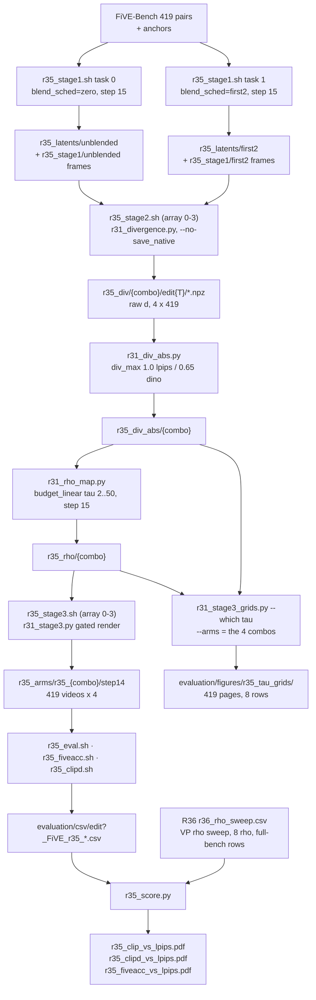

# R35: Full-Bench Spatial Divergence Routing

## Context

R31 established continuous per-token divergence routing on the 22-clip `cases.json` subset, with four divergence arms and **per-clip min/max** normalisation of the divergence field `m`. R35 takes the method to the **whole 419-pair FiVE-Bench** with three changes:

1. **Absolute normalisation.** `m = clip(d, 0, div_max) / div_max` with a fixed per-arm `div_max`, replacing per-clip min/max. Per-clip normalisation makes `tau` depend on which clip a token sits in, which is a confound at 419 pairs rather than a nuisance.
2. **Two arms only** — DINO and LPIPS. `normals` and `latent` are dropped.
3. **Two stage-1 regimes** — the divergence field is measured against an UNBLENDED target, or against a FIRST2 target (Q/K blend fully on for the first 2 denoising steps, then disabled). Crossing 2 arms x 2 regimes gives the four arms.

**Done when:** the four arms are rendered and scored across all 419 pairs, the 419 tau-grid pages exist, and the three comparison figures place the four arms against R36's full-bench VP rho-sweep curve on the editability/preservation plane.

## Execution steps

| # | Step id | Type | What it does | Sets status |
|---|---------|------|--------------|-------------|
| — | *(prep)* | — | `/build-step` the 7 `todos` — stage-1 `--blend_sched`, 6 Slurm scripts, `r35_score.py` | `implemented` |
| 1 | `stage1` | sbatch | Array 0-1, one regime per task, 419 pairs each, 15 steps. Frames + latents. | `running` |
| 2 | `wait-stage1` | manual | 419 latents per regime; blender_rate vector echoed correctly | |
| 3 | `stage2` | sbatch | Array 0-3, one (arm, regime) combo per task. Divergence npz. | |
| 4 | `wait-stage2` | manual | 419 npz x 4 combos, exact per-type breakdown | |
| 5 | `absnorm` | sbatch | Absolute normalisation + budget-linear rho — **CPU batch job** (`--partition=CPU`), no GPU | |
| 6 | `stage3` | sbatch | Array 0-3, one combo per task in priority order. Gated render. | |
| 7 | `wait-stage3` | manual | 419 step14 dirs per combo; combos differ by sha256 | `finished` |
| 8 | `eval` | sbatch | 9-metric harness, stride 8, array 0-3 | |
| 9 | `fiveacc` | sbatch | `--metrics five_acc`, array 0-3 | |
| 10 | `clipd` | sbatch | CLIP-directional, single job | |
| 11 | `wait-eval` | manual | CSV coverage + 0 error lines | |
| 12 | `grids` | local | 419 tau-grid pages, 8 rows each | |
| 13 | `figures` | local | Three comparison figures + `r35_arms.csv` | `analyzed` |

```
/run-step R35 stage1      /run-step R35 absnorm     /run-step R35 wait-eval
/run-step R35 wait-stage1 /run-step R35 stage3      /run-step R35 grids
/run-step R35 stage2      /run-step R35 wait-stage3 /run-step R35 figures
/run-step R35 wait-stage2 /run-step R35 eval|fiveacc|clipd
```

## Decisions

| Question | Choice |
|---|---|
| Scope | All **419** pairs (100/100/100/100/9/10 by edit type). Stage 1 and 3 pass **no** `--cases_json`; stage 2 and the grids use `evaluation/r7_anchor_manifest.json` (419 entries, carries `video_name` + `edit_type`) |
| Arms (SLURM priority order) | `dino_unblended`, `dino_first2`, `lpips_unblended`, `lpips_first2` — treated as four **combos**, so every tree is keyed by combo name |
| Stage-1 regimes | **Both at `--step 15`**, matching stage 3. UNBLENDED = `--blend_sched zero`; FIRST2 = `--blend_sched first2` (source-anchoring `s(p)=1` for steps 0-1, then 0) |
| Normalisation | **Absolute**, `div_min = 0` both arms; `div_max` = **1.0** LPIPS, **0.65** DINO. No per-clip min/max, **no detrending** |
| Mapping | `budget_linear`, **`tau_min = 2`**, `tau_max = 50`, `--step 15`, `flow_shift 1.0` (R30's calibrated pair; `tau_min = 0` belongs only to the exploratory `linear_threshold` mapping) |
| Render config | `--vp_mode vp` + `--first_frame_edit_dir <anchors>`, `fg_boost 4`, `blend_power 2`, `rollout_chunk_size 21`, `seed 0`, `flow_shift 1.0`, `--step 15` — identical to `r31_stage3.sh`, **except** `--dump_steps 14` (final only), not R31's `all`: measured ~914GB vs ~74GB at full-bench scale, and nothing downstream in this plan reads an intermediate step (confirmed with the user 2026-09-24) |
| `--save_native` | **Off** for stage 2. On at 419 x 2 arms x 2 regimes it writes ~27 GB of pre-reduction LPIPS/DINO maps that only the R31 native-resolution figure consumed |
| Comparison reference | **R36's VP rho-sweep curve** (rho in {2,3,4,6,8,10,20,50}, full bench, same sampler/anchors/seed as R35's stage 3), read from **`evaluation/csv/r36_rho_sweep.csv`**, full-bench rows only (`n_pairs == 419`). R36 averages as a plain per-clip mean over 419 clips, matching R35's own points; neither side uses `{stem}_avg.csv`. R7 is **not** evaluated: R36 re-renders rho=2 itself. R26's uniform/constant-b curves and the per-clip oracle are **out of scope**: they exist only on the 22-clip subset |
| Figures | Three **Pareto figures** — `r35_clip_vs_lpips.pdf`, `r35_clipd_vs_lpips.pdf`, `r35_fiveacc_vs_lpips.pdf` — each plotting the **4 R35 arms as points against R36's VP rho-sweep curve** (8 points, rho in {2,3,4,6,8,10,20,50}, joined in rho order), on y = `lpips_unedit_part` (preservation) vs x = CLIP-target / `clip_d_prompt` / `five_acc` yes-no (one per figure) — the same axes and orientation as R36's own Pareto figures |
| Tau grids | **All 419 pages**, 8 rows each (4 combos x the `m`/`tau` pair) |
| Storage root | `~/Data/dataggen/outputs/five_bench/` — **not** `/projects`, which is unreliable per node (2026-09-22 fix) |
| Node exclusions | `--exclude=node01,node51,node52,node57`, the proven post-2026-09-22 set |
| Out of scope | `normals` / `latent` arms; detrended divergence; R26 + oracle curves; `k != 2` step-schedules |

## Step commands

### stage1

```bash
sbatch slurm_scripts/five_bench/r35_stage1.sh          # array 0-1, ~12-16 h/task
```

### wait-stage1

```bash
D=~/Data/dataggen/outputs/five_bench
for r in unblended first2; do
  echo "$r: $(ls $D/r35_latents/$r/edit*/*.npz 2>/dev/null | wc -l) latents (expect 419)"
  for T in 1 2 3 4 5 6; do echo -n "  edit$T=$(ls $D/r35_latents/$r/edit$T/*.npz 2>/dev/null | wc -l)"; done; echo
done
grep -h "blender_rate" logs/r35_stage1_*.out
```

### stage2

```bash
sbatch slurm_scripts/five_bench/r35_stage2.sh          # array 0-3
```

### wait-stage2

```bash
D=~/Data/dataggen/outputs/five_bench
for c in dino_unblended dino_first2 lpips_unblended lpips_first2; do
  echo "$c: $(ls $D/r35_div/$c/edit*/*.npz | wc -l) (expect 419)"
done
grep -c "\[ERROR\]" logs/r35_stage2_*.out
```

### absnorm

```bash
sbatch slurm_scripts/five_bench/r35_absnorm.sh                  # all 4 combos, CPU node
sbatch slurm_scripts/five_bench/r35_absnorm.sh dino_unblended dino_first2   # one chain's subset
# (also runs as plain `bash ...` locally -- same script, same checks)
# which runs, per combo:
#   python evaluation/r31_div_abs.py --arms <combo> --div_max <combo>=<1.0|0.65> \
#     --div_root $D/r35_div -o $D/r35_div_abs
#   python evaluation/r31_rho_map.py --div_root $D/r35_div_abs/<combo> \
#     -o $D/r35_rho/<combo> --tau_min 2 --tau_max 50 --step 15 --flow_shift 1.0
```

### stage3

```bash
sbatch slurm_scripts/five_bench/r35_stage3.sh          # array 0-3, priority-ordered, ~12-16 h/task
```

### wait-stage3

```bash
D=~/Data/dataggen/outputs/five_bench
for c in dino_unblended dino_first2 lpips_unblended lpips_first2; do
  echo "$c: $(ls -d $D/r35_arms/r35_$c/step14/edit*/*/ | wc -l) step14 dirs (expect 419)"
  cat $D/r35_arms/r35_$c/_manifest_edit*.csv | awk -F, '$3!="status" && $3!="ok"' | wc -l
done
```

### eval

```bash
sbatch slurm_scripts/five_bench/r35_eval.sh            # array 0-3
```

### fiveacc

```bash
sbatch slurm_scripts/five_bench/r35_fiveacc.sh         # array 0-3
```

### clipd

```bash
sbatch slurm_scripts/five_bench/r35_clipd.sh           # single job
```

### wait-eval

```bash
ls evaluation/csv/edit?_FiVE_r35_*_frame_stride8.csv | wc -l     # expect 24
grep -c "Error:\|out of memory" logs/r35_eval_*.metrics.log
wc -l evaluation/csv/r35_clip_directional.csv                    # expect 4*419 + 1
```

### grids

```bash
D=~/Data/dataggen/outputs/five_bench
python evaluation/r31_stage3_grids.py --which tau \
  --arms dino_unblended dino_first2 lpips_unblended lpips_first2 \
  --cases evaluation/r7_anchor_manifest.json \
  --div_root $D/r35_div_abs --rho_root $D/r35_rho \
  --tau_out_dir evaluation/figures/r35_tau_grids
```

### figures

```bash
python evaluation/r35_score.py --all      # 3 PDFs + evaluation/csv/r35_arms.csv
```

## Pipeline



## Code to touch

**`evaluation/r31_stage1.py`** — open the pinned blend schedule.
Line 172 is `args.blend_sched = "zero"`, pinned on purpose. Replace with a flag that preserves the guard's intent:

```python
p.add_argument("--blend_sched", choices=("zero", "first1", "first2", "first3"),
               default="zero",
               help="Stage-1 gating regime. 'zero' = Q/K blend OFF for the whole "
                    "rollout (R31's regime, the default, byte-identical to the "
                    "pinned behaviour). 'firstK' = fully source-anchored for the "
                    "first K steps, then disabled.")
# ... after parse: echo the resolved schedule so a wrong regime cannot pass silently
s = [_schedule_blend_rate(args.blend_sched, i, args.step) for i in range(args.step)]
print(f"[r35_stage1] {args.blend_sched}: blender_rate = {[int(1-x) for x in s]}")
```
`blend_sched` is already written into the npz at line 405, so the regime stays traceable. The restricted `choices` keeps the original guarantee that stage 1 cannot be "silently blended" by an arbitrary schedule.

**`slurm_scripts/five_bench/r35_stage1.sh`** *(new)* — array 0-1, `REGIMES=(unblended first2)`, `SCHEDS=(zero first2)`; loops `T` 1..6 with **no** `--cases_json`; `--step 15 --dump_steps 14 --measure_index 14`; `--vp_mode vp --first_frame_edit_dir $ANCHOR_ROOT`; `--time=20:00:00`, `--mem=64G`, `--partition=L40S` (L40S only since 2026-09-24: job 1007492 OOM'd on a 40 GB A100) + `PYTORCH_CUDA_ALLOC_CONF=expandable_segments:True`. Post-run guard: 419 latents for this regime, per-type 100/100/100/100/9/10.

**`slurm_scripts/five_bench/r35_stage2.sh`** *(new)* — array 0-3 over `COMBOS=(dino_unblended dino_first2 lpips_unblended lpips_first2)`; derives `ARM` (`dino_patch`/`lpips`) and `REGIME` from the combo name; loops `T` 1..6 calling `r31_divergence.py --arm $ARM --edit_type $T --cases evaluation/r7_anchor_manifest.json --latent_dir .../r35_latents/$REGIME --target_root .../r35_stage1/$REGIME --no-save_native -o .../r35_div_tmp`, then relocates into `r35_div/$COMBO/`. Simpler alternative: teach `r31_divergence.py` an `--arm_dir_name` override so it writes straight to the combo dir — preferred, one added flag.

**`slurm_scripts/five_bench/r35_absnorm.sh`** *(new)* — **CPU batch job** (`#SBATCH --partition=CPU`, 4 CPUs, 16G, 2 h), also runnable as plain `bash` locally. No model, no GPU: NumPy only, a GPU allocation would only add queue time. It is a batch job rather than a local command so it can sit inside an unattended `--dependency=afterok` chain (stage 2 -> absnorm -> stage 3). Optional positional args select a subset of combos (default all four) -- required for a per-chain run, since the all-four default fails preflight on the other chain's not-yet-computed combos and would block this chain's stage 3. A batch job has none of the interactive shell's state, so it `cd`s to the repo and activates `streamgve` itself. `R35_DIV_ROOT` / `R35_DIV_ABS_ROOT` / `R35_RHO_ROOT` override the roots, for synthetic tests only. Runs the 4 `r31_div_abs.py` + 4 `r31_rho_map.py` calls from **Step commands**; neither tool needed changes.

**`slurm_scripts/five_bench/r35_stage3.sh`** *(new)* — array 0-3, combos in priority order; preflight asserting 419 npz in `r35_div_abs/$COMBO` **before** the model loads; then `r31_stage3.py` per edit type with the R31 render config and **no** `--cases_json`. `--time=20:00:00`.

**`slurm_scripts/five_bench/r35_eval.sh`, `r35_fiveacc.sh`, `r35_clipd.sh`** *(new)* — modelled on `r31_eval.sh` / `r33_fiveacc.sh` / `r34_clip_directional.sh`, with `~/Data` roots and the node-exclusion set. `r35_clipd.sh` stays a single job because the per-clip source embeddings are cached and reused across arms.

**`evaluation/r35_score.py`** *(new)* — three Pareto panels: R36's VP rho-sweep curve (8 points joined in rho order, each labelled with its rho) plus the 4 combos as distinct markers. R36 side: read `evaluation/csv/r36_rho_sweep.csv`, keep rows with `n_pairs == 419`, assert exactly one per rho; resolve the four needed columns (`lpips_unedit_part`, `clip_similarity_target_image`, `clip_d_prompt`, FiVE-Acc yes-no) against the header, `SystemExit` listing the available columns if one is missing. R35 side: one loader per metric family returns `{(combo, video_name, edit_type): value}` from the per-clip CSVs, each point a plain mean over its 419 clips; preflight asserts 100/100/100/100/9/10 per stem. Does **not** read any `*_avg.csv`, R26 curves or oracle helpers. Writes `evaluation/csv/r35_arms.csv` (one row per point: source R35|R36, label, n_clips, the three x metrics, lpips_unedit_part).

**`evaluation/r31_stage3_grids.py`** — no change expected. `--arms` (added 2026-09-24) already accepts the four combo names, and 4 combos x 2 rows = 8 rows lands on the script's tested historical-geometry branch. Confirm the 419-entry manifest is accepted as `--cases` (it needs only `video_name` + `edit_type`).
