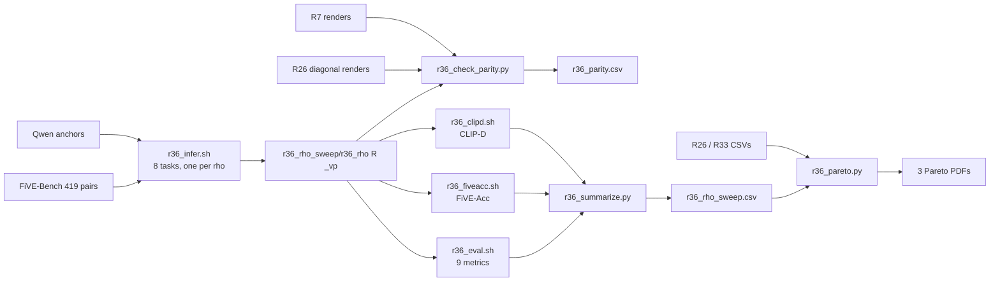

# R36: Sweep Rho in Visual Prompting

## Context

R7 rendered StreamEdit + visual prompting (paper §4.5, Qwen-edited first-frame anchor) on the full FiVE-Bench at only the paper value `rho = --blend_power = 2`. R26's uniform baseline swept `rho ∈ {2,3,4,6,8,10,20,50}` under the same VP setup, but only on the 22 `cases.json` clips. R36 runs that same rho grid on all 419 pairs, so that the preservation/edit trade-off curve for VP is measured on the full benchmark and not just a 22-clip subset.

**Done when:** `evaluation/csv/r36_rho_sweep.csv` has one row per rho with the 9 FiVE harness metrics, FiVE-Acc and CLIP-D, and three Pareto figures (x = CLIP-T, CLIP-D or FiVE-Acc; y = background LPIPS) show the full-bench VP rho curve against R26's 22-clip diagonal.

## Execution steps

| # | Step id | Type | What | Sets status |
|---|---------|------|------|-------------|
| — | *(prep)* | — | build every item in `todos` (see **Code to touch**) | `implemented` |
| 1 | `smoke` | sbatch | 2 clips × rho {2,3}; parity against R26 and R7 | — |
| 2 | `wait-smoke` | manual | all 3 gates pass | — |
| 3 | `infer` | sbatch | 8-task render array, one per rho, all 6 edit types each | `running` |
| 4 | `wait-infer` | manual | 8/8 done, 419 dirs per arm | `finished` |
| 5 | `check-parity` | local | 22 clips × 8 rho sha256 vs R26 diagonal; index-0 vs R7 | — |
| 6 | `evaluate` | sbatch | 9-metric FiVE eval, array over 8 rho (L40S/A100) | — |
| 7 | `five-acc` | sbatch | FiVE-Acc only, array over 8 rho (L40S/A100) | — |
| 8 | `clip-d` | sbatch | directional CLIP, single job over 8 rho | — |
| 9 | `wait-eval` | manual | all eval CSVs complete, no metric crashes | — |
| 10 | `summarize` | local | `r36_rho_sweep.csv` | — |
| 11 | `figures` | local | 3 Pareto PDFs | — |
| 12 | `verdict` | manual | read figures, log outcome | `analyzed` |

```
/run-step R36 smoke
/run-step R36 wait-smoke
/run-step R36 infer
/run-step R36 wait-infer
/run-step R36 check-parity
/run-step R36 evaluate
/run-step R36 five-acc
/run-step R36 clip-d
/run-step R36 wait-eval
/run-step R36 summarize
/run-step R36 figures
/run-step R36 verdict
```

## Decisions

| Topic | Choice |
|-------|--------|
| Clip set | Full FiVE-Bench, 419 pairs (100/100/100/100/9/10). The 424 entries seen in R7's output count the `_manifest.csv` in each edit dir; there are 419 real clips. |
| Rho grid | `{2,3,4,6,8,10,20,50}`, identical to R26's uniform diagonal, so the curves line up point for point |
| rho = 2 | **Re-rendered, not reused** (user decision 2026-09-24). R7's renders and `r21_ref_vp` scores are not used for any R36 number or figure. |
| Anchoring | `--vp_mode vp`, anchors `~/Data/dataggen/outputs/five_bench/anchors` (R7's Qwen-Image-Edit-2511 set) |
| Sampler | step 15, fg_boost 4, flow_shift 1.0, seed 0, chunk 21, overlap 1, sink 0. Byte-identical to R7 and R26, which the parity gates require. |
| Output root | `~/Data/dataggen/outputs/five_bench/r36_rho_sweep/r36_rho{R}_vp/edit{T}/` (`/projects/dataggen` was moved to `~/Data/dataggen` on 2026-09-21) |
| Render array | 8 tasks, one per rho (`rho = RHOS[TID]`), each looping edit types 1–6 (419 pairs). L40S, 64G, 20h (partition max 24h). ~10.5h per task at R35 stage 1's measured ~1.5 min/clip incl. model loads; total ≈ 85 L40S GPU-h. The 48-task (rho × edit type) layout was dropped: it exceeds the per-user submit cap (27–32 jobs). |
| Metrics | **Motion fidelity dropped** (`motion_fidelity_score` and `motion_fidelity_score_edit_part`; CoTracker co-resident with Qwen2.5-VL OOMs off H100, job 961342, and no H100 access). Remaining metrics run in two L40S/A100 passes: (1) R26's explicit 9-metric list; (2) `five_acc` alone, as in R33 job 1004302, which ran 20/20 arms without H100. Plus CLIP-D (`clip_d_prompt`, `clip_d_word`). `--metrics` is always passed on the CLI. |
| Pareto axes | x = semantic alignment (`clip_similarity_target_image`, `clip_d_prompt`, `five_acc` yn — one per figure); y = preservation (`lpips_unedit_part`). Same orientation as R35 |
| Averaging | Plain mean over all 419 clips from the per-clip CSVs; never `{stem}_avg.csv` (mean of per-edit-type means) |
| Gate: R26 parity | For each rho, the 22 `cases.json` clips must be sha256-identical to `r26_spatial_tau/taubg{R}_taufg{R}_vp`, which used the same scalar `--blend_power` path, the same per-pair seed and the same sampler. Any mismatch is a pipeline regression since 2026-09-01 and blocks eval. |
| Gate: R7 parity | At rho=2, the index-0 pair of each edit type must be identical to R7's stored render (unaffected by the reseed fix). |
| CLIP-D | Single job cloned from `r35_clipd.sh`, using R35's `--fullbench --methods` mode of `r33_clip_directional.py` unchanged; no edit to that script |
| CSV stems | `r36_rho{R}_vp` (9-metric harness), `r36_fiveacc_rho{R}_vp`, `r36_clip_directional` (all 8 rho, keyed by `method`), `r36_rho_sweep`, `r36_parity` |
| Out of scope | Motion fidelity (can be added later by one H100 pass over the stored renders; nothing needs re-rendering); no-VP and persistent-VP rho sweeps; spatial/routed arms |

## Step commands

### smoke
```bash
sbatch slurm_scripts/five_bench/r36_smoke.sh
```

### wait-smoke
```bash
grep -E 'GATE|IDENTICAL|DIFFERS|FAIL' logs/r36_smoke_<job_id>.out
grep -c Traceback logs/r36_smoke_<job_id>.err   # expect 0
```

### infer
```bash
sbatch slurm_scripts/five_bench/r36_infer.sh
```

### wait-infer
```bash
sacct -j <job_id> --format=JobID,State,Elapsed | grep -v COMPLETED   # expect only header
for R in 2 3 4 6 8 10 20 50; do
  echo "rho=$R: $(ls -d ~/Data/dataggen/outputs/five_bench/r36_rho_sweep/r36_rho${R}_vp/edit*/*/ | grep -vc '_resize/$')"   # expect 419
done
```

### check-parity
```bash
python evaluation/r36_check_parity.py --out evaluation/csv/r36_parity.csv
```

### evaluate
```bash
sbatch slurm_scripts/five_bench/r36_eval.sh
```

### five-acc
```bash
sbatch slurm_scripts/five_bench/r36_fiveacc.sh
```

### clip-d
```bash
sbatch slurm_scripts/five_bench/r36_clipd.sh
```

### wait-eval
```bash
ls evaluation/csv/edit?_FiVE_r36_rho*_vp_frame_stride8.csv | wc -l          # expect 48
ls evaluation/csv/edit?_FiVE_r36_fiveacc_rho*_vp_frame_stride8.csv | wc -l  # expect 48
wc -l evaluation/csv/r36_clip_directional.csv                               # expect 8*419 + 1 = 3353
grep -lE 'Error:|out of memory' logs/r36_eval_*.metrics.log logs/r36_fiveacc_*.metrics.log   # expect nothing
tail -1 logs/r36_clipd_<job_id>.out                                         # expect "[r36_clipd] OK -> ..."
```

### summarize
```bash
python evaluation/r36_summarize.py --out evaluation/csv/r36_rho_sweep.csv
```

### figures
```bash
python evaluation/r36_pareto.py --sweep evaluation/csv/r36_rho_sweep.csv --outdir evaluation/figures
# -> r36_cliptgt_vs_lpips.pdf, r36_clipd_vs_lpips.pdf, r36_fiveacc_vs_lpips.pdf
```

### verdict
Open the three PDFs and `r36_rho_sweep.csv`, then record the outcome in `daily.md`.

## Pipeline



## Code to touch

| File | Change |
|------|--------|
| `evaluation/r36_smoke_cases.json` | **new**: 2 entries copied verbatim from `cases.json` (`0001_bus` edit1, `0007_guitar-violin` edit5) |
| `slurm_scripts/five_bench/r36_smoke.sh` | **new**: single task, L40S, 64G, 2h; 2 renders (rho 2, 3) into `r36_smoke/`, then `r36_check_parity.py --smoke` |
| `slurm_scripts/five_bench/r36_infer.sh` | **new**: 8-task array (one per rho), looping edit types 1–6 per task; pattern of `r26_infer.sh`'s degenerate branch minus `--cases_json` |
| `evaluation/r36_check_parity.py` | **new**: sha256 frame-by-frame comparison, `--smoke` and full modes |
| `slurm_scripts/five_bench/r36_eval.sh` | **new**: `r21_eval.sh` structure with `r26_eval.sh`'s explicit 9-metric `--metrics` list, L40S/A100, array 0-7 over rho, count check expects 419 |
| `slurm_scripts/five_bench/r36_fiveacc.sh` | **new**: clone of `r33_fiveacc.sh`, `--metrics five_acc`, full bench, array 0-7 over rho |
| `slurm_scripts/five_bench/r36_clipd.sh` | **new**: clone of `r35_clipd.sh`, `COMBOS` → the 8 rho arms, `OUT_ROOT` → `r36_rho_sweep`, arm dirs without R35's `/step14`, `--time=12:00:00` |
| `evaluation/r36_summarize.py` | **new**: per rho, plain mean over the 419 per-clip rows of the 9-metric, FiVE-Acc and CLIP-D CSVs; plus 22-clip subset rows |
| `evaluation/r36_pareto.py` | **new**: 3 Pareto PDFs |

Render loop in `r36_infer.sh`:

```bash
RHOS=(2 3 4 6 8 10 20 50); EXPECTED=(100 100 100 100 9 10)
R=${RHOS[$TID]}; METHOD="r36_rho${R}_vp"
for T in 1 2 3 4 5 6; do
  python evaluation/run_fivebench.py --edit_type "$T" --method "$METHOD" \
    --vp_mode vp --first_frame_edit_dir "$ANCHOR_ROOT" --blend_power "$R" \
    --data_root "$DATA_ROOT" --out_root "$OUT_ROOT" \
    --step 15 --fg_boost_factor 4 --flow_shift 1.0 --seed 0 || FAILED=$((FAILED+1))
  # count real dirs in $OUT_ROOT/$METHOD/edit$T (excl. *_resize) == EXPECTED[T-1],
  # and every _manifest.csv row status == ok; else FAILED++ (loop continues)
done
exit $(( FAILED > 0 ))
```

Parity check core:

```python
def frames_sha(d: Path) -> list[str]:
    return [hashlib.sha256(p.read_bytes()).hexdigest() for p in sorted(d.glob("*.png"))]
# full mode: for rho in RHOS, for case in cases.json:
#   identical = frames_sha(r36/f"r36_rho{rho}_vp"/f"edit{T}"/vid) == frames_sha(r26/f"taubg{rho}_taufg{rho}_vp"/f"edit{T}"/vid)
# plus rho=2 index-0 pair per edit type vs r7_visual_prompting; exit 1 if any False
```
