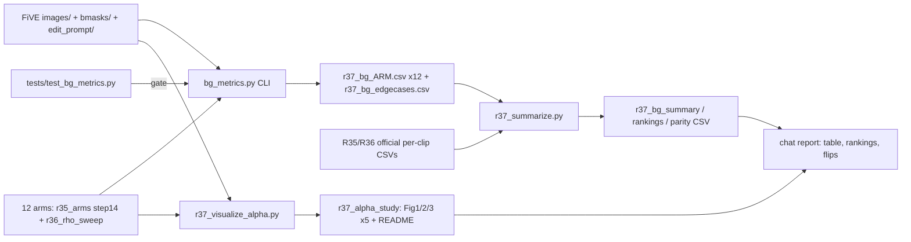

# R37: Distance-Weighted BG Metrics

## Context
FiVE's official background metrics penalize legitimate shape changes (person → lion), and scoring on the edited-object mask is gameable. R37 adds a **distance-weighted** background metric over the fixed, method-independent region ¬S_t: each pixel's error is weighted by `w = clip(dist/(α·L), 0, 1)`, and the result is averaged with a denominator Σw that depends only on S. It reports a sweep over α plus an α-averaged headline over α ∈ [0, 0.5].

Planning found that FiVE's official `*_unedit_part` metric **blacks out S in both frames and scores the full frame** ([metrics_calculator.py:704-780](../../evaluation/fivebench/metrics_calculator.py#L704-L780)): PSNR divides by H·W, LPIPS is SqueezeNet on the whole image, and SSIM is global Gaussian torchmetrics. So α = 0 of the new metric cannot equal the official number. The official number is therefore reported as its own column.

**Done when:** the pytest suite passes (output shown); per-sample CSVs exist for all 12 arms × 419 pairs; the summary, ranking and parity CSVs exist; 5 examples × 3 figures + README are in `evaluation/figures/r37_alpha_study/`; the chat report lists per-category rankings at α ∈ {0, 0.1, 0.25, 0.5} and states every ranking flip.

## Execution steps
| # | id | type | wait_for | sets_status |
|---|----|------|----------|-------------|
| *(prep)* | bg-metrics-core · bg-metrics-official · bg-metrics-cli · summarize · figures | `/build-step` | — | `implemented` |
| 1 | run-tests | local | — | — |
| 2 | launch-sbatch | sbatch | run-tests | `running` |
| 3 | launch-figures | sbatch | run-tests | — |
| 4 | wait-array | manual | launch-sbatch, launch-figures | `finished` |
| 5 | summarize | local | wait-array | — |
| 6 | verify-report | manual | summarize | `analyzed` |

```
/run-step R37 run-tests
/run-step R37 launch-sbatch
/run-step R37 launch-figures
/run-step R37 wait-array
/run-step R37 summarize
/run-step R37 verify-report
```

## Decisions
| Question | Decision |
|---|---|
| α = 0 anchor | Clean per-pixel definition for every α (α = 0 → Σ_{¬S} d / \|¬S\|). A test checks it against an independent plain outside-mask reference to 1e-6. |
| Official FiVE column | Computed on the same frames by calling the **unmodified** `MetricsCalculator.calculate_{psnr,ssim,lpips}` with `1−S`. Reported next to the new metric; the gap (official − clean α=0) is logged per clip. |
| Official parity | Recomputed official PSNR/SSIM/LPIPS must match the existing R35/R36 per-clip CSVs (`evaluation/csv/edit{T}_FiVE_{stem}_frame_stride8.csv`) to ≤ 1e-4. This proves frame/mask alignment. |
| Methods | 12 arms: R35 `{dino,lpips}_{unblended,first2}` (`~/Data/dataggen/outputs/five_bench/r35_arms/r35_<arm>/step14/edit{T}/{video}/*.png`) + R36 ρ ∈ {2,3,4,6,8,10,20,50} (`.../r36_rho_sweep/r36_rho{R}_vp/edit{T}/{video}/*.png`) |
| Figure rows | All 12 methods per example (12 rows × 11 cols) |
| Data | `~/Data/FiVE-Fine-Grained-Video-Editing-Benchmark`: `images/{video}/NNNNN.jpg` (80 frames, 864×480), `bmasks/{video}/NNNNN.jpg` (L-mode JPEG), `edit_prompt/edit{T}_FiVE.json` (100/100/100/100/9/10 = 419 pairs; `editing_type_id` = category) |
| Mask binarization | `mask > 0`, identical to [evaluate.py](../../evaluation/fivebench/evaluate.py) (JPEG ringing counts as object, same as official) |
| Frame sampling | `frame_stride = 8` on both source and edit, then truncate to the shorter (80 src vs 69 edit → 9 frames: 0, 8, …, 64). Same positional alignment as official. No random sampling. |
| Resolution | Edit 832×480 → bicubic (PIL) to source 864×480, as official; masks nearest if they differ from the frame size |
| L | `sqrt(mean |S_t|)` over the **scored** (strided, non-empty) frames of the clip |
| α grid | Computed: α ∈ {0, 0.05, …, 1.0} (21 values, for Fig 2). Headline α-avg over {0, …, 0.5} (`--alpha_max 0.5`). |
| Aggregation | Frame → PSNR_w = 10·log10(1/D_w[MSE]); video = mean over frames; α-avg PSNR per frame = 10·log10(1 / mean_α D_w[MSE]), then mean over frames. SSIM/LPIPS α-avg = mean over α of the video score. Dataset = **plain per-clip mean** (never `_avg.csv`), overall + per category 1–6. |
| LPIPS | `lpips.LPIPS(net='alex', spatial=True)`, inputs ×2−1, GPU, all strided frames of a clip in one batch; eval + no_grad |
| SSIM map | `skimage.metrics.structural_similarity(..., channel_axis=-1, data_range=1.0, full=True)`, map averaged over channels |
| Edge cases | Logged per (method, clip) in `evaluation/csv/r37_bg_edgecases.csv`: resize, truncation, empty-mask frames skipped, all-empty → clip skipped, mask > 90% → `flag_large_mask`, Σw = 0 → frame skipped |
| Ranking flips | For each metric × category × α ∈ {0, 0.1, 0.25, 0.5}: rank the 12 arms; report Kendall τ vs α = 0 and every pairwise swap; also vs the official column |
| Environment | `five-bench` conda env (has lpips, skimage 0.26, scipy 1.17, torch 2.5.1, pytest); jobs on L40S/A100 |
| Naming | Shared: `evaluation/fivebench/bg_metrics.py`, `tests/test_bg_metrics.py`. Task-specific: `r37_*` scripts, CSVs, `evaluation/figures/r37_alpha_study/` |
| 5 examples | `0011_lucia` e2 (woman → lion, non-rigid) · `0058_boat` e3 (colour) · `0011_lucia` e5 (add a dog) · `0042_gym-ball` e6 (remove) · `0001_bus` e1 (bus → jeep, rigid replacement) |
| Out of scope | Changes to FiVE data, `evaluate.py` or `metrics_calculator.py`; Wan-Edit / other official baselines (only 9 clips available); non-R35/R36 arms |

## Step commands

### run-tests
```bash
~/anaconda3/envs/five-bench/bin/python -m pytest tests/test_bg_metrics.py -v 2>&1 | tee logs/r37_pytest.log
```

### launch-sbatch
```bash
sbatch slurm_scripts/five_bench/r37_bg_metrics.sh
```

### launch-figures
```bash
sbatch slurm_scripts/five_bench/r37_figures.sh
```

### wait-array
```bash
sacct -j {job_id} --format=JobID,State,ExitCode
ls evaluation/csv/r37_bg_*.csv | grep -vE 'summary|rankings|parity|edgecases' | wc -l   # expect 12
grep -l ERROR logs/r37_bg_*.out                                                      # expect none
ls evaluation/figures/r37_alpha_study/                                               # 15 PNG + README.md
```

### summarize
```bash
~/anaconda3/envs/five-bench/bin/python evaluation/r37_summarize.py \
  --per_sample_glob "evaluation/csv/r37_bg_*.csv" \
  --official_glob "evaluation/csv/edit{T}_FiVE_{stem}_frame_stride8.csv" \
  --out_summary evaluation/csv/r37_bg_summary.csv \
  --out_rank evaluation/csv/r37_bg_rankings.csv \
  --out_parity evaluation/csv/r37_bg_parity.csv
```

### verify-report
```bash
column -s, -t < evaluation/csv/r37_bg_parity.csv | head
column -s, -t < evaluation/csv/r37_bg_summary.csv
grep -i flip evaluation/csv/r37_bg_rankings.csv
```

## Pipeline


## Code to touch
- **`evaluation/fivebench/bg_metrics.py`** (new, shared)
  - `load_clip(data_root, method_root, edit_type, video, stride=8)`: reuses `list_images` and `mp4_to_frames_ffmpeg` from `evaluate.py` (import, don't copy); mask rule `>0` as in `evaluate.py`; bicubic resize + truncation; returns `src [T,H,W,3]`, `edit [T,H,W,3]` float in [0,1], `masks [T,H,W]` bool, and an edge-case dict.
  - `weight_map(dist, S, alpha, L)`: α = 0 → `(~S).astype(float)`; else `clip(dist/(α·L), 0, 1)`, 0 on S.
  - `error_maps(src, edit, lpips_model)`: `mse [T,H,W]`, `1−ssim [T,H,W]` (skimage per frame), `lpips [T,H,W]` (one GPU batch).
  - `distance_weighted_bg_metrics(src_frames, edit_frames, masks, alphas, lpips_model=None) -> dict`: per α → `psnr_w, ssim_w, lpips_w` (video means), `w_sum` per frame (exposed for the anti-gaming test), `L`, `alpha_avg` block, edge-case counters. `D_mse == 0` → PSNR `inf` (no crash, no warning spam).
  - `official_fivebench(src, edit, masks, device)`: builds `mc = object.__new__(MetricsCalculator)`, sets only `device`, `psnr_metric_calculator`, `lpips_metric_calculator(net_type='squeeze')` and `ssim_metric_calculator` exactly as in its `__init__` (no CoTracker/Qwen), then calls the unmodified `calculate_psnr/ssim/lpips(src_u8, edit_u8, 1−S3, 1−S3)` per frame.
  - CLI: `--method_root --method_name --data_root --edit_types 1..6 --stride 8 --alpha_step 0.05 --alpha_to 1.0 --alpha_max 0.5 --out_csv --edgecase_csv --seed 0`. Logs args, torch/lpips/skimage versions and GPU at start. Writes long rows `method, sample_id, category, alpha, psnr_w, ssim_w, lpips_w` plus `alpha='avg'` and `alpha='official'` rows. Raises (never swallows) on per-clip errors, after printing `ERROR <clip>`.
- **`tests/test_bg_metrics.py`** (new): (1) identical frames → LPIPS_w < 1e-6, SSIM_w > 1−1e-6, PSNR_w == inf; (2) α = 0 vs a hand-written `mask`-indexed mean of the three maps, ≤ 1e-6; (3) `w_sum` identical for two different edits with the same S; (4) a far perturbation (dist > ρ) lowers PSNR_w more than the same patch at dist < 0.2ρ; (5) a 60%-of-¬S perturbation scores worse than 5%; (6) a smooth synthetic scene (low-freq gradient + disc mask) at 2× downscale: α-avg change < 5% on all three metrics; (7) *(smoke, skipped if data is missing)* official column on `0001_bus` e1, `r36_rho2_vp` equals the R36 per-clip CSV to 1e-4. The LPIPS model is a module-scoped fixture that runs on CPU.
- **`evaluation/r37_summarize.py`** (new): joins per-sample CSVs → `r37_bg_summary.csv` (method × category × {official, α=0 clean, α ∈ {0.1, 0.25, 0.5}, α-avg} × 3 metrics, plain per-clip mean + n) → `r37_bg_rankings.csv` (rank, Kendall τ vs α = 0, `flip` pairs) → `r37_bg_parity.csv` (max |Δ| official vs R35/R36 CSVs per arm).
- **`evaluation/r37_visualize_alpha.py`** (new): imports `bg_metrics`; uses the 5 fixed examples × 12 arms. Fig 1: mid strided frame, 11 cols, colour scales shared across rows (dist in px with colorbar; w in [0, 1]; LPIPS and w·LPIPS on one global vmax per example). Fig 2: metric vs α ∈ [0, 1] step 0.05, one line per arm, α = 0 marked "FiVE official" with the official value drawn as a marker. Fig 3: ring means of LPIPS and MSE over r ∈ [0, 2L], bin 0.05·L, pooled over the strided frames. Writes `evaluation/figures/r37_alpha_study/{video}_e{T}_{grid,alpha,rings}.png` + `README.md` (one line per figure).
- **`slurm_scripts/five_bench/r37_bg_metrics.sh`** (new): `#SBATCH --array=0-11 --gres=gpu:1 --partition=L40S,A100 --cpus-per-task=8 --time=06:00:00 -o logs/r37_bg_%A_%a.out`; bash array `ARMS` (4 R35 at `.../r35_<arm>/step14`, 8 R36); `five-bench` env; `STEM` = `r35_<arm>` / `r36_rho{R}_vp` to match the existing official CSV stems; runs the CLI → `evaluation/csv/r37_bg_${STEM}.csv`; `set -euo pipefail` and a row-count check (419 × 23 rows).
- **`slurm_scripts/five_bench/r37_figures.sh`** (new): single GPU job running `r37_visualize_alpha.py`.
