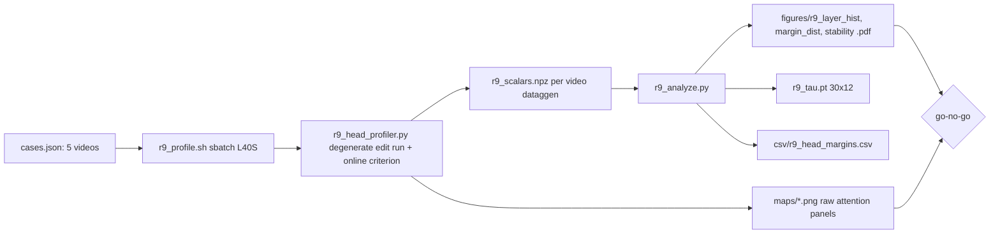

> **SUPERSEDED by [R19](r19-svg-faithful-head-profiling_b47f0e23.plan.md)
> (2026-07-21).** R9's two candidate key sets were not the same size — 1560
> spatial keys against 18 temporal ones at the classification point. Restricted
> reconstruction error falls as a key set grows, so the comparison partly
> measured key count rather than head type: on random q/k/v a head with no
> specialisation scores margin −0.97 under this criterion. SVG, whose criterion
> R9 adopts, equalises the two budgets by construction
> (`svg/models/wan/utils.py:63-110` builds one band and transposes the frame and
> position axes). R19 re-derives the taxonomy with per-row budgets matched.
> The GO verdict, thresholds, and `tau` recorded below are retained as the
> record of what was run; treat them as pending re-confirmation, not as current.

# R9: E0 head-taxonomy existence check

## Context

Go/no-go experiment for the head-routing program (ideas.tex Step 1 / claim 5,
premise of claim 1). Question: do the 360 self-attention heads of the
**distilled, block-causal, few-step** Self-Forcing build separate into
spatial vs temporal types under the SVG output-reconstruction criterion —
i.e., does the taxonomy HALO confirmed on bidirectional Wan survive causal
few-step distillation? Profiling runs on the **source branch** of a
degenerate edit call (trg=src), so the captured attention calls have the exact
structure of apply-time calls. Done when: per-layer head-type histogram,
margin distribution (decides binary vs 3-way routing), stability over last-3
steps / across 5 videos / across blocks, raw map panels, and a recorded
GO/NO-GO verdict exist.

## Execution steps

| # | id | type | what | sets_status |
|---|----|------|------|-------------|
| 0 | *(prep)* | — | todos: pick-videos, profiler, slurm-script, analyzer | `implemented` |
| 1 | launch-profile | sbatch | submit r9_profile.sh (1 GPU, 5 videos sequential) | `running` |
| 2 | wait-profile | manual | job done, 5/5 npz present | `finished` |
| 3 | analyze | local | aggregate → tau, margins, figures | — |
| 4 | go-no-go | manual | verdict vs criteria; outcome bullet in daily.md | `analyzed` |

Invoke: `/run-step R9 launch-profile` → `/run-step R9 wait-profile` →
`/run-step R9 analyze` → `/run-step R9 go-no-go`.

## Decisions

| Decision | Choice |
|---|---|
| Workspace / submission | This clone (`~/Code/StreamEdit_bigchantier`), SLURM `sbatch`, partition L40S, conda `streamgve` (r1_infer.sh conventions; `REPO` updated to this clone) |
| Inputs | 5 FiVE-Bench cases from `evaluation/cases.json`, one per motion type: rigid translation (`0001_bus`), articulated (`0028_kite-walk`), multi-object (`0034_cows`), + 1 camera-motion + 1 low-motion case picked from cases.json at implementation |
| Forward pass | Degenerate edit driver: `EditCausalInferencePipeline` with `trg_prompt=src_prompt`, `trg_word=src_word`; capture the **source half** of each `attention()` call |
| Criterion | SVG output-reconstruction, computed **online** in the capture hook (per-head scalars only — full K/V dumps would be ~6 GB/step/video); `\|P\|` = 1% of S_b ≈ 47 query rows, fixed seed |
| Profile points | **All 7 blocks** × steps {0, 7, 12, 13, 14} of 15 (criterion is scalars-only, ~2 GFLOP per layer-block-step — invisible next to generation). Classification uses last block × last-3 steps; the full grid gives the per-head ramp curve and a ready per-block tau table for free |
| Block-drift interpretation | Margins at blocks 0–1 compressing toward 0 with unchanged sign = measurement artifact of the 3-frame stripe ⇒ frozen tau stands. Genuine sign flips persisting at mid blocks (reach 9–12) = real context-length dependence ⇒ switch to per-block tau `[7,30,12]` (free: the source pre-pass visits every block) |
| Margin | signed `(err_spat − err_temp)/(err_spat + err_temp)` per head; classification threshold 0; ambiguous band decided by R12 from the margin distribution |
| Raw maps | For 6 hand-picked (layer, head) pairs × 4 query rows: attention prob vectors reshaped to (F_vis, h_l, w_l), saved as PNG panels — the "look at the maps first" check (ideas.tex risk 2) |
| Config | `--step 15`, seed 0, standard resolution, single window (no rollout); rollout stability axis deferred |
| Outputs (bulk) | `/projects/dataggen/outputs/five_bench/r9_head_profile/{video}/r9_scalars.npz`, `maps/*.png` |
| Outputs (repo) | `evaluation/csv/r9_head_margins.csv`, `evaluation/r9_tau.pt` `[30,12]` bool + `evaluation/r9_tau_per_block.pt` `[7,30,12]`, `evaluation/figures/r9_{layer_hist,margin_dist,stability,ramp}.pdf` |
| Out of scope | Rollout/window-2 stability (E1 axis ii), 3-way routing decision, any pipeline modification — R9 is read-only profiling |

## Step commands

### launch-profile

```bash
cd ~/Code/StreamEdit_bigchantier
sbatch slurm_scripts/five_bench/r9_profile.sh
```

### wait-profile

```bash
# job id from launch output; slurmdbd flaky -> fall back to logs
sacct -j {job_id} --format=JobID,State,Elapsed || tail -5 logs/r9_profile_{job_id}.out
ls /projects/dataggen/outputs/five_bench/r9_head_profile/*/r9_scalars.npz | wc -l   # expect 5
```

### analyze

```bash
cd ~/Code/StreamEdit_bigchantier
python evaluation/r9_analyze.py \
  --in_root /projects/dataggen/outputs/five_bench/r9_head_profile \
  --out_csv evaluation/csv --out_fig evaluation/figures \
  --out_tau evaluation/r9_tau.pt
```

### go-no-go

```bash
# inspect figures + csv, then record verdict:
#   GO: margin distribution bimodal AND cross-video flip rate <5% at last block
#   NO-GO: flat/unimodal margins -> re-derive pseudo key-sets for block-causal layout
# append outcome bullet to daily.md; set R9 status accordingly
```

## Pipeline



## Code to touch

- **`evaluation/r9_head_profiler.py`** (new): loads pipeline via
  `run_fivebench.load_pipe`-equivalent (reuse
  `Self-Forcing_StreamEdit/inference_edit_streamedit.py` helpers); runs
  `rollout_inference` with `trg=src` per video. Capture: monkey-patch
  `wan.modules.causal_model.attention` with a wrapper that, when a
  module-level `PROFILE` context is active for the current (layer, block,
  step), slices the source half of `(q, k, v)` (first `attention()` call
  inside the bridge branch = pure source; if the bridge is skipped —
  degenerate masks empty — batch index 0 of the dual call), computes for ~47
  fixed query rows: full attention output over all visible keys, restricted
  outputs over (a) same-frame keys, (b) same-(x,y) stride-`h_l·w_l` keys,
  per-head L2 errors → accumulate scalars at every block × the 5 profile
  steps (scalars only; no block skipping). Layer index from a call counter
  mod 30; block/step advanced by callbacks set around the pipeline's
  generator calls. `--dump_maps` saves prob panels for the 6 chosen
  (layer, head) pairs.
- **`slurm_scripts/five_bench/r9_profile.sh`** (new): r1_infer.sh header
  (L40S, 1 GPU, no array, `--time=04:00:00`, logs/r9_profile_%j),
  `REPO=/home/ids/skhairi/Code/StreamEdit_bigchantier`, loops the 5 video
  ids, calls `python evaluation/r9_head_profiler.py --case {id} --out_root
  /projects/dataggen/outputs/five_bench/r9_head_profile --dump_maps`.
- **`evaluation/r9_analyze.py`** (new): loads the 5 npz; per-head margins;
  tau at last block/last-3-steps (majority vote) plus the per-block table
  `r9_tau_per_block.pt` `[7,30,12]`; flip rates across videos / steps /
  blocks and the per-head ramp curve (margin vs block); writes
  `r9_head_margins.csv` (layer, head, err_spat, err_temp, margin, tau, flip
  stats), `r9_tau.pt`, and the four figures (layer_hist, margin_dist,
  stability, ramp).
- **No changes** to `wan/`, `pipeline/`, or the driver — profiling is
  wrap-and-restore only.
